# Logbook Kegiatan — 10 April 2026

| | |
|---|---|
| **Penelitian** | Sistem Kendali Drone Kamikaze Berbasis Deteksi Objek Warna dalam Simulasi HITL |
| **Tim** | Musa El Hanafi & Muhammad Ihsan Fahriansyah |
| **Lokasi** | Lab Komputer SMA Swasta Alfa Centauri, Kota Bandung |
| **Hari/Tanggal** | Jumat, 10 April 2026 |

---

## 1. Instalasi Tools & Environment Setup

**Kegiatan:**
Instalasi seluruh software dan toolchain yang diperlukan untuk pengembangan sistem HITL.

**Software yang diinstal:**

### A. X-Plane 11
- **Platform:** Steam
- **Link:** [https://store.steampowered.com/app/269950/XPlane_11/](https://store.steampowered.com/app/269950/XPlane_11/)
- **Langkah instalasi (Windows):**
  1. Install **Steam** terlebih dahulu jika belum ada: [https://store.steampowered.com/about/](https://store.steampowered.com/about/)
  2. Login ke Steam → buka halaman X-Plane 11 → klik **"Play Game"** / **"Install"**
  3. Pilih direktori instalasi → Steam mengunduh dan menginstal otomatis
  4. Setelah selesai, jalankan X-Plane 11 dari Steam Library untuk verifikasi
  5. Lokasi folder instalasi default: `C:\Program Files (x86)\Steam\steamapps\common\X-Plane 11\`

### B. Visual Studio Code
- **Download:** [https://code.visualstudio.com/download](https://code.visualstudio.com/download)
- **Langkah instalasi (Windows):**
  1. Unduh `VSCodeUserSetup-x64-*.exe`
  2. Jalankan installer → centang **"Add to PATH"** dan **"Register Code as an editor"**
  3. Setelah install, buka VS Code → install extension **Python** (Microsoft) dari marketplace

### C. QGroundControl
- **Download:** [https://docs.qgroundcontrol.com/master/en/getting_started/download_and_install.html](https://docs.qgroundcontrol.com/master/en/getting_started/download_and_install.html)
- **Langkah instalasi (Windows):**
  1. Unduh `QGroundControl-installer.exe`
  2. Jalankan installer → ikuti wizard
  3. Install driver USB Pixhawk jika diminta (biasanya otomatis via Windows Update)
  4. Hubungkan Pixhawk via USB → verifikasi QGC mendeteksi perangkat

### D. Python 3.x
- **Download:** [https://www.python.org/downloads/windows/](https://www.python.org/downloads/windows/)
- **Langkah instalasi (Windows):**
  1. Unduh **Python 3.10.x** (Windows installer 64-bit) — direkomendasikan untuk kompatibilitas pymavlink & dronekit
  2. Jalankan installer → **wajib centang "Add Python to PATH"** sebelum klik Install Now
  3. Verifikasi di Command Prompt:
     ```
     python --version
     pip --version
     ```

### E. arm-none-eabi-gcc (ARM Toolchain)
- **Download:** [https://developer.arm.com/downloads/-/arm-gnu-toolchain-downloads](https://developer.arm.com/downloads/-/arm-gnu-toolchain-downloads)
- **Langkah instalasi (Windows):**
  1. Unduh file `arm-gnu-toolchain-*-mingw-w64-x86_64-arm-none-eabi.exe`
  2. Jalankan installer → pada halaman akhir, centang **"Add path to environment variable"**
  3. Verifikasi di Command Prompt:
     ```
     arm-none-eabi-gcc --version
     ```

### F. Git
- **Download:** [https://git-scm.com/download/win](https://git-scm.com/download/win)
- **Langkah instalasi (Windows):**
  1. Unduh `Git-*-64-bit.exe` dari link di atas
  2. Jalankan installer → pada bagian **"Adjusting your PATH environment"**, pilih **"Git from the command line and also from 3rd-party software"**
  3. Pilihan lain biarkan default → klik Next hingga selesai
  4. Verifikasi di Command Prompt atau PowerShell:
     ```
     git --version
     ```

### G. Dependensi Python ArduPilot
- Setelah Python terinstal, jalankan perintah berikut di Command Prompt:
  ```
  pip install MAVProxy pymavlink dronekit
  ```
- Verifikasi:
  ```
  python -c "import pymavlink; print('pymavlink OK')"
  python -c "import dronekit; print('dronekit OK')"
  ```

**Hasil:** Semua tools berhasil terinstal dan berjalan. Environment build ArduPilot (`waf configure --board fmuv3`) berhasil diverifikasi.

**Dokumentasi:**

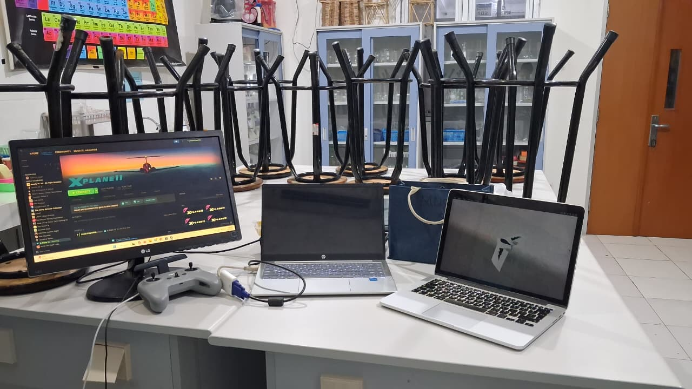

---

## 2. Verifikasi Koneksi X-Plane via LAN (2 Laptop)

**Kegiatan:**
Menghubungkan dua laptop dalam satu sesi X-Plane — satu sebagai player (pengendali) dan satu sebagai viewer only (pengamat).

**Konfigurasi:**
- Laptop 1 (Player): menjalankan X-Plane sebagai host, mengendalikan penerbangan
- Laptop 2 (Viewer Only): menjalankan X-Plane sebagai client, hanya menampilkan tampilan simulasi tanpa kontrol
- Koneksi: via jaringan lokal (LAN/Wi-Fi)

**Langkah:**
1. Set IP address kedua laptop dalam satu subnet lokal
2. Di Laptop 1: buka X-Plane → Settings → Network → aktifkan **"Allow other computers to control this copy of X-Plane"**
3. Di Laptop 2: buka X-Plane → Settings → Network → masukkan IP Laptop 1, set sebagai **Viewer Only**
4. Mulai sesi penerbangan di Laptop 1 — Laptop 2 otomatis menampilkan tampilan yang sama secara real-time

**Hasil:** Koneksi berhasil. Laptop 2 menampilkan tampilan simulasi X-Plane secara sinkron dengan Laptop 1 sebagai viewer only.

**Dokumentasi:**


---

## 3. Penambahan Custom Aircraft FX-61 Phantom

**Kegiatan:**
Menambahkan model pesawat custom FX-61 Phantom ke dalam library X-Plane sebagai wahana utama pengujian HITL.

**Sumber model:**
Model FX-61 Phantom diambil dari forum X-Plane.org: [https://forums.x-plane.org/files/file/33623-fx-61-uav/](https://forums.x-plane.org/files/file/33623-fx-61-uav/)

**Langkah:**
1. Unduh file `FX-61.zip` dari forum X-Plane.org (link di atas)
2. Ekstrak (unzip) `FX-61.zip` ke direktori `X-Plane/Aircraft/Extra Aircraft/`
   - Pastikan hasil ekstrak membentuk folder `FX-61/` berisi file `.acf`, `.param`, dan tekstur
3. Buka X-Plane → pilih aircraft FX-61 Phantom dari menu Aircraft
3. Verifikasi model aerodinamika: karakteristik fixed-wing delta wing tampil sesuai
4. Uji kontrol dasar (aileron, elevator, throttle) dalam mode manual di X-Plane

**Spesifikasi FX-61 Phantom:**
- Bentang sayap: ±1.5 m (delta flying wing)
- Kecepatan cruise: ±65–80 km/h
- Payload: mendukung kamera/seeker mount

**Hasil:** FX-61 Phantom berhasil dimuat di X-Plane, model fisika dan kontrol permukaan berfungsi normal.

---

## 4. Modifikasi FX-61 — Penambahan JATO (Jet Assisted Take Off)

**Kegiatan:**
Modifikasi model FX-61 Phantom di X-Plane untuk menambahkan sistem JATO guna mendukung takeoff tanpa runway panjang.

**Metode modifikasi (Plane Maker):**
1. Buka file `.acf` FX-61 di **Plane Maker** (tools bawaan X-Plane)
2. Tambahkan engine tambahan bertipe "Rocket/JATO" pada tab `Engines`
3. Set parameter JATO:
   - Thrust: ~50–80 N (disesuaikan berat FX-61)
   - Burn time: ±1 detik
   - Posisi: center-rear fuselage
4. Simpan file `.acf` dan reload di X-Plane

**Hasil:** JATO berhasil ditambahkan. FX-61 mampu melakukan accelerated takeoff dalam jarak < 30 m di X-Plane menggunakan dorongan JATO selama ±1 detik.

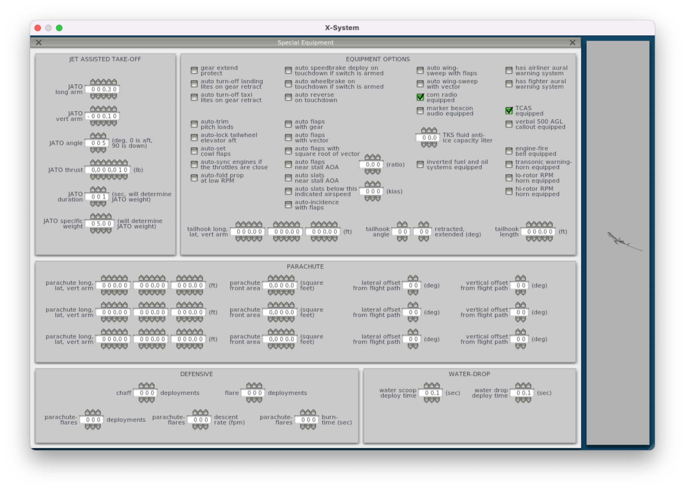

---

## 4b. Konfigurasi Wing FX-61 — Plane Maker

**Kegiatan:**
Verifikasi dan modifikasi parameter sayap (Wing 1 & Wing 2) FX-61 Phantom di Plane Maker.

### Tampilan 3D FX-61 di Plane Maker

Visualisasi 3D model FX-61 Phantom di Plane Maker (menu Standard → Wings). File aircraft: `Aircraft/Extra Aircraft/FX61/FX-61.acf`.

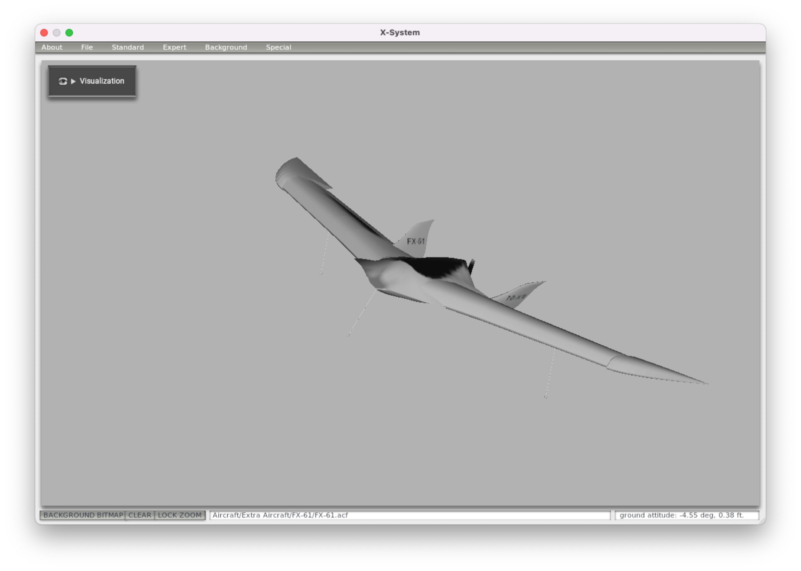

### Wing 1 — Kondisi Original (Sebelum Modifikasi)

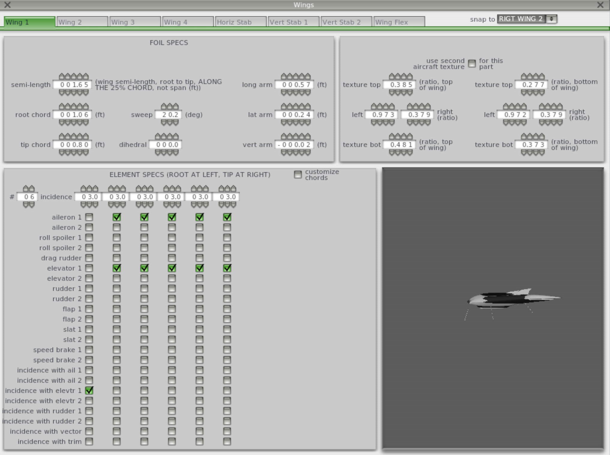

### Wing 1 — Foil Specs (Setelah Modifikasi)

| Parameter | Nilai | Satuan | Keterangan |
|---|---|---|---|
| Semi-length | 1.65 | ft | Panjang semi-span dari root ke tip, sepanjang 25% chord |
| Root chord | 1.06 | ft | Chord di pangkal sayap |
| Tip chord | 0.80 | ft | Chord di ujung sayap |
| Sweep | 20.2 | deg | Sudut sweep sayap |
| Dihedral | 0.0 | deg | Sudut dihedral |
| Long arm | 0.57 | ft | Lengan longitudinal sayap |
| Lat arm | 0.24 | ft | Lengan lateral sayap |
| Vert arm | −0.02 | ft | Lengan vertikal sayap |

### Wing 1 — Element Specs

- Jumlah elemen: **6** (root di kiri, tip di kanan)
- Incidence seluruh elemen: **3.0°**

| Kontrol | Elemen Aktif | Keterangan |
|---|---|---|
| Aileron 1 | 2, 3, 4, 5, 6 | Aktif dari elemen 2 hingga tip |
| Elevator 1 | 2, 3, 4, 5, 6 | Elevon — aktif dari elemen 2 hingga tip |
| Incidence with Elevtr 1 | 1 | Hanya root (elemen 1) |

> **Catatan:** FX-61 adalah flying wing — aileron dan elevator digabung sebagai **elevon**. Tidak ada rudder, flap, atau slat yang aktif.

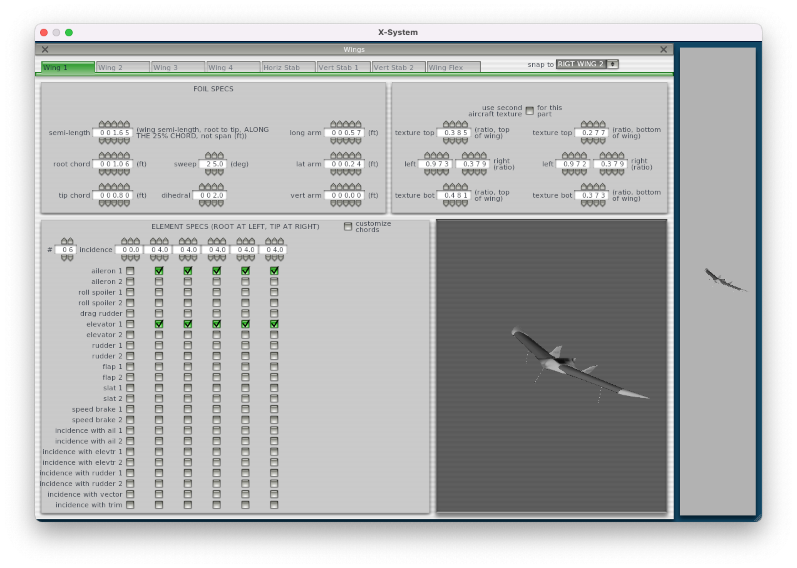

### Wing 2 — Foil Specs

| Parameter | Nilai | Satuan | Keterangan |
|---|---|---|---|
| Semi-length | 0.2 | ft | Panjang semi-span |
| Root chord | 1.0 | ft | Chord di pangkal |
| Tip chord | 0.8 | ft | Chord di ujung |
| Sweep | 5.5 | deg | Sudut sweep |
| Dihedral | 0.0 | deg | Sudut dihedral |
| Long arm | 0.0 | ft | Lengan longitudinal |
| Lat arm | 0.0 | ft | Lengan lateral |
| Vert arm | 0.0 | ft | Lengan vertikal |

### Wing 2 — Element Specs

- Jumlah elemen: **8** (root di kiri, tip di kanan)
- Incidence seluruh elemen: **0.0°**

| Kontrol | Elemen Aktif | Keterangan |
|---|---|---|
| Aileron 1 | — | Tidak aktif |
| Elevator 1 | — | Tidak aktif |

> **Catatan:** Wing 2 berfungsi sebagai permukaan sekunder / strake. Tidak ada kontrol aktif.

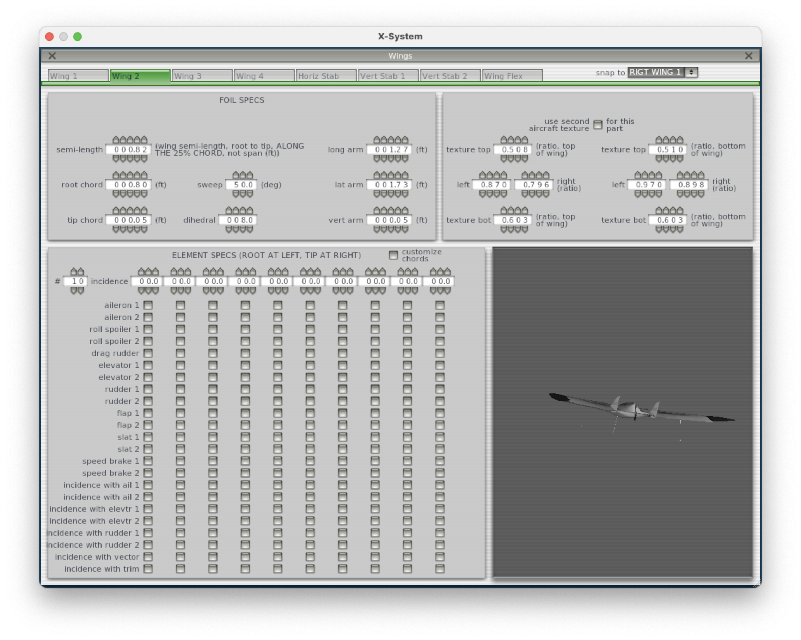

---

## 4e. Konfigurasi Stabilizer FX-61 — Plane Maker

**Kegiatan:**
Verifikasi dan modifikasi parameter stabilizer (Stab 1 & Stab 2) FX-61 Phantom di Plane Maker.

### Vert Stab 1 — Foil Specs

Konfigurasi: **RIGHT wing** aktif.

| Parameter | Nilai | Satuan | Keterangan |
|---|---|---|---|
| Semi-length | 0.4 | ft | Panjang semi-span stabilizer |
| Root chord | 1.0 | ft | Chord di pangkal |
| Tip chord | 0.8 | ft | Chord di ujung |
| Sweep | 5.5 | deg | Sudut sweep |
| Dihedral | 0.0 | deg | Sudut dihedral |
| Long arm | 0.0 | ft | Lengan longitudinal |
| Lat arm | 0.0 | ft | Lengan lateral |
| Vert arm | 0.0 | ft | Lengan vertikal |

### Vert Stab 1 — Element Specs

| Kontrol | Elemen Aktif | Keterangan |
|---|---|---|
| Elevator 1 | 1, 2, 3, 4, 5, 6 | Aktif seluruh elemen |
| Incidence with Elevtr 1 | — | Tidak aktif |

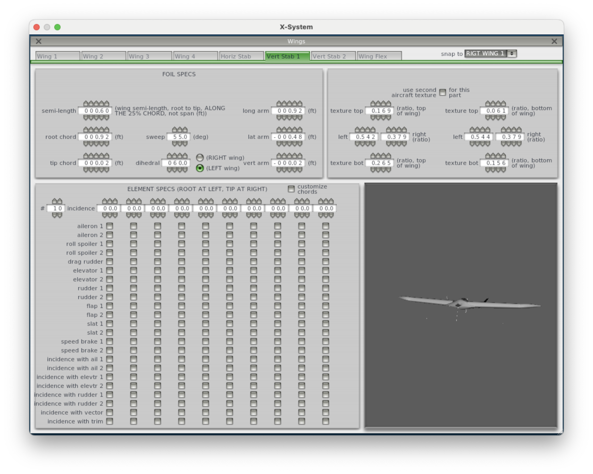

### Vert Stab 2 — Foil Specs

Konfigurasi: **RIGHT wing** aktif.

| Parameter | Nilai | Satuan | Keterangan |
|---|---|---|---|
| Semi-length | 0.4 | ft | Panjang semi-span stabilizer |
| Root chord | 1.0 | ft | Chord di pangkal |
| Tip chord | 0.8 | ft | Chord di ujung |
| Sweep | 5.5 | deg | Sudut sweep |
| Dihedral | 0.0 | deg | Sudut dihedral |
| Long arm | 0.0 | ft | Lengan longitudinal |
| Lat arm | 0.0 | ft | Lengan lateral |
| Vert arm | 0.0 | ft | Lengan vertikal |

### Vert Stab 2 — Element Specs

| Kontrol | Elemen Aktif | Keterangan |
|---|---|---|
| Elevator 1 | 1, 2, 3, 4, 5, 6 | Aktif seluruh elemen |
| Incidence with Elevtr 1 | — | Tidak aktif |

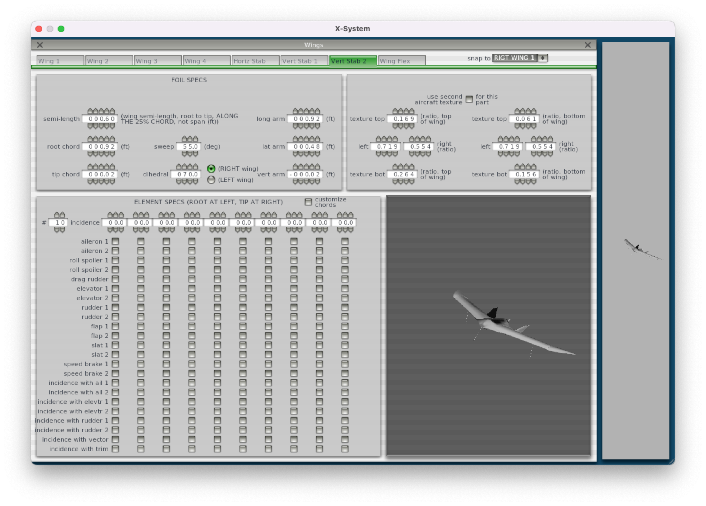

---

## 4f. Weight & Balance FX-61 — Plane Maker

**Kegiatan:**
Verifikasi konfigurasi weight & balance FX-61 Phantom di Plane Maker.

### Center of Gravity

| Parameter | Nilai | Satuan | Keterangan |
|---|---|---|---|
| Long CG | 0.77 | ft | Posisi CG longitudinal (forward limit) |
| Vert CG | 0.0 | ft | Posisi CG vertikal |

### Weights

| Parameter | Nilai | Satuan | Keterangan |
|---|---|---|---|
| Empty weight | 5.0 | lbs | Berat kosong pesawat |
| Fuel load | 0.0 | lbs | Berat bahan bakar |
| JATO weight | 0.0 | lbs | Dari Special Cannon screen |
| Jettisionable load | 0.0 | lbs | Beban yang dapat dilepas |
| Maximum weight | 5.0 | lbs | Berat maksimum takeoff |
| Weight shift weight | 0.0 | lbs | Beban penggeser CG |
| Displaced weight | 0.0 | lbs | Untuk dirigibles/blimps |

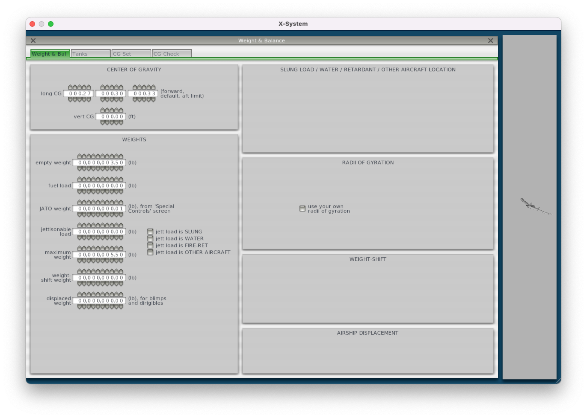

---

## 4c. Konfigurasi Landing Gear FX-61 — Plane Maker

**Kegiatan:**
Verifikasi dan pencatatan parameter landing gear FX-61 Phantom di Plane Maker (tab Gear Loc).

### Tipe Gear

| Gear | Tipe |
|---|---|
| Gear 1 (Nose) | Single |
| Gear 2 (Main Kiri) | Single |
| Gear 3 (Main Kanan) | Single |
| Gear 4–10 | None |

### Posisi & Geometri (Gear Loc)

| Parameter | Gear 1 (Nose) | Gear 2 (Main Kiri) | Gear 3 (Main Kanan) | Satuan |
|---|---|---|---|---|
| Long arm | 0.10 | 1.09 | 1.09 | ft |
| Lat arm | 0.00 | 1.20 | −1.20 | ft |
| Vert arm | 0.00 | 0.00 | 0.00 | ft |
| Lon angle extended | 20 | −20 | −20 | deg |
| Lat angle extended | 0 | 40 | −40 | deg |
| Lon angle retracted | −90 | 90 | 90 | deg |
| Lat angle retracted | 0 | 0 | 0 | deg |
| Eagle-claw | 0 | 0 | 0 | deg |
| Leg length | 0.5 | 0.5 | 0.5 | ft |
| Tire radius | 0.01 | 0.01 | 0.01 | ft |
| Tire semi-width | 0.01 | 0.01 | 0.01 | ft |
| N-W steering slow | 0.0 | 0.0 | 0.0 | deg |
| N-W steering fast | 0.0 | 0.0 | 0.0 | deg |
| Cycle time | 0.1 | 0.1 | 0.1 | sec |

### Flags

| Flag | Gear 1 | Gear 2 | Gear 3 |
|---|---|---|---|
| Brakes | ✅ | ✅ | ✅ |
| Retracts | ✅ | ✅ | ✅ |
| Castors | — | — | - |
| Faired | — | — | — |

> **Catatan:** Ketiga gear bersifat retractable. Gear 3 (main kanan) memiliki castor aktif.

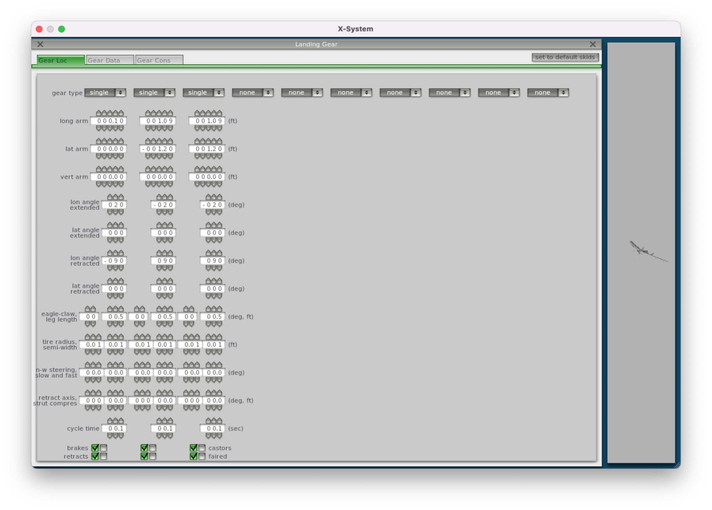

---

## 4d. Konfigurasi Control Geometry FX-61 — Plane Maker

**Kegiatan:**
Verifikasi dan pencatatan parameter geometri kontrol permukaan (elevon) FX-61 Phantom di Plane Maker.

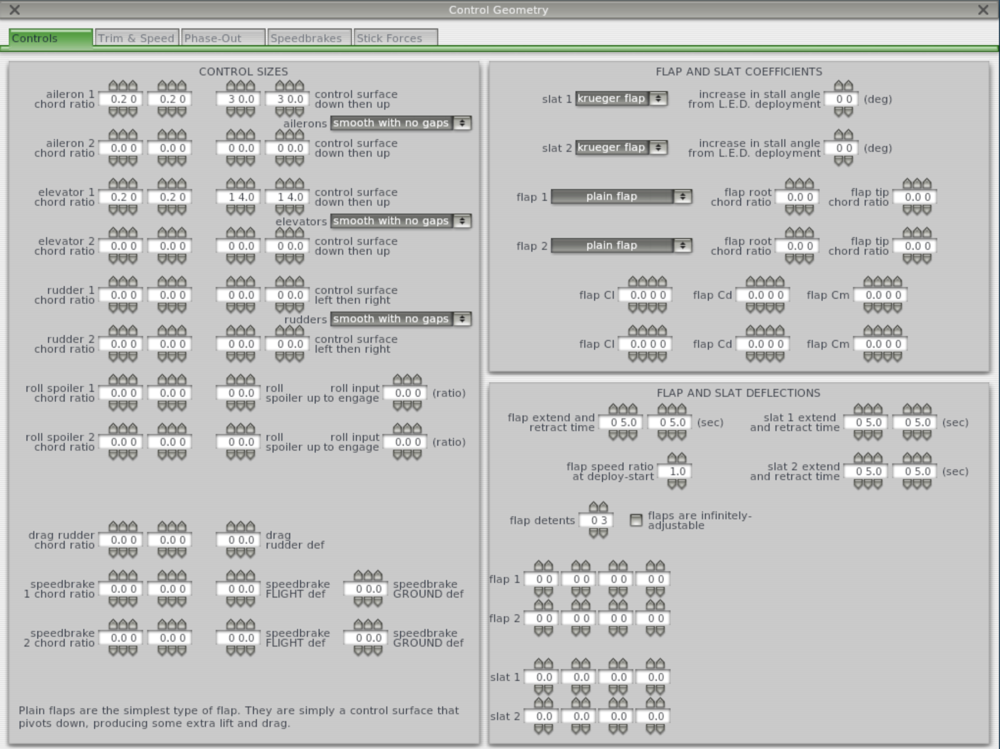

---

## 5. Penambahan Custom Airport WICC (Husein Sastranegara)

**Kegiatan:**
Menambahkan custom airport Bandara Husein Sastranegara (ICAO: WICC) ke dalam lingkungan X-Plane sebagai lokasi pengujian.

**Langkah:**
1. Unduh file `Custom Scenery.zip` yang berisi data airport WICC beserta objek target hot-pink
2. Ekstrak (unzip) `Custom Scenery.zip` ke direktori `X-Plane/Custom Scenery/`
3. Verifikasi folder `WICC/` telah muncul di dalam `Custom Scenery/`
4. Restart X-Plane agar scenery baru terdeteksi dan dimuat

**Hasil:** Airport WICC berhasil dimuat di X-Plane. Runway 11 dan objek target hot-pink tampil sesuai posisi yang direncanakan.

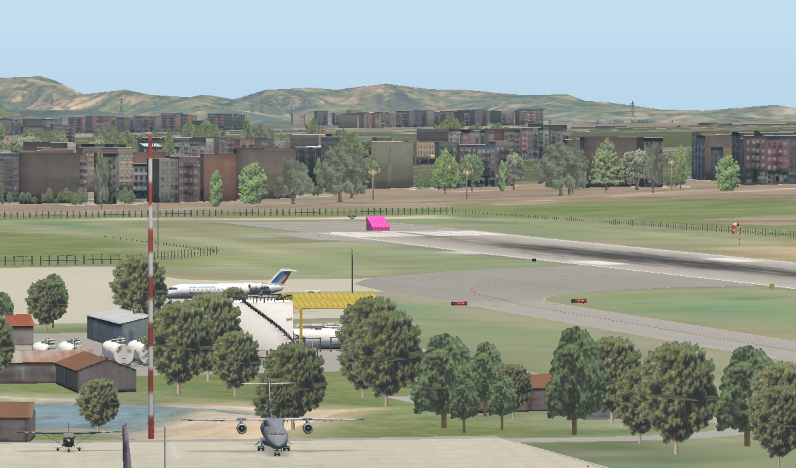

---

## 6. Uji Coba Terbang FX-61 di Lokasi WICC — X-Plane

**Kegiatan:**
Uji coba penerbangan perdana FX-61 Phantom di lingkungan simulasi Bandara Husein Sastranegara (WICC).

**Skenario pengujian:**
1. Spawn FX-61 di threshold runway 11 WICC
2. Takeoff menggunakan JATO → transisi ke glide normal
3. Terbang manual di sekitar area WICC
4. Observasi respons aerodinamika: roll, pitch, yaw, kecepatan
5. Landing kembali di runway 11

**Parameter yang diamati:**

| Parameter | Nilai |
|---|---|
| Kecepatan takeoff | ±55 km/h |
| Kecepatan cruise | ±70 km/h |
| Altitude jelajah | 75–100 m AGL |
| Respons aileron | Normal |
| Respons elevator | Normal |

**Dokumentasi:**

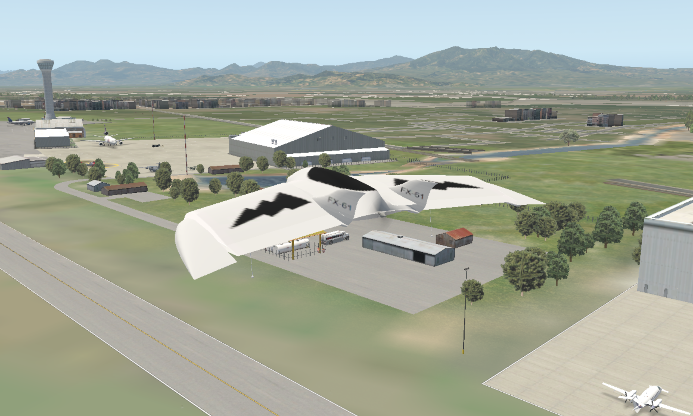

**Kendala & Tindak Lanjut:**
- Terrain mesh WICC perlu fine-tuning (beberapa titik ketinggian tidak rata)
- JATO burn time 1 detik
- Minggu depan: setup koneksi pppd Pixhawk ↔ laptop untuk HITL mode

---

## Ringkasan Kegiatan

| No | Kegiatan | Status |
|---|---|---|
| 1 | Instalasi X-Plane, VS Code, QGroundControl, Git, toolchain ArduPilot | ✅ Selesai |
| 2 | Verifikasi koneksi X-Plane via LAN (2 laptop) | ✅ Selesai |
| 3 | Tambah custom aircraft FX-61 Phantom | ✅ Selesai |
| 4 | Modifikasi FX-61 + JATO (Plane Maker) | ✅ Selesai |
| 4b | Konfigurasi Wing FX-61 — Plane Maker (Wing 1 & Wing 2) | ✅ Selesai |
| 4c | Konfigurasi Landing Gear FX-61 — Plane Maker (Gear Loc) | ✅ Selesai |
| 4d | Konfigurasi Control Geometry FX-61 — Plane Maker | ✅ Selesai |
| 4e | Konfigurasi Stabilizer FX-61 — Plane Maker (Stab 1 & Stab 2) | ✅ Selesai |
| 4f | Weight & Balance FX-61 — Plane Maker | ✅ Selesai |
| 5 | Tambah custom airport WICC (Husein Sastranegara) | ✅ Selesai |
| 6 | Uji coba terbang FX-61 di WICC — X-Plane | ✅ Selesai |

---

## Panduan Git — Logbook OPSI

Repository logbook: [https://github.com/musaelhanafi/logbook-opsi](https://github.com/musaelhanafi/logbook-opsi)

### Clone (pertama kali)

```
git clone git@github.com:musaelhanafi/logbook-opsi.git
cd logbook-opsi
```

> Pastikan SSH key sudah terdaftar di GitHub. Jika belum:
> ```
> ssh-keygen -t ed25519 -C "email@gmail.com"
> cat ~/.ssh/id_ed25519.pub
> ```
> Salin output → GitHub → Settings → SSH Keys → New SSH Key → Paste → Save.

---

### Workflow Harian (Add → Commit → Push)

Setelah menambah atau mengedit file logbook:

```
cd logbook-opsi

# 1. Cek status perubahan
git status

# 2. Tambahkan file yang berubah
git add .

# 3. Commit dengan pesan deskriptif
git commit -m "logbook: tambah kegiatan 10 April 2026"

# 4. Push ke GitHub
git push
```

---

### Pull (sinkronisasi dari GitHub)

Jalankan sebelum mulai kerja, terutama jika dikerjakan di beberapa laptop:

```
cd logbook-opsi
git pull
```

---

### Struktur Folder

```
logbook-opsi/
├── 01_10 April 2026/
│   ├── logbook_10_april_2026.md
│   ├── logbook_10_april_2026.pdf
│   └── (foto/screenshot)
├── 02_<tanggal>/
│   └── ...
└── README.md
```

Setiap sesi logbook dibuat dalam folder baru dengan format: `NN_DD Bulan YYYY/`.

---

*Logbook dibuat: 10 April 2026 | Penelitian OPSI 2026 — SMA Swasta Alfa Centauri*
