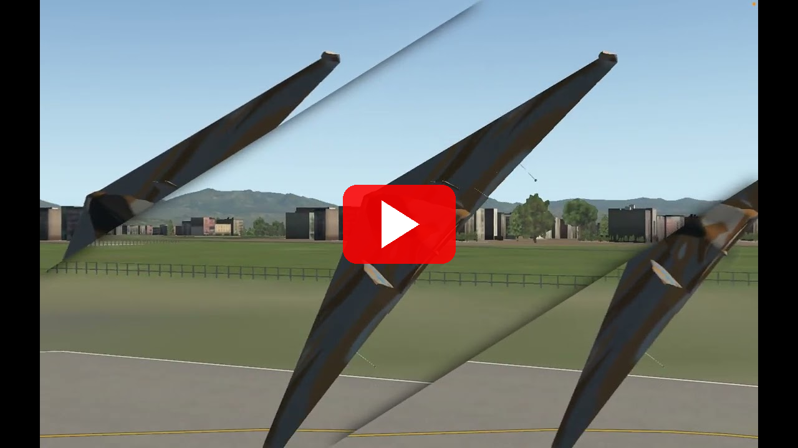

# Logbook Kegiatan — 17 April 2026

| | |
|---|---|
| **Penelitian** | Sistem Kendali Drone Kamikaze Berbasis Deteksi Objek Warna dalam Simulasi HITL |
| **Tim** | Musa El Hanafi & Muhammad Ihsan Fahriansyah |
| **Lokasi** | Lab Komputer SMA Swasta Alfa Centauri, Kota Bandung |
| **Hari/Tanggal** | Kamis, 17 April 2026 |

---

Kegiatan hari ini dibagi dalam dua bagian utama: **Bagian I — Darat** mencakup setup environment pengembangan, fork dan clone repositori firmware, serta kompilasi dan upload firmware ke Pixhawk; **Bagian II — Pesawat** mencakup implementasi firmware khusus SATRIA (board config HITL, elevon mapping, konfigurasi SITL), setup sesi terbang, uji terbang manual, autotune, dan auto takeoff dengan navigasi waypoint.

---

## Arsitektur Sistem HITL

HITL (Hardware-in-the-Loop) menggunakan Pixhawk v2 (fmuv3) yang menjalankan firmware ArduPlane custom. X-Plane menyediakan model fisika penerbangan; Pixhawk menjalankan kode autopilot nyata. Injeksi sensor dan output aktuator ditangani sepenuhnya **di dalam firmware** via SITL XPlane backend — tidak memerlukan bridge script atau MAVProxy.


**Aliran data:**

| Arah | Jalur | Konten |
|---|---|---|
| X-Plane → Pixhawk | UDP → PPP (TELEM2) | DATA@ rows (IMU, GPS, airspeed, attitude) |
| Pixhawk → X-Plane | PPP (TELEM2) → UDP | DREF packets (yoke ratios, throttle) |
| QGC ↔ Pixhawk | USB (SERIAL0) | MAVLink2 telemetry, parameter, misi |
| RC Transmitter → Pixhawk | 2.4 GHz radio + SBUS/PPM | Input stick RC |

**SIM_XPlane backend** (`SIM_XPlane.cpp`) berjalan di Pixhawk dan:
- Mendecode DATA@ rows masuk → populate `SIMState` (injeksi sensor)
- Membaca `input.servos[]` tiap siklus → mengirim DREF packets ke X-Plane
- Menggunakan `xplane_plane.json` (embedded di firmware ROMFS) untuk memetakan servo channel ke DREF X-Plane

**Koneksi fisik:**

| Kabel | Dari | Ke |
|---|---|---|
| USB-A → micro-B | Laptop | Pixhawk USB (SERIAL0) |
| USB–UART adapter | Laptop (pppd) | Pixhawk TELEM2 (SERIAL2) @ 115200 baud |

**DREF mapping (`xplane_plane.json`):**

| Channel | DREF | Tipe |
|---|---|---|
| CH1 (aileron) | `sim/joystick/yoke_roll_ratio` | angle (−1…+1) |
| CH2 (elevator) | `sim/joystick/yoke_pitch_ratio` | angle_neg (inverted) |
| CH3 (throttle) | `sim/flightmodel/engine/ENGN_thro_use[0]` | range (0…1) |
| CH4 (rudder) | `sim/joystick/yoke_heading_ratio` | angle (−1…+1) |

---

## Bagian I — Darat

---

### 1. Instalasi Git

**Kegiatan:**
Instalasi Git pada laptop yang digunakan sebagai build machine untuk firmware ArduPilot.

**Langkah:**
1. Download Git dari https://git-scm.com/download/win
2. Jalankan installer → pada bagian **"Adjusting your PATH environment"**, pilih **"Git from the command line and also from 3rd-party software"**
3. Pilihan lain biarkan default → klik Next hingga selesai
4. Verifikasi di Command Prompt:
   ```
   git --version
   ```

**Hasil:** Git berhasil terinstal dan dapat diakses dari terminal.

---

### 2. Pendaftaran Akun GitHub

**Kegiatan:**
Membuat akun GitHub untuk menyimpan repositori firmware SATRIA dan logbook penelitian.

**Langkah:**
1. Buka https://github.com
2. Klik **"Sign up"** → masukkan email, password, dan username
3. Verifikasi email melalui link konfirmasi
4. Generate SSH key dan daftarkan ke GitHub:
   ```bash
   ssh-keygen -t rsa -b 4096 -C "email@gmail.com"
   cat ~/.ssh/id_rsa.pub
   ```
   Salin output → GitHub → Settings → SSH Keys → New SSH Key → Paste → Save
5. Verifikasi koneksi SSH:
   ```bash
   ssh -T git@github.com
   ```

**Hasil:** Akun GitHub berhasil dibuat dan SSH key terdaftar.

---

### 3. Fork Repositori ArduPilot → satria-firmaware

**Kegiatan:**
Fork repositori ArduPilot ke akun GitHub `musaelhanafi` sebagai basis pengembangan firmware custom SATRIA.

**Langkah:**
1. Buka https://github.com/ArduPilot/ardupilot
2. Klik **"Fork"** → pilih akun `musaelhanafi` sebagai owner → rename menjadi `satria-firmaware` → klik **Create fork**
3. Repositori fork tersedia di `git@github.com:musaelhanafi/satria-firmaware.git`
4. Set remote pada repositori lokal:
   ```bash
   git remote rename origin upstream
   git remote add origin git@github.com:musaelhanafi/satria-firmaware.git
   git push -u origin main
   ```

**Hasil:** Fork berhasil. Repositori satria-firmaware tersedia di `git@github.com:musaelhanafi/satria-firmaware.git`.

---

### 4. Clone Repositori satria-firmaware

**Kegiatan:**
Clone repositori firmware yang sudah di-fork ke mesin lokal. Repo ini merupakan fork ArduPilot yang akan dimodifikasi dengan konfigurasi board `fmuv3-hil` dan patch HITL khusus SATRIA.

**Perintah:**
```bash
git clone git@github.com:musaelhanafi/satria-firmaware.git
cd satria-firmaware
git submodule update --init --recursive
```

**Catatan:** Proses `submodule update` memakan waktu ±10–15 menit tergantung koneksi internet karena submodul MAVLink, ChibiOS, dan lainnya berukuran besar.

**Hasil:** Repositori satria-firmaware berhasil di-clone lengkap dengan seluruh submodul.

---

### 5. Konfigurasi Environment Build & Kompilasi Firmware

**Kegiatan:**
Konfigurasi build environment menggunakan WAF build system ArduPilot dan kompilasi firmware ArduPlane dengan konfigurasi board `fmuv3-hil` (Pixhawk 2.4.8 mode HITL).

**Langkah:**
1. Install dependensi Python yang diperlukan:
   ```bash
   pip install empy==3.3.4 pexpect pymavlink future
   ```
2. Fix MAVLink headers yang berpotensi konflik sebelum build:
   ```bash
   python3 fix_mavlink_headers.py
   ```
3. Konfigurasi board `fmuv3-hil`:
   ```bash
   ./waf configure --board fmuv3-hil
   ```
4. Kompilasi firmware ArduPlane:
   ```bash
   ./waf plane
   ```

**Output:** File firmware `arduplane.apj` tersimpan di folder `build/fmuv3-hil/bin/`.

> **Catatan:** Jika build gagal dengan error `redefinition of 'param_union'`, jalankan ulang `python3 fix_mavlink_headers.py` lalu `./waf distclean` sebelum configure ulang.

**Hasil:** Firmware ArduPlane HITL berhasil dikompilasi untuk board `fmuv3-hil` tanpa error.

---

### 6. Upload Firmware ke Pixhawk 2.4.8

**Kegiatan:**
Upload firmware ArduPlane hasil kompilasi ke Pixhawk 2.4.8 langsung melalui WAF via koneksi USB.

**Langkah:**
1. Hubungkan Pixhawk ke laptop via kabel USB
2. Jalankan perintah upload:
   ```bash
   ./waf plane --upload
   ```
   WAF otomatis mendeteksi Pixhawk pada port USB dan meng-upload firmware `arduplane.apj`.
3. Pixhawk reboot otomatis setelah upload selesai.

**Hasil:** Firmware berhasil di-upload ke Pixhawk 2.4.8.

---

### 7. Verifikasi Boot via QGroundControl

**Kegiatan:**
Verifikasi bahwa Pixhawk berhasil boot dengan firmware ArduPlane yang baru diupload.

**Langkah:**
1. Setelah upload, Pixhawk reboot otomatis dan terhubung kembali ke QGroundControl
2. Cek vehicle summary: firmware version, board type, dan status sensor
3. Verifikasi tidak ada critical error di message log QGC
4. Cek deteksi sensor: IMU, barometer, dan compass

**Hasil:** Pixhawk berhasil boot dengan ArduPlane. QGroundControl menampilkan status normal — sensor IMU dan barometer terdeteksi tanpa error.

---

## Bagian II — Pesawat

---

### 8. Implementasi Board Config HITL: fmuv3-hil, fmuv3-hil-plane, x86-hil

**Kegiatan:**
Membuat tiga konfigurasi board baru di firmware satria-firmaware untuk mendukung mode HITL dengan X-Plane sebagai physics engine.

#### A. fmuv3-hil (Pixhawk — Flying Wing Elevon)

**File:** `libraries/AP_HAL_ChibiOS/hwdef/fmuv3-hil/hwdef.dat` dan `defaults.parm`

| Parameter | Nilai | Keterangan |
|---|---|---|
| `AHRS_EKF_TYPE` | 2 | EKF2 (sesuai keterbatasan STM32F427) |
| `EK2_ENABLE` | 1 | EKF2 aktif |
| `EK3_ENABLE` | 0 | EKF3 nonaktif |
| `GPS1_TYPE` | 100 | SITL GPS |
| `ARSPD_TYPE` | 100 | SITL airspeed |
| `NET_ENABLE` | 1 | PPP networking aktif |
| `SERIAL2_PROTOCOL` | 48 | PPP protocol di TELEM2 |
| `SERIAL2_BAUD` | 115 | 115200 baud |
| `NET_OPTIONS` | 64 | PPP options |
| `SIM_OPOS_LAT` | −6.897434 | Bandara WICC — Bandung |
| `SIM_OPOS_LNG` | 107.566887 | |
| `SIM_OPOS_ALT` | 744.0 | AMSL (m) |

#### B. fmuv3-hil-plane (Pixhawk — Fixed Wing Konvensional)

**File:** `libraries/AP_HAL_ChibiOS/hwdef/fmuv3-hil-plane/hwdef.dat` dan `defaults.parm`

Sama dengan fmuv3-hil tetapi menggunakan `xplane_plane.json` (aileron/elevator/throttle/rudder terpisah).

| Parameter | Nilai | Keterangan |
|---|---|---|
| `SERVO1_FUNCTION` | 4 | Aileron |
| `SERVO2_FUNCTION` | 19 | Elevator |
| `SERVO3_FUNCTION` | 70 | Throttle |
| `SERVO4_FUNCTION` | 21 | Rudder |

#### C. x86-hil (SITL Binary — Laptop/x86)

**File:** `libraries/AP_HAL_SITL/hwdef/x86-hil/hwdef.dat` dan `defaults.parm`

Konfigurasi untuk menjalankan ArduPlane sebagai SITL binary di laptop yang sama dengan X-Plane. Tidak memerlukan PPP — koneksi UDP langsung.

**Hasil:** Tiga konfigurasi board HITL berhasil dibuat dan dapat dikompilasi.

---

### 9. Implementasi xplane_elevon.json

**Kegiatan:**
Membuat file DREF map baru untuk flying wing (elevon) yang digunakan oleh board x86-hil dan fmuv3-hil.

**File:** `Tools/autotest/models/xplane_elevon.json`

`SIM_XPlane.cpp` melakukan demix servo sebelum mengirim ke X-Plane:

| DRef X-Plane | Tipe | Formula (SIM_XPlane.cpp) |
|---|---|---|
| `sim/joystick/yoke_roll_ratio` | `elevon_aileron` | `(CH1_left − CH2_right) / 1000` |
| `sim/joystick/yoke_pitch_ratio` | `elevon_elevator` | `(CH1_left + CH2_right − 3000) / 1000 + 0.5` |
| `sim/flightmodel/engine/ENGN_thro_use[0]` | `range` | `(CH3 − 1000) / 1000` |

**Channel mapping:**

| Channel | Servo | Keterangan |
|---|---|---|
| `channel: 1` | SERVO1 | Left elevon (CH1) |
| `channel2: 2` | SERVO2 | Right elevon (CH2) |
| `channel: 3` | SERVO3 | Throttle |

**Hasil:** xplane_elevon.json berhasil dibuat dan elevon SATRIA bergerak benar di X-Plane.

---

### 10. Fix Build & Konfigurasi Sensor SITL

**Kegiatan:**
Menyelesaikan tiga isu yang muncul setelah konfigurasi SITL.

#### A. Fix AHRS_EKF_TYPE — Compass Tidak Sinkron dengan X-Plane

`AHRS_EKF_TYPE 3` (EKF3) menyebabkan heading lag karena heading harus konvergen melalui fusi gyro + compass. Dengan `AHRS_EKF_TYPE 10` (SIM backend), attitude langsung dari `fdm.quaternion` X-Plane — zero lag.

> Constructor `SIM_XPlane` sendiri mengomentari: *"XPlane sensor data is not good enough for EKF. Use fake EKF by default."*

| Parameter | Nilai | Keterangan |
|---|---|---|
| `AHRS_EKF_TYPE` | **10** | Attitude langsung dari X-Plane quaternion |
| `EK3_ENABLE` | 1 | EKF3 tetap aktif untuk terrain/odometry |
| `EK2_ENABLE` | 0 | EKF2 nonaktif |

#### B. Konfigurasi Compass SITL (SIM_MAGx_DEVID)

Di binary SITL, `AP_Compass_SITL` dibuat otomatis untuk setiap `SIM_MAGx_DEVID` yang bernilai non-nol. Default ada 7 compass phantom — cukup aktifkan satu.

| Parameter | Nilai | Keterangan |
|---|---|---|
| `COMPASS_USE` | 1 | Gunakan compass 1 |
| `COMPASS_USE2` | 0 | Nonaktifkan compass 2 |
| `COMPASS_USE3` | 0 | Nonaktifkan compass 3 |
| `SIM_MAG1_DEVID` | 97539 | Non-nol = compass 1 aktif |
| `SIM_MAG2_DEVID` | **0** | Nol = tidak membuat instance compass 2 |
| `SIM_MAG3_DEVID` | **0** | Nol = tidak membuat instance compass 3 |

**Hasil:** Heading sinkron dengan X-Plane. Compass phantom berlebih dinonaktifkan.

---

### 11. Konfigurasi Parameter SITL X-Plane

**Kegiatan:**
Dokumentasi dan verifikasi seluruh parameter ArduPilot yang relevan untuk konfigurasi SITL dengan X-Plane backend.

#### Parameter Home / Origin

| Parameter | Nilai (WICC Bandung) | Keterangan |
|---|---|---|
| `SIM_OPOS_LAT` | −6.897434 | Latitude startup |
| `SIM_OPOS_LNG` | 107.566887 | Longitude startup |
| `SIM_OPOS_ALT` | 744.0 | Altitude AMSL (m) |
| `SIM_OPOS_HDG` | 108.0 | Heading startup (°) |

#### Parameter Sensor Backend

| Parameter | Nilai | Keterangan |
|---|---|---|
| `GPS1_TYPE` | 100 | SITL GPS backend |
| `ARSPD_TYPE` | 100 | SITL airspeed backend |
| `AHRS_EKF_TYPE` | **10** | Attitude dari X-Plane — jangan ubah ke 3 |
| `INS_GYR_CAL` | 0 | Skip kalibrasi gyro saat startup |

#### Parameter Kontrol Simulasi

| Parameter | Nilai | Keterangan |
|---|---|---|
| `SIM_SPEEDUP` | **1** | Wajib 1 — X-Plane berjalan real-time |
| `SIM_XP_BIND_PORT` | 49005 | Port UDP yang didengarkan ArduPilot dari X-Plane |
| `SIM_OH_MASK` | 255 (fmuv3) / 0 (x86) | Bitmask channel servo ke hardware |

#### Ringkasan defaults.parm x86-hil

```
# AHRS
AHRS_EKF_TYPE  10
EK3_ENABLE      1
EK2_ENABLE      0

# Sensor backends
GPS1_TYPE     100
ARSPD_TYPE    100

# Compass
COMPASS_USE     1
COMPASS_USE2    0
COMPASS_USE3    0
SIM_MAG2_DEVID  0
SIM_MAG3_DEVID  0

# Home position (WICC Bandung)
SIM_OPOS_LAT   -6.897434
SIM_OPOS_LNG  107.566887
SIM_OPOS_ALT  744.0
SIM_OPOS_HDG  108.0

# Simulasi
SIM_SPEEDUP     1
SIM_OH_MASK     0
SIM_XP_BIND_PORT 49005

# RC & Arming
THR_FAILSAFE    0
RC_OVERRIDE_TIME -1
BRD_SAFETY_DEFLT 0
ARMING_SKIPCHK  -1
ARMING_REQUIRE   1

# Takeoff
TKOFF_THR_MINACC 0
TKOFF_THR_MINSPD 0
TKOFF_ROTATE_SPD 12
```

**Hasil:** Seluruh parameter SITL X-Plane terdokumentasi dan terverifikasi.

---

### 12. Setup Sesi HITL — Jaringan X-Plane, PPP Tunnel, dan QGroundControl

**Kegiatan:**
Prosedur lengkap menjalankan sesi HITL ArduPlane fmuv3-hil + X-Plane 11/12.

#### Langkah 1 — Konfigurasi Jaringan X-Plane

**Settings → Net Connections → Data:**

| Field | Nilai |
|---|---|
| Send data to IP | `10.0.0.2` |
| Send data port | `49005` |
| Receive commands port | `49000` |

Aktifkan DATA@ rows berikut (**Settings → Data Output**, centang "Send data over the net"):

| Row # | Nama | Digunakan untuk |
|---|---|---|
| 1 | Frame rate / sim time | Timing |
| 3 | Speeds | IAS → sensor airspeed |
| 4 | G-load | Akselerasi body-frame → IMU |
| 16 | Angular velocities | Roll/pitch/yaw rates → gyro |
| 17 | Pitch, roll, heading | Attitude → EKF |
| 20 | Lat, lon, altitude | Posisi GPS |
| 21 | Loc, vel, dist | Kecepatan NED → GPS velocity |

#### Langkah 2 — Start PPP Tunnel

Hubungkan USB–UART adapter ke port TELEM2 Pixhawk. Cari nama device, lalu jalankan `pppd`:

```bash
# macOS
sudo pppd /dev/tty.usbserial-XXXX 115200 \
  10.0.0.1:10.0.0.2 \
  noauth local nodetach \
  asyncmap 0 novj nopcomp noaccomp \
  lcp-echo-interval 0
```

```bash
# Linux
sudo pppd /dev/ttyUSB0 115200 \
  10.0.0.1:10.0.0.2 \
  noauth local nodetach \
  asyncmap 0 novj nopcomp noaccomp \
  lcp-echo-interval 0
```

| IP | Host |
|---|---|
| `10.0.0.1` | Laptop (sisi X-Plane) |
| `10.0.0.2` | Pixhawk |

> - `lcp-echo-interval 0` — nonaktifkan LCP keepalive (tanpa ini pppd putus setelah ~12 detik)
> - `novj` — nonaktifkan VJ TCP header compression (kurangi latensi)
> - `asyncmap 0` — tidak ada escaping karakter kontrol

#### Langkah 3 — Hubungkan QGroundControl

Colokkan USB Pixhawk ke laptop. Buka QGroundControl — akan auto-connect via USB di 921600 baud (SERIAL0).

Harus terlihat: vehicle connected (ArduPlane), parameters loaded, flight mode aktif.

#### Langkah 4 — Membuat Flight Plan di QGroundControl

1. Klik ikon **Plan** di toolbar atas QGC → tampilan beralih ke peta top-down
2. Klik **"+ Waypoint"** → klik posisi runway di peta → ubah type WP1 menjadi **Takeoff**:
   - Set **Min. Pitch**: `15°`
   - Set **Altitude**: `100 m` AGL
3. Tambah WP2, WP3, dst. dengan altitude `150 m` dan acceptance radius `25 m`
4. Tambah **LOITER_UNLIM** sebagai perintah akhir
5. Klik **Upload** → konfirmasi **"Mission uploaded"**

> **Catatan:** Takeoff wajib menjadi WP1. ArduPlane tidak akan memasuki mode AUTO jika WP1 bukan Takeoff atau misi kosong.

#### Langkah 5 — Unpause X-Plane & Arm

1. Tekan **P** di X-Plane untuk memulai simulasi
2. Tunggu EKF konvergen — GPS fix muncul di QGC
3. Nyalakan RC transmitter → verifikasi RC link
4. Arm via QGC → terbang

**Parameter kunci:**

| Parameter | Nilai | Tujuan |
|---|---|---|
| `BRD_SAFETY_DEFLT` | 0 | Tidak ada safety switch |
| `ARMING_SKIPCHK` | -1 | Skip pre-arm checks |
| `THR_FAILSAFE` | 0 | Nonaktifkan RC failsafe |
| `TKOFF_THR_MINSPD` | 0 | Tidak ada cek kecepatan GPS |
| `TKOFF_THR_MINACC` | 0 | Tidak ada cek akselerasi |

**Troubleshooting:**

| Gejala | Kemungkinan Penyebab | Solusi |
|---|---|---|
| pppd "Peer not responding" | LCP echo tidak dinonaktifkan | Tambahkan `lcp-echo-interval 0` |
| QGC tidak menampilkan GPS | EKF belum konvergen | Cek `SIM_OPOS_*`, pastikan X-Plane di-unpause |
| Kontrol tidak bergerak di X-Plane | Override DREFs timeout | Firmware mengirim ulang overrides otomatis tiap ~1 detik |
| "Waiting for RC" | Failsafe aktif | Verifikasi `THR_FAILSAFE 0` |
| Takeoff tidak mulai di AUTO | Throttle gate tidak terbuka | Verifikasi `TKOFF_THR_MINSPD 0`, `TKOFF_THR_MINACC 0` |

---

### 13. Verifikasi Data X-Plane → Pixhawk

**Kegiatan:**
Verifikasi bahwa data sensor dari X-Plane berhasil diterima oleh Pixhawk melalui koneksi PPP over TELEM2.

**Langkah:**
1. Jalankan X-Plane dengan simulasi aktif
2. Hubungkan PPP tunnel laptop ↔ Pixhawk via TELEM2
3. Cek log ArduPlane di QGroundControl — verifikasi:
   - GPS lock diperoleh dari data X-Plane
   - Data IMU bergerak sesuai manuver di X-Plane
   - Airspeed berubah sesuai kecepatan di X-Plane

**Hasil:** Data X-Plane berhasil diterima Pixhawk. GPS lock tercapai, data IMU responsif terhadap pergerakan di X-Plane.

---

### 14. Terbang Manual SATRIA (Mode HITL)

**Kegiatan:**
Uji terbang SATRIA di X-Plane dalam mode HITL dengan Pixhawk sebagai flight controller aktif.

**Skenario:**
1. Spawn SATRIA di threshold runway 11 WICC Bandung
2. Arm Pixhawk via QGroundControl
3. Set mode MANUAL
4. Takeoff dan uji manuver dasar: roll, pitch, climb, descent
5. Observasi sinkronisasi respons servo fisik SATRIA dengan tampilan X-Plane

**Hasil:** SATRIA berhasil diterbangkan dalam mode HITL. Respons kontrol normal — input RC menggerakkan permukaan kontrol di X-Plane secara real-time melalui Pixhawk.

---

### 15. Konfigurasi Channel 5 RC — MANUAL / STABILIZE / AUTOTUNE

**Kegiatan:**
Konfigurasi RC channel 5 sebagai 3-position flight mode switch sebelum menjalankan Autotune.

#### Set Flight Mode Channel

| Parameter | Nilai | Keterangan |
|---|---|---|
| `FLTMODE_CH` | **5** | Channel RC yang digunakan untuk flight mode switch |

#### Mapping 3-Position Switch ke Flight Mode

| Slot | Parameter | Nilai | Mode | Rentang PWM |
|---|---|---|---|---|
| Posisi 1 (bawah) | `FLTMODE1` | **0** | MANUAL | 1000 – 1230 |
| | `FLTMODE2` | **0** | MANUAL | 1231 – 1360 |
| Posisi 2 (tengah) | `FLTMODE3` | **2** | STABILIZE | 1361 – 1490 |
| | `FLTMODE4` | **2** | STABILIZE | 1491 – 1620 |
| Posisi 3 (atas) | `FLTMODE5` | **8** | AUTOTUNE | 1621 – 1749 |
| | `FLTMODE6` | **8** | AUTOTUNE | 1750 – 2000 |

> **Kode mode ArduPlane:** MANUAL = 0, STABILIZE = 2, AUTOTUNE = 8.

#### Langkah Set di QGroundControl

1. **Vehicle Setup → Parameters** → set `FLTMODE_CH = 5`
2. Set `FLTMODE1` s.d. `FLTMODE6` sesuai tabel di atas
3. Reboot Pixhawk
4. Verifikasi di **QGC Fly View → Flight Mode indicator**: gerakkan switch transmitter

| Posisi Switch | Mode yang Harus Muncul |
|---|---|
| Bawah | MANUAL |
| Tengah | STABILIZE |
| Atas | AUTOTUNE |

> **Penting:** Pastikan switch di posisi **MANUAL** atau **STABILIZE** saat arm. Jangan arm dalam kondisi AUTOTUNE.

---

### 16. Manual Fix Parameter — Minimasi Pitch Jitter SATRIA

**Kegiatan:**
Perbaikan parameter manual untuk mengurangi pitch jitter sebelum menjalankan Autotune. Autotune tidak dapat bekerja optimal jika jitter belum diminimasi terlebih dahulu.

**Root Cause Pitch Jitter:**

| Penyebab | Parameter | Dampak |
|---|---|---|
| Gain PID pitch terlalu tinggi | `PTCH_RATE_P`, `PTCH_RATE_D` | Osilasi cepat di axis pitch |
| TECS terlalu agresif | `TECS_PTCH_DAMP`, `TECS_TIME_CONST` | Hunting panjang saat altitude hold |
| Vibrasi motor masuk ke gyro | `INS_HNTCH_ENABLE` | Noise frekuensi tinggi di sensor |
| Filter gyro kurang kuat | `INS_GYRO_FILTER` | Noise tidak tersaring |
| Respon elevon terlalu sensitif | `MIXING_GAIN` | Over-correction tiap frame |

#### Step A — TECS

| Parameter | Nilai Lama | **Nilai Baru** | Alasan |
|---|---|---|---|
| `TECS_PTCH_DAMP` | 0.0 | **0.30** | Tambah damping pitch di TECS |
| `TECS_TIME_CONST` | 5.0 | **7.0** | Perlambat respon TECS |
| `TECS_THR_DAMP` | 0.1 | **0.50** | Damping throttle |
| `TECS_VERT_ACC` | 7.0 | **6.0** | Kurangi akselerasi vertikal maks |

#### Step B — Pitch Rate PID

| Parameter | Nilai Lama | **Nilai Baru** | Alasan |
|---|---|---|---|
| `PTCH_RATE_P` | 0.10 | **0.07** | Turunkan P untuk kurangi osilasi |
| `PTCH_RATE_I` | 0.10 | **0.08** | Turunkan I agar tidak windup |
| `PTCH_RATE_D` | 0.001 | **0.002** | Naikkan D untuk damping |
| `PTCH_RATE_FF` | 0.0 | **0.18** | Feedforward respon halus |
| `PTCH_RATE_FLTE` | 0.0 | **2.0** | Filter error pitch — kunci anti-jitter |
| `PTCH_RATE_FLTD` | 0.0 | **10.0** | Filter derivative pitch |

#### Step C — Pitch Attitude Controller

| Parameter | Nilai Lama | **Nilai Baru** | Alasan |
|---|---|---|---|
| `PTCH2SRV_TCONST` | 0.5 | **0.60** | Perlambat respon attitude pitch |
| `PTCH2SRV_P` | 1.0 | **0.90** | Turunkan P attitude |
| `PTCH2SRV_D` | 0.0 | **0.06** | Tambah D untuk damping |

#### Step D — Notch Filter (Vibrasi Motor)

| Parameter | Nilai | Keterangan |
|---|---|---|
| `INS_HNTCH_ENABLE` | **1** | Aktifkan harmonic notch filter |
| `INS_HNTCH_FREQ` | **100** | Estimasi frekuensi motor SATRIA |
| `INS_HNTCH_BW` | **50** | Bandwidth = setengah frekuensi |
| `INS_HNTCH_ATT` | **40** | Atenuasi 40 dB |
| `INS_HNTCH_MODE` | **1** | Mode throttle-based |
| `INS_HNTCH_HMNCS` | **3** | Filter harmonik 1 dan 2 |

#### Step E — Filter Gyro

| Parameter | Nilai Lama | **Nilai Baru** | Alasan |
|---|---|---|---|
| `INS_GYRO_FILTER` | 20 | **15** | Filter lebih kuat |
| `INS_ACCEL_FILTER` | 20 | **15** | Filter akselerometer |

#### Step F — Elevon & Airspeed

| Parameter | Nilai Lama | **Nilai Baru** | Alasan |
|---|---|---|---|
| `MIXING_GAIN` | 0.5 | **0.45** | Kurangi sensitivitas elevon |
| `ARSPD_FBW_MIN` | 9 | **11** | Airspeed minimum (m/s) |
| `STALL_PREVENTION` | 0 | **1** | Aktifkan stall prevention |

**Verifikasi (Test Flight FBWA Sebelum Autotune):**

| Yang Diobservasi | Kondisi Buruk | Kondisi Baik (siap autotune) |
|---|---|---|
| Gerak pitch | Osilasi terus-menerus | Stabil atau osilasi sangat kecil |
| Gerak roll | Hunting kiri-kanan | Level stabil |
| Altitude | Berfluktuasi >5 m | Stabil dalam ±3 m |

> Jangan jalankan Autotune jika jitter masih parah — Autotune akan menghasilkan gain yang salah.

---

### 17. Autotune SATRIA

**Kegiatan:**
Menjalankan Autotune ArduPlane pada SATRIA untuk mendapatkan gain PID roll dan pitch yang optimal secara otomatis.

**Parameter Autotune:**

| Parameter | Nilai | Keterangan |
|---|---|---|
| `AUTOTUNE_LEVEL` | **6** | Agresivitas tuning 1–10 |
| `AUTOTUNE_OPTIONS` | **0** | Tune semua axis (roll + pitch) |

**Langkah:**
1. Set `AUTOTUNE_LEVEL = 6` di QGroundControl Parameters
2. Terbangkan SATRIA dalam mode **FBWA** — naik minimal **150 m AGL**
3. Pastikan area terbang radius >200 m
4. Switch mode ke **AUTOTUNE** via QGC Fly View → dropdown flight mode

   | Fase | Yang Terjadi |
   |---|---|
   | Roll sweep | Pesawat roll kiri-kanan berulang untuk identifikasi gain roll |
   | Pitch sweep | Pesawat pitch up-down berulang untuk identifikasi gain pitch |
   | Konvergensi | Gain diperhalus — manuver semakin kecil amplitudonya |

5. Tunggu alert **"Autotune complete"** di QGC → biarkan 30 detik lagi sebelum land
6. Switch ke **FBWA** → test respon pitch dan roll

**Menyimpan hasil Autotune:**

```
QGroundControl → Vehicle Setup → Parameters
→ Tools → Save to file → SATRIA_autotune_result.params
```

**Verifikasi nilai gain hasil tuning:**

| Parameter | Range Normal SATRIA | Jika Diluar Range |
|---|---|---|
| `PTCH_RATE_P` | 0.05 – 0.12 | Ulangi Autotune dengan level lebih rendah |
| `PTCH_RATE_D` | 0.001 – 0.005 | Periksa vibrasi motor |
| `RLL_RATE_P` | 0.05 – 0.15 | Normal untuk flying wing |
| `RLL_RATE_D` | 0.001 – 0.004 | Periksa vibrasi motor |

**Troubleshooting:**

| Gejala | Kemungkinan Penyebab | Solusi |
|---|---|---|
| Pitch jitter masih ada | `PTCH_RATE_D` terlalu rendah | Naikkan 0.001 per iterasi |
| Osilasi lambat (hunting) | `TECS_TIME_CONST` kecil | Naikkan ke 8.0 atau 9.0 |
| Autotune P sangat tinggi | Vibrasi motor | Pastikan `INS_HNTCH_ENABLE = 1` |
| Alert "Autotune failed" | Area terbang terlalu sempit | Cari area lebih luas, ulangi |

**Hasil:** Autotune berhasil dijalankan. Gain PID roll dan pitch teridentifikasi optimal dan tersimpan.

---

### 18. Auto Takeoff dan Navigasi Waypoint (Mode AUTO)

**Kegiatan:**
Menguji kemampuan SATRIA untuk melakukan takeoff otomatis dan mengikuti flight plan waypoint menggunakan mode AUTO ArduPlane dalam simulasi HITL.

**Prasyarat:**
- Misi sudah dibuat dan diupload ke Pixhawk via QGC (lihat seksi 12.4)
- HITL aktif: X-Plane berjalan, PPP tunnel aktif, GPS lock tercapai

| Parameter | Nilai | Tujuan |
|---|---|---|
| `TKOFF_THR_MINACC` | `0` | Tidak ada cek akselerasi minimum |
| `TKOFF_THR_MINSPD` | `0` | Tidak ada cek kecepatan GPS |
| `TKOFF_ALT` | `100` | Altitude target takeoff (m AGL) |
| `CRUISE_SPEED` | `20` | Kecepatan jelajah (m/s) |
| `WP_RADIUS` | `25` | Acceptance radius waypoint (m) |
| `ARMING_REQUIRE` | `1` | Vehicle harus di-arm |

**Langkah eksekusi:**

1. **Verifikasi misi di Fly View** — pastikan jalur waypoint tergambar, WP1 bertipe Takeoff
2. **Set mode ke AUTO** via QGC dropdown → Pixhawk siap mengeksekusi misi saat di-arm
3. **Arm vehicle** → throttle naik otomatis → SATRIA berakselerasi di runway
4. **Takeoff otomatis** — ArduPlane rotate dan climb menuju altitude WP1
5. **Transisi ke navigasi** — setelah WP1 tercapai, autopilot heading ke WP2, dst.
6. **Monitoring:**

| Yang Dimonitor | Nilai Normal |
|---|---|
| Flight mode | AUTO (tidak berubah) |
| Altitude | Sesuai altitude WP yang dituju |
| Airspeed | Sekitar nilai `CRUISE_SPEED` |

7. **Akhir misi** — ganti ke **FBWA** atau **RTL** untuk mengakhiri

**Video Auto Takeoff SATRIA (mode AUTO):**

[](https://www.youtube.com/watch?v=Fu6zhfEW_hM)

**Hasil:** SATRIA berhasil melakukan auto takeoff dari runway WICC Bandung dan mengikuti seluruh waypoint yang diprogram. Mode AUTO berjalan penuh tanpa intervensi manual.

---

## Ringkasan Kegiatan

| No | Kegiatan | Status |
|---|---|---|
| 1 | Instalasi Git | ✅ Selesai |
| 2 | Pendaftaran akun GitHub + SSH key | ✅ Selesai |
| 3 | Fork ArduPilot → satria-firmaware | ✅ Selesai |
| 4 | Clone repositori satria-firmaware + submodule | ✅ Selesai |
| 5 | Konfigurasi environment build & kompilasi firmware fmuv3-hil | ✅ Selesai |
| 6 | Upload firmware ke Pixhawk 2.4.8 | ✅ Selesai |
| 7 | Verifikasi boot via QGroundControl | ✅ Selesai |
| 8 | Implementasi board config HITL: fmuv3-hil, fmuv3-hil-plane, x86-hil | ✅ Selesai |
| 9 | Implementasi xplane_elevon.json (demix elevon) | ✅ Selesai |
| 10 | Fix AHRS_EKF_TYPE & konfigurasi compass SITL | ✅ Selesai |
| 11 | Dokumentasi & verifikasi seluruh parameter SITL X-Plane | ✅ Selesai |
| 12 | Setup sesi HITL: X-Plane network, PPP tunnel, QGC, flight plan | ✅ Selesai |
| 13 | Verifikasi data X-Plane terkirim ke Pixhawk | ✅ Selesai |
| 14 | Terbang manual SATRIA dalam mode HITL | ✅ Selesai |
| 15 | Konfigurasi channel 5 RC (MANUAL / STABILIZE / AUTOTUNE) | ✅ Selesai |
| 16 | Manual fix parameter — minimasi pitch jitter SATRIA | ✅ Selesai |
| 17 | Autotune SATRIA — identifikasi gain PID roll & pitch optimal | ✅ Selesai |
| 18 | Auto takeoff dan navigasi waypoint (mode AUTO) | ✅ Selesai |

---

*Logbook dibuat: 17 April 2026 | Penelitian OPSI 2026 — SMA Swasta Alfa Centauri*
