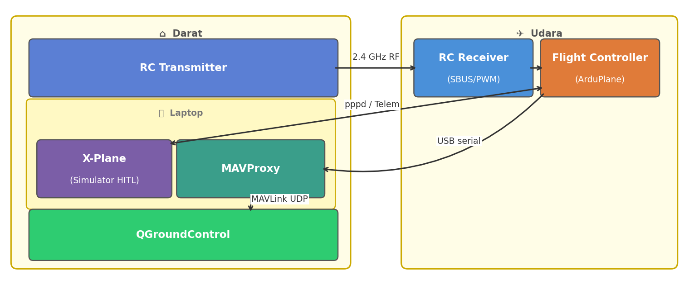
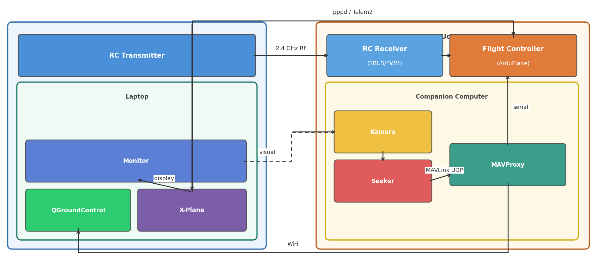

# Logbook Kegiatan — 17 April 2026

| | |
|---|---|
| **Penelitian** | Sistem Kendali Drone Kamikaze Berbasis Deteksi Objek Warna dalam Simulasi HITL |
| **Tim** | Musa El Hanafi & Muhammad Ihsan Fahriansyah |
| **Lokasi** | Lab Komputer SMA Swasta Alfa Centauri, Kota Bandung |
| **Hari/Tanggal** | Kamis, 17 April 2026 |

---

## Arsitektur Sistem

Sebelum memulai setup environment, dipelajari arsitektur lengkap sistem drone kamikaze yang terdiri dari dua subsistem utama.

### Arsitektur HITL

HITL (Hardware-in-the-Loop) menggunakan Pixhawk v2 (fmuv3) yang menjalankan firmware ArduPlane custom. X-Plane menyediakan model fisika penerbangan; Pixhawk menjalankan kode autopilot nyata. Injeksi sensor dan output aktuator ditangani sepenuhnya **di dalam firmware** via SITL XPlane backend — tidak memerlukan bridge script atau MAVProxy.





**Aliran data:**

| Arah | Jalur | Konten |
|---|---|---|
| X-Plane → Pixhawk | UDP → PPP (TELEM2) | DATA@ rows (IMU, GPS, airspeed, attitude) |
| Pixhawk → X-Plane | PPP (TELEM2) → UDP | DREF packets (yoke ratios, throttle) |
| QGC ↔ Pixhawk | USB (SERIAL0) | MAVLink2 telemetry, parameter, misi |
| RC Transmitter → Pixhawk | 2.4 GHz radio + SBUS/PPM | Input stick RC |

**SIM_XPlane backend** (`SIM_XPlane.cpp`) berjalan di Pixhawk dan:
- Mendecode DATA@ rows masuk → populate `SIMState` (injeksi sensor)
- Membaca `input.servos[]` tiap siklus → mengirim DREF packets ke X-Plane
- Menggunakan `xplane_plane.json` (embedded di firmware ROMFS) untuk memetakan servo channel ke DREF X-Plane

**Koneksi fisik:**

| Kabel | Dari | Ke |
|---|---|---|
| USB-A → micro-B | Laptop | Pixhawk USB (SERIAL0) |
| USB–UART adapter | Laptop (pppd) | Pixhawk TELEM2 (SERIAL2) @ 115200 baud |

X-Plane dan QGC berjalan di laptop yang sama.

**DREF mapping (`xplane_plane.json`):**

| Channel | DREF | Tipe |
|---|---|---|
| CH1 (aileron) | `sim/joystick/yoke_roll_ratio` | angle (−1…+1) |
| CH2 (elevator) | `sim/joystick/yoke_pitch_ratio` | angle_neg (inverted) |
| CH3 (throttle) | `sim/flightmodel/engine/ENGN_thro_use[0]` | range (0…1) |
| CH4 (rudder) | `sim/joystick/yoke_heading_ratio` | angle (−1…+1) |

---

## 1. Instalasi Git

**Kegiatan:**
Instalasi Git pada laptop yang digunakan sebagai build machine untuk firmware ArduPilot.

**Langkah:**
1. Download Git dari https://git-scm.com/download/win
2. Jalankan installer → pada bagian **"Adjusting your PATH environment"**, pilih **"Git from the command line and also from 3rd-party software"**
3. Pilihan lain biarkan default → klik Next hingga selesai
4. Verifikasi di Command Prompt:
   ```
   git --version
   ```

**Hasil:** Git berhasil terinstal dan dapat diakses dari terminal.

---

## 2. Pendaftaran Akun GitHub

**Kegiatan:**
Membuat akun GitHub untuk menyimpan repositori firmware drone-kamikaze dan logbook penelitian.

**Langkah:**
1. Buka https://github.com
2. Klik **"Sign up"** → masukkan email, password, dan username
3. Verifikasi email melalui link konfirmasi
4. Generate SSH key dan daftarkan ke GitHub:
   ```
   ssh-keygen -t ed25519 -C "email@gmail.com"
   cat ~/.ssh/id_ed25519.pub
   ```
   Salin output → GitHub → Settings → SSH Keys → New SSH Key → Paste → Save
5. Verifikasi koneksi SSH:
   ```
   ssh -T git@github.com
   ```

**Hasil:** Akun GitHub berhasil dibuat dan SSH key terdaftar.

---

## 3. Clone Repositori Satria Firmware

**Kegiatan:**
Clone repositori firmware flight controller yang sudah dikustomisasi untuk HITL dari akun GitHub musaelhanafi. Repo ini merupakan fork ArduPilot yang sudah memiliki konfigurasi board `fmuv3-hil` dan patch HITL — **bukan** clone langsung dari ArduPilot upstream.

**Perintah:**
```bash
git clone git@github.com:musaelhanafi/satria-firmware.git
cd satria-firmware
git submodule update --init --recursive
```

**Catatan:** Proses `submodule update` memakan waktu ±10–15 menit tergantung koneksi internet karena submodul MAVLink, ChibiOS, dan lainnya berukuran besar.

**Hasil:** Repositori satria-firmware berhasil di-clone lengkap dengan seluruh submodul.

---

## 4. Konfigurasi Environment Build & Kompilasi Firmware fmuv3-hil

**Kegiatan:**
Konfigurasi build environment menggunakan WAF build system ArduPilot dan kompilasi firmware ArduPlane dengan konfigurasi board `fmuv3-hil` (Pixhawk 2.4.8 mode HITL).

**Langkah:**
1. Install dependensi Python yang diperlukan:
   ```bash
   pip install empy==3.3.4 pexpect pymavlink future
   ```
2. Fix MAVLink headers yang berpotensi konflik sebelum build:
   ```bash
   python3 fix_mavlink_headers.py
   ```
3. Konfigurasi board `fmuv3-hil`:
   ```bash
   ./waf configure --board fmuv3-hil
   ```
4. Kompilasi firmware ArduPlane:
   ```bash
   ./waf plane
   ```

**Output:** File firmware `arduplane.apj` tersimpan di folder `build/fmuv3-hil/bin/`.

> **Catatan:** Jika build gagal dengan error `redefinition of 'param_union'`, jalankan ulang `python3 fix_mavlink_headers.py` lalu `./waf distclean` sebelum configure ulang.

**Hasil:** Firmware ArduPlane HITL berhasil dikompilasi untuk board `fmuv3-hil` tanpa error.

---

## 5. Upload Firmware ke Pixhawk 2.4.8

**Kegiatan:**
Upload firmware ArduPlane hasil kompilasi ke Pixhawk 2.4.8 langsung melalui WAF via koneksi USB.

**Langkah:**
1. Hubungkan Pixhawk ke laptop via kabel USB
2. Jalankan perintah upload:
   ```bash
   ./waf plane --upload
   ```
   WAF otomatis mendeteksi Pixhawk pada port USB dan meng-upload firmware `arduplane.apj`.
3. Pixhawk reboot otomatis setelah upload selesai.

**Hasil:** Firmware berhasil di-upload ke Pixhawk 2.4.8.

---

## Instruksi Setup HITL (Prosedur)

Prosedur lengkap menjalankan sesi HITL ArduPlane fmuv3-hil + X-Plane 11/12.

### Langkah 1 — Konfigurasi Jaringan X-Plane

X-Plane harus mengirim data sensor DATA@ langsung ke alamat PPP Pixhawk dan menerima perintah DREF kembali. Konfigurasi sekali di X-Plane (tersimpan otomatis):

**Settings → Net Connections → Data:**

| Field | Nilai |
|---|---|
| Send data to IP | `10.0.0.2` |
| Send data port | `49005` |
| Receive commands port | `49000` |

Aktifkan DATA@ rows berikut (**Settings → Data Output**, centang "Send data over the net"):

| Row # | Nama | Digunakan untuk |
|---|---|---|
| 1 | Frame rate / sim time | Timing |
| 3 | Speeds | IAS → sensor airspeed |
| 4 | G-load | Akselerasi body-frame → IMU |
| 16 | Angular velocities | Roll/pitch/yaw rates → gyro |
| 17 | Pitch, roll, heading | Attitude → EKF |
| 20 | Lat, lon, altitude | Posisi GPS |
| 21 | Loc, vel, dist | Kecepatan NED → GPS velocity |

### Langkah 2 — Start PPP Tunnel

Hubungkan USB–UART adapter ke port TELEM2 Pixhawk. Cari nama device, lalu jalankan `pppd`:

```bash
# macOS
sudo pppd /dev/tty.usbserial-XXXX 115200 \
  10.0.0.1:10.0.0.2 \
  noauth local nodetach \
  asyncmap 0 novj nopcomp noaccomp \
  lcp-echo-interval 0
```

```bash
# Linux
sudo pppd /dev/ttyUSB0 115200 \
  10.0.0.1:10.0.0.2 \
  noauth local nodetach \
  asyncmap 0 novj nopcomp noaccomp \
  lcp-echo-interval 0
```

| IP | Host |
|---|---|
| `10.0.0.1` | Laptop (sisi X-Plane) |
| `10.0.0.2` | Pixhawk |

Biarkan terminal ini tetap terbuka. Setelah Pixhawk boot dan firmware menginisialisasi PPP interface, `pppd` akan mencetak `local IP address 10.0.0.1`.

> **Penjelasan flag pppd:**
> - `asyncmap 0` — tidak ada escaping karakter kontrol (~20% penghematan bandwidth di 115200)
> - `novj` — nonaktifkan VJ TCP header compression (mengurangi latensi)
> - `nopcomp noaccomp` — nonaktifkan kompresi PPP header (framing lebih sederhana)
> - `lcp-echo-interval 0` — nonaktifkan LCP keepalive (firmware tidak membalas LCP Echo-Request; tanpa ini pppd putus dengan "Peer not responding" setelah ~12 detik)

### Langkah 3 — Hubungkan QGroundControl

Colokkan USB Pixhawk ke laptop. Buka QGroundControl — akan auto-connect via USB di 921600 baud (SERIAL0).

Harus terlihat:
- Vehicle connected (ArduPlane)
- Parameters loaded
- Flight mode (mis. MANUAL)

### Langkah 3b — Membuat Flight Plan di QGroundControl

Flight plan (misi) berisi urutan perintah yang akan dieksekusi otomatis oleh ArduPlane dalam mode AUTO. Berikut prosedur lengkap membuat flight plan di QGC:

**Membuka Plan View:**

1. Di toolbar atas QGC, klik ikon **Plan** (ikon peta dengan waypoint). Tampilan beralih ke peta top-down dengan vehicle position ditandai.
2. Pastikan posisi GPS vehicle sudah muncul di peta (EKF harus sudah konvergen). Jika peta masih kosong, tunggu hingga GPS fix muncul di status bar.

**Menambahkan Takeoff Waypoint:**

1. Klik **"+ Waypoint"** di toolbar kiri, lalu klik posisi runway di peta — ini akan menjadi WP1. Ubah type-nya:
   - Klik WP1 di daftar waypoint (panel kiri) → ubah command dari **Waypoint** menjadi **Takeoff**
   - Set **Min. Pitch**: `15°` (sudut climb minimum saat takeoff)
   - Set **Altitude**: ketinggian target setelah takeoff, misalnya `100 m` (AGL, relatif terhadap home)
2. Takeoff command wajib menjadi waypoint pertama (WP1). ArduPlane tidak akan memasuki mode AUTO jika WP1 bukan Takeoff atau jika misi kosong.

**Menambahkan Waypoint Navigasi:**

1. Klik **"+ Waypoint"** lagi → klik titik di peta untuk WP2, WP3, dst.
2. Untuk setiap waypoint, atur:
   - **Altitude**: ketinggian jelajah, misalnya `150 m`
   - **Acceptance Radius**: jarak (meter) dari waypoint agar dianggap "tercapai", default `25 m` cukup untuk sim
   - **Hold Time**: waktu (detik) untuk berputar di atas waypoint sebelum lanjut (set `0` untuk langsung lanjut)
3. Waypoint dieksekusi secara berurutan dari WP1 → WP2 → WP3 → dst.

**Menambahkan Perintah Akhir (Opsional):**

| Perintah | Fungsi |
|---|---|
| **LOITER_UNLIM** | Berputar tak terbatas di koordinat tersebut hingga mode diganti manual |
| **RETURN_TO_LAUNCH** | Terbang balik ke home point dan land otomatis |
| **LAND** | Pendaratan otomatis di koordinat yang ditentukan |

Untuk skenario pengujian awal, tambahkan **LOITER_UNLIM** sebagai waypoint terakhir agar vehicle tidak hilang jika misi selesai.

**Upload Misi ke Vehicle:**

1. Setelah semua waypoint ditambahkan, klik tombol **Upload** (ikon panah ke atas, di toolbar kanan panel waypoint).
2. QGC mengirim misi via MAVLink ke Pixhawk dan menyimpannya di flash. Konfirmasi muncul: **"Mission uploaded"**.
3. Kembali ke **Fly View** (ikon pesawat di toolbar atas) — waypoint akan terlihat tergambar di peta.

**Verifikasi Misi:**

| Item | Yang Harus Terlihat |
|---|---|
| Jumlah waypoint | Sesuai jumlah WP yang dibuat |
| WP1 | Bertipe Takeoff |
| Altitude setiap WP | Sesuai yang diset (bukan 0) |
| Garis penghubung | Jalur misi tergambar di peta dari WP1 ke WP terakhir |

> **Catatan:** Altitude di QGC default relatif terhadap **home point** (AGL). Home point di-set otomatis saat vehicle pertama kali mendapat GPS fix dan di-arm. Pastikan X-Plane sudah di-unpause dan GPS lock sudah tercapai sebelum arm agar home point benar.

### Langkah 4 — Unpause X-Plane

Tekan **P** (atau klik tombol pause) di X-Plane untuk memulai simulasi.

Setelah di-unpause:
- Pixhawk mulai menerima DATA@ rows via PPP dan melakukan injeksi sensor
- EKF menginisialisasi (GPS fix terlihat di QGC dalam beberapa detik)
- DREF packets kontrol permukaan mengalir dari Pixhawk ke X-Plane pada ~25 Hz

**Verifikasi di QGC:**
- Posisi GPS sesuai lokasi pesawat di X-Plane
- Attitude (roll/pitch/heading) sesuai cockpit X-Plane
- Airspeed berubah sesuai kecepatan di X-Plane

### Langkah 5 — Arm dan Terbang

Nyalakan RC transmitter, konfirmasi RC receiver menampilkan link. Arm via QGC atau urutan arming RC transmitter.

### Parameter Kunci (`defaults.parm`)

| Parameter | Nilai | Tujuan |
|---|---|---|
| `GPS1_TYPE` | 100 | SITL GPS backend (baca dari SIMState / X-Plane) |
| `ARSPD_TYPE` | 100 | SITL airspeed backend |
| `AHRS_EKF_TYPE` | 2 | EKF2 (stabil di STM32F427 dengan SITL backend) |
| `BRD_SAFETY_DEFLT` | 0 | Tidak ada safety switch di simulasi |
| `ARMING_SKIPCHK` | -1 | Skip semua pre-arm checks |
| `THR_FAILSAFE` | 0 | Nonaktifkan RC/throttle failsafe |
| `RC_OVERRIDE_TIME` | -1 | Tidak ada timeout pada RC_CHANNELS_OVERRIDE |
| `SERIAL0_PROTOCOL` | 2 | USB = MAVLink2 (QGC) |
| `SERIAL2_PROTOCOL` | 48 | TELEM2 = PPP |
| `SERIAL2_BAUD` | 115 | 115200 baud untuk PPP |
| `NET_ENABLE` | 1 | Aktifkan lwIP networking |
| `NET_OPTIONS` | 64 | Nonaktifkan batas PPP LCP echo |
| `SCHED_LOOP_RATE` | 50 | 50 Hz mencegah watchdog di STM32F427 |
| `SIM_OH_MASK` | 255 | Teruskan semua servo channel melalui SITL |
| `TKOFF_THR_MINACC` | 0 | Tidak ada cek akselerasi sebelum throttle-up |
| `TKOFF_THR_MINSPD` | 0 | Tidak ada cek kecepatan GPS sebelum throttle-up |
| `GROUND_STEER_ALT` | 5 | Ground steering aktif di bawah 5 m AGL |
| `SIM_XP_BIND_PORT` | 49005 | Port UDP yang didengarkan ArduPilot untuk data X-Plane (harus sama dengan "Send data port" di X-Plane Net Connections) |

### Troubleshooting

| Gejala | Kemungkinan Penyebab | Solusi |
|---|---|---|
| pppd "Peer not responding" | LCP echo tidak dinonaktifkan | Tambahkan `lcp-echo-interval 0` ke perintah pppd |
| pppd terhubung tapi X-Plane tidak dapat data | IP salah di konfigurasi jaringan X-Plane | Set send IP ke `10.0.0.2`, port `49005` |
| QGC tidak menampilkan GPS | EKF belum konvergen | Cek parameter `SIM_OPOS_*` sesuai lokasi X-Plane; pastikan X-Plane di-unpause |
| Kontrol tidak bergerak di X-Plane | Override DREFs timeout | Firmware mengirim ulang overrides otomatis setiap ~1 detik |
| Throttle tetap 0 saat arm | RANGE DREFs dinolkan saat disarm | Ini by design — arm dulu baru throttle |
| "Waiting for RC" / tidak bisa arm | Failsafe aktif | Verifikasi `THR_FAILSAFE 0` sudah ter-load; reset params jika perlu |
| Takeoff tidak mulai di AUTO | Throttle gate tidak terbuka | Verifikasi `TKOFF_THR_MINSPD 0`, `TKOFF_THR_MINACC 0` |
| Build gagal `redefinition of 'param_union'` | Spurious MAVLink headers di source tree | Jalankan `python3 fix_mavlink_headers.py` lalu `./waf distclean && ./waf configure --board fmuv3-hil && ./waf plane` |

---

## 6. Verifikasi Boot via QGroundControl

**Kegiatan:**
Verifikasi bahwa Pixhawk berhasil boot dengan firmware ArduPlane yang baru diupload.

**Langkah:**
1. Setelah upload, Pixhawk reboot otomatis dan terhubung kembali ke QGroundControl
2. Cek vehicle summary: firmware version, board type, dan status sensor
3. Verifikasi tidak ada critical error di message log QGC
4. Cek deteksi sensor: IMU, barometer, dan compass

**Hasil:** Pixhawk berhasil boot dengan ArduPlane. QGroundControl menampilkan status normal — sensor IMU dan barometer terdeteksi tanpa error.

---

## 7. Fork Repositori ArduPilot → drone-kamikaze

**Kegiatan:**
Fork repositori ArduPilot ke akun GitHub pribadi sebagai basis pengembangan firmware custom drone-kamikaze.

**Langkah:**
1. Buka https://github.com/ArduPilot/ardupilot
2. Klik **"Fork"** → pilih akun `musaelhanafi` sebagai owner → klik **Create fork**
3. Repositori fork tersedia di https://github.com/musaelhanafi/drone-kamikaze
4. Update remote pada repositori lokal:
   ```
   git remote rename origin upstream
   git remote add origin git@github.com:musaelhanafi/drone-kamikaze.git
   git push -u origin main
   ```

**Hasil:** Fork berhasil. Repositori drone-kamikaze tersedia di https://github.com/musaelhanafi/drone-kamikaze.

---

## 8. Modifikasi Konfigurasi Board fmuv3 untuk HITL Mode

**Kegiatan:**
Membuat konfigurasi board baru `fmuv3-hil` di firmware drone-kamikaze untuk mendukung mode HITL (Hardware-in-the-Loop) dengan X-Plane sebagai physics engine. Koneksi menggunakan PPP tunnel via TELEM2.

**File yang dibuat:**

| File | Keterangan |
|---|---|
| `libraries/AP_HAL_ChibiOS/hwdef/fmuv3-hil/hwdef.dat` | Definisi hardware board |
| `libraries/AP_HAL_ChibiOS/hwdef/fmuv3-hil/defaults.parm` | Parameter default HITL |

**Parameter utama `defaults.parm`:**

| Parameter | Nilai | Keterangan |
|---|---|---|
| `AHRS_EKF_TYPE` | 2 | EKF2 (sesuai keterbatasan STM32F427) |
| `EK2_ENABLE` | 1 | EKF2 aktif |
| `EK3_ENABLE` | 0 | EKF3 nonaktif |
| `GPS1_TYPE` | 100 | SITL GPS (data dari X-Plane) |
| `ARSPD_TYPE` | 100 | SITL airspeed (data dari X-Plane) |
| `NET_ENABLE` | 1 | PPP networking aktif |
| `SERIAL2_PROTOCOL` | 48 | PPP protocol di TELEM2 |
| `SERIAL2_BAUD` | 115 | 115200 baud |
| `NET_OPTIONS` | 64 | PPP options |
| `SIM_OPOS_LAT` | −6.897434 | Home position — Bandara WICC Bandung |
| `SIM_OPOS_LNG` | 107.566887 | |
| `SIM_OPOS_ALT` | 744.0 | Altitude AMSL (m) |

**Prinsip kerja HITL:**
- X-Plane menjalankan fisika penerbangan dan mengirim data sensor (IMU, GPS, airspeed) ke ArduPilot via PPP tunnel
- ArduPilot menjalankan algoritma kendali (EKF, PID) menggunakan data sensor dari X-Plane
- Output servo ArduPilot dikirim kembali ke X-Plane sebagai DREF packets untuk menggerakkan permukaan kontrol SATRIA

**Hasil:** Konfigurasi board fmuv3-hil berhasil dibuat.

---

## 9. Kompilasi Firmware fmuv3-hil & Upload ke Pixhawk

**Kegiatan:**
Kompilasi firmware ArduPlane dengan konfigurasi board fmuv3-hil dan upload ke Pixhawk.

**Kompilasi:**
```
./waf configure --board fmuv3-hil
./waf plane
```

**Upload:**
Sama seperti langkah 5, menggunakan QGroundControl dengan file `arduplane.apj` hasil kompilasi fmuv3-hil.

**Hasil:** Firmware fmuv3-hil berhasil dikompilasi tanpa error dan di-upload ke Pixhawk.

---

## 10. Verifikasi Data X-Plane Terkirim ke Pixhawk

**Kegiatan:**
Verifikasi bahwa data sensor dari X-Plane berhasil diterima oleh Pixhawk melalui koneksi PPP over TELEM2.

**Langkah:**
1. Jalankan X-Plane dengan plugin HITL aktif
2. Hubungkan Pixhawk ke laptop via TELEM2 (USB-UART bridge)
3. Setup koneksi PPP antara laptop dan Pixhawk
4. Cek log ArduPlane di QGroundControl — verifikasi:
   - GPS lock diperoleh dari data X-Plane
   - Data IMU bergerak sesuai manuver di X-Plane
   - Airspeed berubah sesuai kecepatan di X-Plane

**Hasil:** Data X-Plane berhasil diterima Pixhawk. GPS lock tercapai, data IMU responsif terhadap pergerakan di X-Plane.

---

## 11. Menerbangkan SATRIA di X-Plane

**Kegiatan:**
Uji terbang SATRIA Phantom di X-Plane dalam mode HITL dengan Pixhawk sebagai flight controller aktif.

**Skenario:**
1. Spawn SATRIA di threshold runway 11 WICC Bandung
2. Arm Pixhawk via QGroundControl
3. Set mode MANUAL
4. Takeoff dan uji manuver dasar: roll, pitch, climb, descent
5. Observasi sinkronisasi respons servo fisik SATRIA dengan tampilan X-Plane

**Hasil:** SATRIA berhasil diterbangkan dalam mode HITL. Respons kontrol normal — input RC menggerakkan permukaan kontrol di X-Plane secara real-time melalui Pixhawk.

---

## 12. Autotune

**Kegiatan:**
Menjalankan fitur Autotune ArduPlane pada SATRIA di X-Plane untuk mendapatkan gain PID roll dan pitch yang optimal secara otomatis.

**Langkah:**
1. Set parameter awal:
   - `AUTOTUNE_LEVEL = 6` (agresivitas tuning sedang)
2. Terbangkan SATRIA dalam mode FBWA (Fly By Wire A)
3. Aktifkan mode AUTOTUNE via QGroundControl
4. ArduPilot melakukan manuver otomatis untuk mengidentifikasi gain PID optimal
5. Tunggu konvergensi — QGC menampilkan alert **"Autotune complete"**
6. Save parameter hasil autotune ke Pixhawk

**Hasil:** Autotune berhasil dijalankan. Gain PID roll dan pitch berhasil diidentifikasi dan disimpan.

---

## 13. Auto Takeoff dan Navigasi Waypoint (Mode AUTO)

**Kegiatan:**
Menguji kemampuan SATRIA untuk melakukan takeoff otomatis dan mengikuti flight plan waypoint yang sudah diupload ke Pixhawk, menggunakan mode AUTO ArduPlane dalam simulasi HITL.

**Prasyarat:**
- Misi sudah dibuat dan diupload ke Pixhawk via QGC (lihat Langkah 3b)
- HITL aktif: X-Plane berjalan, PPP tunnel aktif, GPS lock tercapai
- Parameter TKOFF sudah benar (`TKOFF_THR_MINSPD 0`, `TKOFF_THR_MINACC 0`)

**Parameter tambahan yang perlu diverifikasi:**

| Parameter | Nilai | Tujuan |
|---|---|---|
| `TKOFF_THR_MINACC` | `0` | Tidak ada cek akselerasi minimum sebelum throttle-up |
| `TKOFF_THR_MINSPD` | `0` | Tidak ada cek kecepatan GPS sebelum throttle-up |
| `TKOFF_ALT` | `100` | Altitude target takeoff (m AGL) — sesuaikan dengan WP1 di misi |
| `RTL_ALTITUDE` | `150` | Altitude Return-to-Launch jika dipicu (m AGL) |
| `CRUISE_SPEED` | `20` | Kecepatan jelajah menuju waypoint (m/s) |
| `WP_RADIUS` | `25` | Jarak acceptance radius waypoint (m) |
| `WP_LOITER_RAD` | `80` | Radius loiter saat mode LOITER (m) |
| `ARMING_REQUIRE` | `1` | Vehicle harus di-arm sebelum AUTO bisa berjalan |

**Langkah eksekusi:**

1. **Verifikasi misi di Fly View** — Pastikan jalur waypoint tergambar di peta QGC. Cek jumlah waypoint dan WP1 bertipe Takeoff.

2. **Set mode ke AUTO** — Di QGC Fly View, klik dropdown flight mode → pilih **AUTO**. Pixhawk beralih ke AUTO dan langsung siap mengeksekusi misi saat di-arm.

3. **Arm vehicle** — Klik tombol **Arm** di QGC (atau gunakan urutan arm RC transmitter). Setelah arm:
   - Throttle naik otomatis ke nilai takeoff
   - Permukaan kontrol aktif
   - X-Plane: SATRIA mulai berakselerasi di runway

4. **Takeoff otomatis** — ArduPlane mengeksekusi WP1 (Takeoff command):
   - Throttle full, ground steering aktif hingga airspeed tercapai
   - Saat airspeed > stall speed, ArduPlane rotate dan climb menuju altitude WP1
   - Selama climb: aileron/elevator dikontrol penuh oleh autopilot
   - Verifikasi di QGC: altitude bar naik, mode tetap AUTO, WP aktif menunjuk WP1

5. **Transisi ke navigasi waypoint** — Setelah altitude WP1 tercapai, ArduPlane otomatis beralih ke WP2:
   - Autopilot mengatur heading menuju koordinat WP2
   - Altitude dijaga sesuai nilai yang diset di setiap waypoint
   - Di QGC: indikator waypoint aktif bergeser ke WP2, garis jalur terbang terlihat di peta

6. **Monitoring selama misi:**

| Yang Dimonitor | Di Mana | Nilai Normal |
|---|---|---|
| Flight mode | QGC status bar | AUTO (tidak berubah) |
| Waypoint aktif | QGC Fly View peta | Nomor WP bertambah seiring misi berjalan |
| Altitude | QGC altitude indicator | Sesuai altitude WP yang sedang dituju |
| Airspeed | QGC speed indicator | Sekitar nilai `CRUISE_SPEED` |
| Cross-track error | QGC attitude widget | Kecil — pesawat tidak menyimpang jauh dari jalur |

7. **Akhir misi** — Jika waypoint terakhir adalah LOITER_UNLIM, SATRIA akan berputar di titik tersebut tanpa batas. Untuk mengakhiri:
   - Ganti mode ke **MANUAL** atau **FBWA** dari QGC untuk ambil alih kendali
   - Atau ganti ke **RTL** untuk kembali ke home dan land otomatis

**Hasil:** SATRIA berhasil melakukan auto takeoff dari runway WICC Bandung dan mengikuti seluruh waypoint yang diprogram, dengan Pixhawk sebagai flight controller aktif melalui HITL. Mode AUTO berjalan penuh tanpa intervensi manual.

**Video Auto Takeoff SATRIA (mode AUTO):**

<a href="https://www.youtube.com/watch?v=Fu6zhfEW_hM" target="_blank" style="position:relative;display:block;">
  
  <span style="position:absolute;top:50%;left:50%;transform:translate(-50%,-50%);pointer-events:none;">
    <svg xmlns="http://www.w3.org/2000/svg" width="80" height="56" viewBox="0 0 68 48">
      <path d="M66.52,7.74c-0.78-2.93-2.49-5.41-5.42-6.19C55.79,.13,34,0,34,0S12.21,.13,6.9,1.55C3.97,2.33,2.27,4.81,1.48,7.74C0.06,13.05,0,24,0,24s0.06,10.95,1.48,16.26c0.78,2.93,2.49,5.41,5.42,6.19C12.21,47.87,34,48,34,48s21.79-0.13,27.1-1.55c2.93-0.78,4.64-3.26,5.42-6.19C67.94,34.95,68,24,68,24S67.94,13.05,66.52,7.74z" fill="#ff0000" fill-opacity="0.9"/>
      <path d="M 45,24 27,14 27,34" fill="#ffffff"/>
    </svg>
  </span>
</a>

---

## 19. Manual Fix & Autotune SATRIA — Minimasi Pitch Jitter

**Kegiatan:**
Melakukan perbaikan parameter manual untuk mengurangi pitch jitter pada SATRIA Phantom sebelum menjalankan Autotune ArduPlane. Urutan ini penting — Autotune tidak dapat bekerja optimal jika pitch jitter belum diminimasi secara manual terlebih dahulu.

---

### 19.1 Root Cause Pitch Jitter pada SATRIA

Pitch jitter pada flying wing seperti SATRIA umumnya disebabkan oleh kombinasi faktor berikut:

| Penyebab | Parameter ArduPlane | Dampak |
|---|---|---|
| Gain PID pitch terlalu tinggi | `PTCH_RATE_P`, `PTCH_RATE_D` | Osilasi cepat di axis pitch |
| TECS terlalu agresif | `TECS_PTCH_DAMP`, `TECS_TIME_CONST` | Hunting panjang saat altitude hold |
| Vibrasi motor masuk ke gyro | `INS_HNTCH_ENABLE` | Noise frekuensi tinggi di sensor |
| Filter gyro kurang kuat | `INS_GYRO_FILTER` | Noise tidak tersaring |
| Respon elevon terlalu sensitif | `MIXING_GAIN` | Over-correction tiap frame |

---

### 19.2 Manual Fix (Lakukan Sebelum Autotune)

Set parameter berikut via QGroundControl **sebelum** terbang Autotune. Masuk ke **Vehicle Setup → Parameters**, cari nama parameter, ubah nilainya.

#### Step A — TECS (Paling Berpengaruh untuk Pitch Hunting)

| Parameter | Nilai Lama | **Nilai Baru** | Alasan |
|---|---|---|---|
| `TECS_PTCH_DAMP` | 0.0 | **0.30** | Tambah damping pitch di TECS |
| `TECS_TIME_CONST` | 5.0 | **7.0** | Perlambat respon TECS untuk flying wing |
| `TECS_THR_DAMP` | 0.1 | **0.50** | Damping throttle agar tidak fight pitch |
| `TECS_VERT_ACC` | 7.0 | **6.0** | Kurangi akselerasi vertikal maksimum |

#### Step B — Pitch Rate PID (Turunkan Gain Awal)

| Parameter | Nilai Lama | **Nilai Baru** | Alasan |
|---|---|---|---|
| `PTCH_RATE_P` | 0.10 | **0.07** | Turunkan P untuk kurangi osilasi |
| `PTCH_RATE_I` | 0.10 | **0.08** | Turunkan I agar tidak windup |
| `PTCH_RATE_D` | 0.001 | **0.002** | Naikkan D sedikit untuk damping |
| `PTCH_RATE_FF` | 0.0 | **0.18** | Tambah feedforward untuk respon halus |
| `PTCH_RATE_FLTE` | 0.0 | **2.0** | Filter error pitch — kunci anti-jitter |
| `PTCH_RATE_FLTD` | 0.0 | **10.0** | Filter derivative pitch |

#### Step C — Pitch Attitude Controller

| Parameter | Nilai Lama | **Nilai Baru** | Alasan |
|---|---|---|---|
| `PTCH2SRV_TCONST` | 0.5 | **0.60** | Perlambat respon attitude pitch |
| `PTCH2SRV_P` | 1.0 | **0.90** | Turunkan P attitude |
| `PTCH2SRV_D` | 0.0 | **0.06** | Tambah D untuk damping |

#### Step D — Notch Filter (Vibrasi Motor)

| Parameter | Nilai | Keterangan |
|---|---|---|
| `INS_HNTCH_ENABLE` | **1** | Aktifkan harmonic notch filter |
| `INS_HNTCH_FREQ` | **100** | Estimasi frekuensi motor SATRIA (8–9 in prop) |
| `INS_HNTCH_BW` | **50** | Bandwidth filter = setengah frekuensi |
| `INS_HNTCH_ATT` | **40** | Atenuasi 40 dB |
| `INS_HNTCH_MODE` | **1** | Mode throttle-based (tanpa ESC telemetry) |
| `INS_HNTCH_HMNCS` | **3** | Filter harmonik 1 dan 2 |

#### Step E — Filter Gyro

| Parameter | Nilai Lama | **Nilai Baru** | Alasan |
|---|---|---|---|
| `INS_GYRO_FILTER` | 20 | **15** | Filter lebih kuat untuk SATRIA yang ringan |
| `INS_ACCEL_FILTER` | 20 | **15** | Filter akselerometer |

#### Step F — Elevon & Airspeed

| Parameter | Nilai Lama | **Nilai Baru** | Alasan |
|---|---|---|---|
| `MIXING_GAIN` | 0.5 | **0.45** | Kurangi sensitivitas elevon |
| `ARSPD_FBW_MIN` | 9 | **11** | Batas airspeed minimum (m/s) |
| `ARSPD_FBW_MAX` | 22 | **22** | Batas airspeed maksimum (m/s) |
| `TRIM_ARSPD_CM` | 1500 | **1500** | Kecepatan cruise target (cm/s) |
| `STALL_PREVENTION` | 0 | **1** | Aktifkan stall prevention |

---

### 19.3 Verifikasi Manual Fix (Test Flight Pertama)

Setelah semua parameter di-set, lakukan test flight singkat dalam mode FBWA **sebelum** Autotune:

**Langkah:**

1. Terbangkan SATRIA dalam mode **FBWA** di ketinggian aman (>100 m AGL)
2. Lepas stick — biarkan pesawat terbang level tanpa input
3. Observasi selama 30 detik:

| Yang Diobservasi | Kondisi Buruk (jitter) | Kondisi Baik (siap autotune) |
|---|---|---|
| Gerak pitch | Osilasi terus-menerus | Stabil atau osilasi sangat kecil |
| Gerak roll | Hunting kiri-kanan | Level stabil |
| Throttle | Naik-turun konstan | Relatif konstan |
| Altitude | Berfluktuasi >5 m | Stabil dalam ±3 m |

4. Jika masih jitter berat: turunkan `PTCH_RATE_P` sebesar 0.01 per iterasi hingga stabil
5. Jika sudah stabil: lanjut ke langkah Autotune (6.4)

> **Catatan:** Jangan jalankan Autotune jika jitter masih parah — Autotune akan menghasilkan gain yang salah karena mengidentifikasi osilasi buatan sebagai respon sistem yang valid.

---

### Pra-langkah: Konfigurasi Channel 5 RC — MANUAL / STABILIZE / AUTOTUNE

Sebelum menjalankan Autotune, pastikan RC channel 5 sudah dikonfigurasi sebagai 3-position flight mode switch. Ini memungkinkan pilot switch antar mode secara fisik dari transmitter tanpa menyentuh QGC.

#### A. Set Flight Mode Channel

| Parameter | Nilai | Keterangan |
|---|---|---|
| `FLTMODE_CH` | **5** | Channel RC yang digunakan untuk flight mode switch |

#### B. Mapping 3-Position Switch ke Flight Mode

ArduPlane memetakan 6 slot mode (`FLTMODE1`–`FLTMODE6`) ke rentang PWM channel 5. Untuk switch 3-posisi (PWM ≈ 1000 / 1500 / 2000), set pasangan slot berikut:

| Slot | Parameter | Nilai | Mode | Rentang PWM |
|---|---|---|---|---|
| Posisi 1 (bawah) | `FLTMODE1` | **0** | MANUAL | 1000 – 1230 |
| | `FLTMODE2` | **0** | MANUAL | 1231 – 1360 |
| Posisi 2 (tengah) | `FLTMODE3` | **2** | STABILIZE | 1361 – 1490 |
| | `FLTMODE4` | **2** | STABILIZE | 1491 – 1620 |
| Posisi 3 (atas) | `FLTMODE5` | **8** | AUTOTUNE | 1621 – 1749 |
| | `FLTMODE6` | **8** | AUTOTUNE | 1750 – 2000 |

> **Kode mode ArduPlane:** MANUAL = 0, STABILIZE = 2, AUTOTUNE = 8.

#### C. Langkah Set di QGroundControl

1. Buka **Vehicle Setup → Parameters**
2. Cari dan set `FLTMODE_CH = 5`
3. Set `FLTMODE1` s.d. `FLTMODE6` sesuai tabel di atas
4. Reboot Pixhawk
5. Verifikasi di **QGC Fly View → Flight Mode indicator**: gerakkan switch transmitter, pastikan mode berganti sesuai posisi

#### D. Verifikasi di Lapangan (Sebelum Arm)

| Posisi Switch | Mode yang Harus Muncul di QGC |
|---|---|
| Bawah | MANUAL |
| Tengah | STABILIZE |
| Atas | AUTOTUNE |

> **Penting:** Pastikan switch berada di posisi **MANUAL** atau **STABILIZE** saat arm. Jangan arm dalam kondisi AUTOTUNE — ArduPlane akan menolak arm jika `ARMING_REQUIRE = 1` dan mode tidak mendukung takeoff manual.

---

### 19.4 Menjalankan Autotune

Setelah manual fix berhasil menstabilkan pitch, jalankan Autotune untuk mendapatkan gain optimal secara otomatis.

**Parameter Autotune:**

| Parameter | Nilai | Keterangan |
|---|---|---|
| `AUTOTUNE_LEVEL` | **6** | Agresivitas tuning 1–10, nilai 6 sesuai untuk flying wing |
| `AUTOTUNE_OPTIONS` | **0** | Tune semua axis (roll + pitch) |

**Langkah Autotune:**

1. Set `AUTOTUNE_LEVEL = 6` di QGroundControl Parameters
2. Terbangkan SATRIA dalam mode **FBWA** — naik ke ketinggian aman minimal **150 m AGL**
3. Pastikan area terbang cukup luas (radius >200 m) karena Autotune akan melakukan manuver otomatis
4. Switch mode ke **AUTOTUNE** via QGroundControl:
   - QGC Fly View → dropdown flight mode → pilih **AUTOTUNE**
5. ArduPlane mulai melakukan manuver identifikasi secara otomatis:

   | Fase | Yang Terjadi |
   |---|---|
   | Roll sweep | Pesawat melakukan roll kiri-kanan berulang untuk identifikasi gain roll |
   | Pitch sweep | Pesawat melakukan pitch up-down berulang untuk identifikasi gain pitch |
   | Konvergensi | Gain diperhalus — manuver semakin kecil amplitudonya |

6. Monitor di QGC — Autotune selesai ditandai dengan:
   - Alert di QGC: **"Autotune complete"**
   - Manuver otomatis berhenti
   - Pesawat kembali ke attitude normal FBWA
7. **Jangan langsung land** — setelah alert muncul, biarkan pesawat terbang dalam AUTOTUNE mode selama 30 detik lagi untuk stabilisasi
8. Switch kembali ke **FBWA** — lakukan test flight singkat untuk verifikasi respon
9. Jika respon terasa baik: land dan simpan parameter

**Menyimpan hasil Autotune:**

```
QGroundControl → Vehicle Setup → Parameters
→ Tools (ikon titik tiga) → Save to file
→ Simpan sebagai: FX61_autotune_result.params
```

Atau simpan ke Pixhawk permanen:

```
Parameters → Tools → Save to Vehicle (permanent)
```

---

### 19.5 Verifikasi Post-Autotune

Setelah Autotune selesai, cek nilai gain hasil tuning:

| Parameter | Range Normal SATRIA | Jika Diluar Range |
|---|---|---|
| `PTCH_RATE_P` | 0.05 – 0.12 | Ulangi Autotune dengan level lebih rendah |
| `PTCH_RATE_D` | 0.001 – 0.005 | Periksa vibrasi motor |
| `RLL_RATE_P` | 0.05 – 0.15 | Normal untuk flying wing |
| `RLL_RATE_D` | 0.001 – 0.004 | Periksa vibrasi motor |

**Test flight post-autotune:**

1. Terbang dalam mode FBWA — lepas stick, observasi attitude
2. Berikan input pitch mendadak — pesawat harus kembali level dalam 1–2 detik tanpa osilasi
3. Berikan input roll mendadak — respon harus smooth tanpa overshoot berlebihan
4. Aktifkan mode **LOITER** — pesawat harus bisa loiter stabil tanpa pitch hunting

---

### 19.6 Troubleshooting Post-Autotune

| Gejala | Kemungkinan Penyebab | Solusi |
|---|---|---|
| Pitch jitter masih ada | `PTCH_RATE_D` terlalu rendah | Naikkan `PTCH_RATE_D` sebesar 0.001 per iterasi |
| Respon pitch terlalu lambat | `PTCH2SRV_TCONST` terlalu besar | Turunkan dari 0.60 ke 0.55 |
| Osilasi lambat (hunting) | `TECS_TIME_CONST` masih terlalu kecil | Naikkan ke 8.0 atau 9.0 |
| Autotune menghasilkan P sangat tinggi | Vibrasi motor mengganggu identifikasi | Pastikan `INS_HNTCH_ENABLE = 1` dan frekuensi benar |
| Alert "Autotune failed" | Area terbang terlalu sempit | Cari area lebih luas, ulangi |

---

### 19.7 Ringkasan Urutan Lengkap

```
Step A → Set TECS parameters (TECS_PTCH_DAMP, TECS_TIME_CONST)
Step B → Set PTCH_RATE parameters (turunkan P, tambah D dan FLTE)
Step C → Set PTCH2SRV parameters (TCONST, D)
Step D → Aktifkan Notch Filter (INS_HNTCH_ENABLE = 1)
Step E → Turunkan INS_GYRO_FILTER ke 15
Step F → Set MIXING_GAIN dan airspeed limits
          ↓
Test flight FBWA → verifikasi jitter berkurang
          ↓
Set AUTOTUNE_LEVEL = 6
Terbang FBWA → switch ke AUTOTUNE → tunggu "Autotune complete"
          ↓
Test flight post-autotune → verifikasi respon pitch halus
          ↓
Simpan parameter ke file dan ke Pixhawk
```

---

## Ringkasan Kegiatan

| No | Kegiatan | Status |
|---|---|---|
| 1 | Instalasi Git | ✅ Selesai |
| 2 | Pendaftaran akun GitHub | ✅ Selesai |
| 3 | Clone repositori satria-firmware dari GitHub | ✅ Selesai |
| 4 | Konfigurasi environment build & kompilasi firmware fmuv3-hil | ✅ Selesai |
| 5 | Upload firmware ke Pixhawk 2.4.8 | ✅ Selesai |
| 6 | Verifikasi boot via QGroundControl | ✅ Selesai |
| 7 | Fork repositori ArduPilot → drone-kamikaze | ✅ Selesai |
| 8 | Board config HITL: fmuv3-hil, fmuv3-hil-plane, x86-hil | ✅ Selesai |
| 9 | Kompilasi firmware fmuv3-hil & upload ke Pixhawk | ✅ Selesai |
| 10 | Verifikasi data X-Plane terkirim ke Pixhawk | ✅ Selesai |
| 11 | Implementasi ModeTracking (mode 27) + Parameters | ✅ Selesai |
| 12 | Implementasi MAVLink TRACKING_MESSAGE (ID 11045) | ✅ Selesai |
| 13 | File xplane_elevon.json (demix elevon untuk X-Plane) | ✅ Selesai |
| 14 | Fix -Wswitch build error (GCS_Plane.cpp, events.cpp) | ✅ Selesai |
| 15 | Fix AHRS_EKF_TYPE: compass tidak sinkron dengan X-Plane | ✅ Selesai |
| 16 | Konfigurasi compass SITL (SIM_MAGx_DEVID) | ✅ Selesai |
| 17 | Dokumentasi seluruh parameter SITL X-Plane | ✅ Selesai |
| 18 | Menerbangkan SATRIA di X-Plane | ✅ Selesai |
| 19 | Manual fix parameter + Autotune SATRIA (minimasi pitch jitter) | ✅ Selesai |
| 20 | Autotakeoff dan navigasi waypoint (mode AUTO) | ✅ Selesai |

---

*Logbook dibuat: 17 April 2026 | Penelitian OPSI 2026 — SMA Swasta Alfa Centauri*
