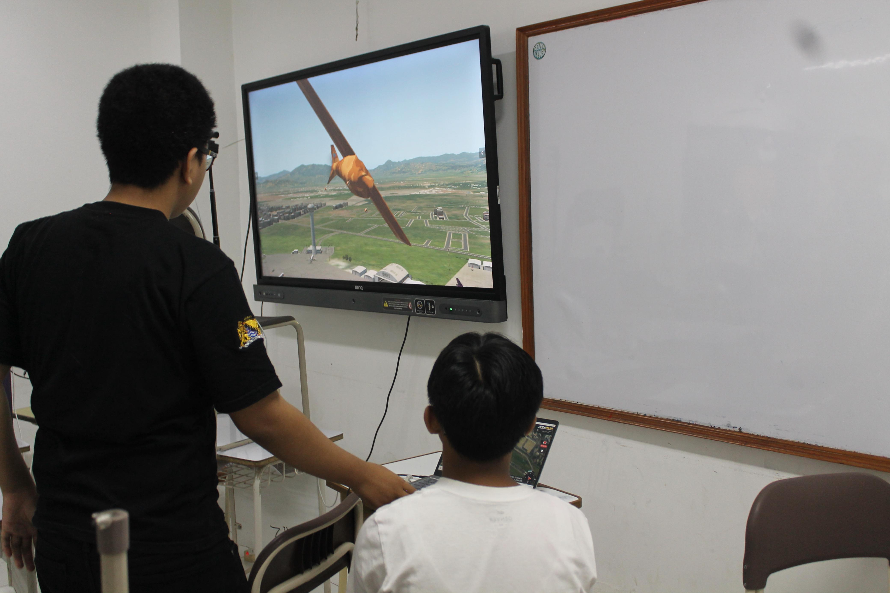
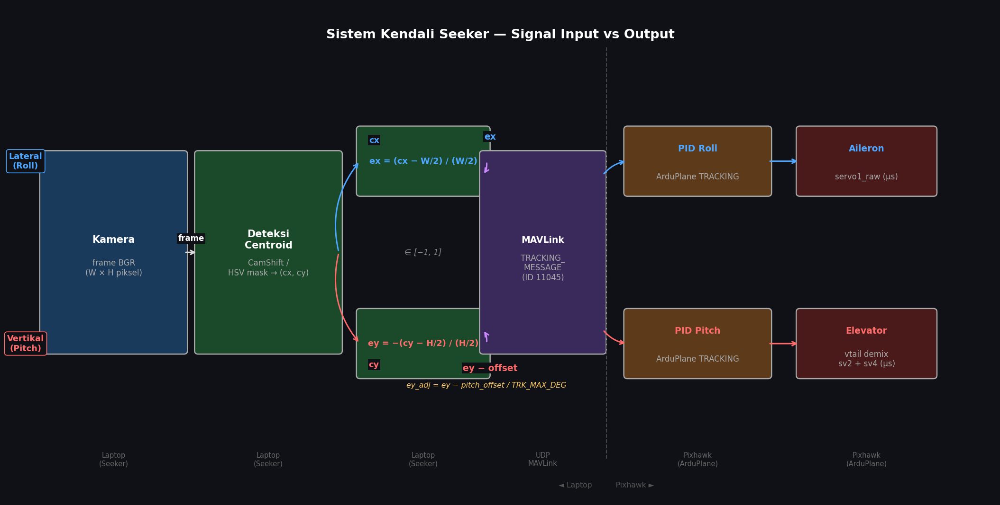
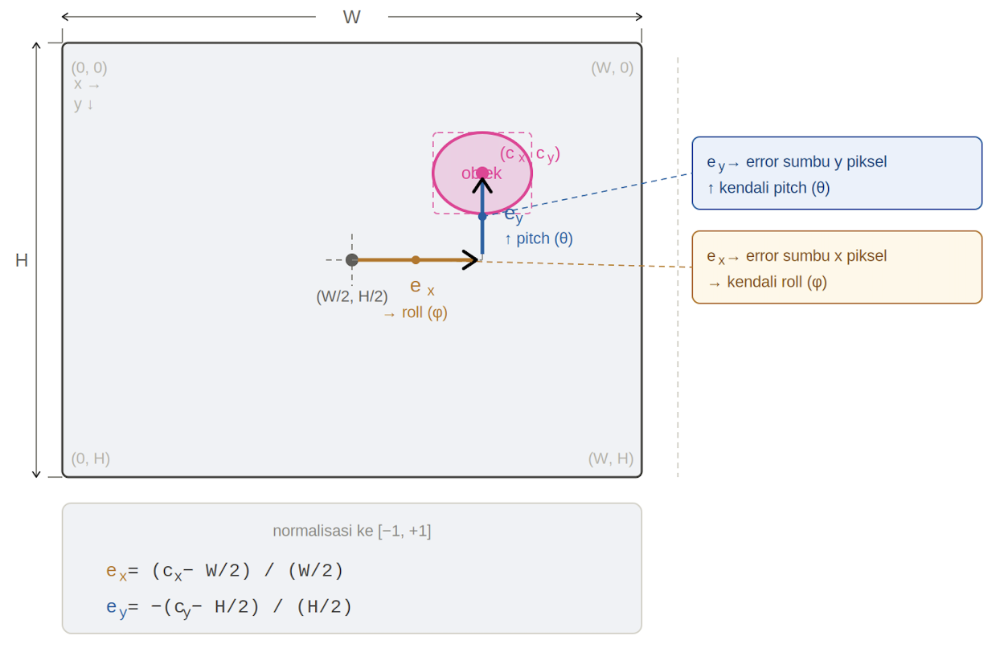

# Logbook Kegiatan — 1 Mei 2026

| | |
|---|---|
| **Penelitian** | Sistem Kendali Drone Kamikaze Berbasis Deteksi Objek Warna dalam Simulasi HITL |
| **Tim** | Musa El Hanafi & Muhammad Ihsan Fahriansyah |
| **Lokasi** | Lab Komputer SMA Swasta Alfa Centauri, Kota Bandung |
| **Hari/Tanggal** | Jumat, 1 Mei 2026 |

---

Kegiatan hari ini berfokus pada dua topik: **tampilan HUD pada jendela imshow** yang membaca data attitude dan posisi dari MAVLink secara real-time, serta **pengujian respon servo** untuk memverifikasi bahwa output aktuator aileron dan elevator bereaksi sesuai terhadap perintah kendali tracking.

---

## 1. Display HUD di imshow dari MAVLink

### Latar Belakang

Saat seeker berjalan, jendela `cv2.imshow` menampilkan feed kamera beranotasi. Agar operator dapat memantau attitude pesawat secara langsung di layar yang sama — tanpa membuka Ground Control Station terpisah — ditambahkan overlay **HUD (Head-Up Display)** yang menampilkan informasi roll, pitch, yaw, dan koordinat GPS.

Data attitude dan posisi dibaca dari pesan MAVLink yang dikirim Pixhawk secara periodik:

| Pesan MAVLink | Field yang digunakan | Keterangan |
|---|---|---|
| `ATTITUDE` | `roll`, `pitch`, `yaw` | Orientasi pesawat dalam radian → dikonversi ke derajat |
| `GLOBAL_POSITION_INT` | `lat`, `lon` | Posisi GPS dalam degE7 → dikonversi ke derajat desimal |

### Implementasi — `hud_display.py`

HUD diimplementasikan dalam class `HudDisplay` dengan tiga komponen visual utama:

```
Frame kamera (annotated)
        │
        ▼
  draw_hud(is_enabled, frame, lat, lon, yaw, pitch, roll)
        │
        ├── draw_center(zero, roll)     → garis vertikal + angka roll
        ├── draw_pitch(zero, pitch)     → pitch ladder (tangga pitch)
        │
        ├── cv2.warpAffine(zero, M)     → rotasi overlay sesuai roll
        ├── cv2.addWeighted(frame, 0.6, zero, 0.4)  → blend ke frame
        │
        └── draw_yaw(frame, lat, lon, yaw) → kompas yaw + koordinat GPS
```

#### Komponen 1 — Pitch Ladder

Pitch ladder ditampilkan di kuadran kanan-tengah frame (`x = 3/4 × lebar`, `y = 1/2 × tinggi`). Setiap garis mewakili interval 5° pitch.

```python
def draw_pitch(self, frame, pitch):
    x = int(3 * frame.shape[1] / 4)
    y = int(frame.shape[0] / 2 - self.offsety)

    pp    = int(pitch / 5.0) * 5      # pitch dibulatkan ke kelipatan 5
    delta = int(pitch - pp)            # sisa untuk animasi geser halus

    for idx in range(7):               # 7 garis, tengah = 0°
        yy = idx - 3
        dd = yy * 5 + pp
        oy = yy * 15 - delta * 3       # offset piksel

        sx    = 50 if dd == 0 else (15 if dd % 10 == 0 else 10)
        color = (0, 0, 255) if dd == 0 else (0, 255, 0)

        cv2.line(frame, (x - sx, y + oy), (x + sx, y + oy), color, thick)
        cv2.putText(frame, deg, (x + 20, y + oy + 5), ...)
```

Garis tengah (0°) berwarna **merah** dan lebih panjang; garis lainnya **hijau**. Ladder bergeser naik/turun mengikuti pitch aktual.

#### Komponen 2 — Roll Indicator

Roll divisualisasikan dengan merotasi seluruh overlay pitch menggunakan `cv2.warpAffine`. Ini memberikan efek pitch ladder yang "miring" sesuai bank angle pesawat.

```python
M = np.float32([
    [cr, -sr, -(xx1 - 3 * cols / 4)],
    [sr,  cr, -(yy1 - rows / 2 + self.offsety)],
])
zero = cv2.warpAffine(zero, M, (cols, rows))
```

Nilai roll yang ditampilkan dicetak di atas elips arc (±60°):
```python
cv2.ellipse(zero, center, axes, 270, -60, 60, (0, 0, 255), 4)
```

#### Komponen 3 — Kompas Yaw

Kompas yaw ditampilkan sebagai **tape horizontal** di bagian bawah frame. Tiap interval 5° diwakili oleh satu tick; tick pusat (yaw aktual) berwarna merah.

```python
def draw_yaw(self, frame, lat, lon, yaw):
    for idx in range(15):
        dd  = (yy * 5 + pp) % 360
        # Ganti angka dengan arah mata angin
        if dd == 0:   deg = "  N "
        if dd == 90:  deg = "  E "
        if dd == 180: deg = "  S "
        if dd == 270: deg = "  W "

        color = (0, 0, 255) if idx == 7 else (0, 255, 0)
        cv2.line(frame, (xx1 + x, y - sx), (xx1 + x, y + sx), color, size)
```

Di bawah kompas, koordinat GPS ditampilkan sebagai teks:
```python
latlon = "Location: %7.5f, %8.5f" % (lat, lon)
cv2.putText(frame, latlon, (x - 120, y + 60), ...)
```

### Integrasi dengan `seekerctrl.py`

`HudDisplay` diinstansiasi di `__init__` dan dipanggil tiap frame setelah anotasi seeker:

```python
# Inisialisasi
self._hud = HudDisplay(show_pitch=hud_pitch, show_yaw=hud_yaw)

# Tiap frame — data diambil dari state MAVLink yang sudah di-poll
self._hud.draw_hud(True, annotated,
                   self._lat, self._lon,
                   self._yaw_deg, self._pitch_deg, self._roll_deg)
```

Data `_roll_deg`, `_pitch_deg`, `_yaw_deg` diperbarui tiap frame oleh `_poll_mavlink_state()` dari pesan `ATTITUDE`:

```python
msg = self.master.messages.get("ATTITUDE")
if msg:
    self._roll_deg       = math.degrees(msg.roll)
    self._pitch_deg      = math.degrees(msg.pitch)
    self._yaw_deg        = math.degrees(msg.yaw) % 360
```

### Hasil

| Fitur | Status |
|---|---|
| Pitch ladder real-time dari MAVLink ATTITUDE | ✅ Berfungsi |
| Roll — overlay dirotasi sesuai bank angle | ✅ Berfungsi |
| Yaw tape + arah mata angin | ✅ Berfungsi |
| Koordinat GPS di bawah kompas | ✅ Berfungsi |
| Blend transparan ke frame kamera (α=0.4) | ✅ Berfungsi |
| Opsi `show_pitch` / `show_yaw` via argumen CLI | ✅ Berfungsi |

HUD berhasil tampil pada jendela imshow secara real-time tanpa mengganggu pipeline deteksi dan tracking objek.



---

## 2. Test Respon Servo

### Latar Belakang

Pengujian dilakukan untuk memverifikasi bahwa output aktuator (aileron dan elevator) benar-benar merespons sinyal error yang dihasilkan kamera secara proporsional dan searah. Metode yang digunakan adalah **tracking kertas pink secara manual** — kertas digerakkan di depan kamera ke kiri, kanan, atas, dan bawah, sedangkan seeker aktif dalam mode **force active** dan Pixhawk dihubungkan dalam kondisi HITL statis.

### Setup Pengujian

```
  Operator
     │  gerakkan kertas pink
     │  kiri ↔ kanan,  atas ↕ bawah
     ▼
  Kamera Seeker
     │  deteksi warna pink → centroid (cx, cy)
     │  hitung ex, ey
     ▼
  seekerctrl.py  [mode: force active, ch6 ≥ 1700 µs]
     │  kirim TRACKING_MESSAGE (ex, ey_adj)
     ▼
  Pixhawk — ArduPlane TRACKING mode
     │  PID Roll  → servo1  (aileron)
     │  PID Pitch → sv2+sv4 (elevator V-tail)
     ▼
  SERVO_OUTPUT_RAW → di-log ke tracking_*.csv
     │
     ▼
  terminal_analyse_simple.py
     → grafik ex vs aileron  &  ey vs elevator
```

### Prosedur Pengujian

| Langkah | Tindakan |
|---|---|
| 1 | Hubungkan Pixhawk ke laptop via USB, jalankan HITL (X-Plane di ground) |
| 2 | Jalankan `main.py --force-active` — seeker langsung masuk TRACKING saat target terdeteksi |
| 3 | Hadapkan kamera ke kertas pink, pastikan target terkunci (`LOCK: ON` di HUD) |
| 4 | Gerakkan kertas **ke kanan** perlahan → amati aileron bergerak positif |
| 5 | Gerakkan kertas **ke kiri** → amati aileron bergerak negatif |
| 6 | Gerakkan kertas **ke atas** → amati elevator bergerak positif |
| 7 | Gerakkan kertas **ke bawah** → amati elevator bergerak negatif |
| 8 | Kembalikan kertas ke tengah frame → semua servo kembali ke trim |
| 9 | Tekan `q` untuk keluar — CSV tracking tersimpan otomatis |
| 10 | Jalankan `terminal_analyse_simple.py tracking_*.csv` untuk analisis grafik |

### Mode Force Active

Seeker dijalankan dengan ch6 di posisi **force active** (PWM ≥ 1700 µs). Dalam mode ini, TRACKING diaktifkan segera setelah target terdeteksi tanpa syarat mode AUTO / waypoint:

```python
def _ch6_force_active(self) -> bool:
    pwm = self.rc_channels.get("ch6", 0)
    return pwm >= _CH6_FORCE_ACTIVE_PWM   # 1700 µs

# Di loop utama:
elif self._ch6_force_active():
    if ch6_on and target_locked and not self._in_tracking:
        self.set_mode_tracking()
        self._in_tracking = True
```

### Pembacaan dan Normalisasi SERVO_OUTPUT_RAW

`seekerctrl.py` membaca PWM output servo tiap frame:

```python
msg = self.master.messages.get("SERVO_OUTPUT_RAW")
if msg:
    self._srv1_raw = msg.servo1_raw   # aileron     (µs)
    self._srv2_raw = msg.servo2_raw   # R-rudvator  (µs)
    self._srv4_raw = msg.servo4_raw   # L-rudvator  (µs)
```

Normalisasi ke [-1, 1] menggunakan parameter trim dan range asimetris:

```python
# Aileron
srv1_half = (self._srv1_max - self._srv1_trim) if self._srv1_raw >= self._srv1_trim \
            else (self._srv1_trim - self._srv1_min)
aileron   = (self._srv1_raw - self._srv1_trim) / srv1_half

# Elevator — V-tail demix
sum_trim  = self._srv2_trim + self._srv4_trim
denom     = (self._srv2_max - self._srv2_trim) + (self._srv4_max - self._srv4_trim)
elevator  = -(self._srv2_raw + self._srv4_raw - sum_trim) / denom
```

### Hasil Pengujian

Data CSV hasil sesi dianalisis dengan `terminal_analyse_simple.py`. Grafik menunjukkan output aktuator mengikuti sinyal error input dengan arah yang benar sepanjang sesi.

| Gerakan kertas | ex / ey | Respons aktuator | Hasil |
|---|---|---|---|
| Kanan | `ex > 0` | `aileron > 0` (roll kanan) | ✅ Sesuai |
| Kiri | `ex < 0` | `aileron < 0` (roll kiri) | ✅ Sesuai |
| Atas | `ey > 0` | `elevator > 0` (pitch up) | ✅ Sesuai |
| Bawah | `ey < 0` | `elevator < 0` (pitch down) | ✅ Sesuai |
| Tengah | `ex ≈ ey ≈ 0` | semua servo ke trim | ✅ Sesuai |


---

## 3. Sistem Kendali: Signal Input vs Output



### Konsep Dasar

Sistem kendali tracking bekerja sebagai **loop tertutup (closed-loop)**. Sinyal error dari kamera menjadi **input** yang mendorong aktuator pesawat sebagai **output**. Output diharapkan mengikuti input — semakin besar error, semakin besar defleksi aktuator untuk mengoreksi posisi pesawat.

Terdapat dua pasang input-output yang independen:

| Axis | Input (sinyal error kamera) | Output (aktuator) | Aksi koreksi |
|---|---|---|---|
| Lateral | `ex` — error horizontal, positif = target di kanan | Aileron | Roll kanan (pesawat belok kanan mengejar target) |
| Vertikal | `ey` — error vertikal, positif = target di atas | Elevator | Pitch up (pesawat mendongak mengejar target) |

---

### Ilustrasi Sistem Kendali

#### Kanal Lateral — ex → Aileron

```
  Kamera                 Pixhawk (ArduPlane TRACKING)
  ┌─────────────┐        ┌────────────────────────────┐
  │  Frame BGR  │        │                            │
  │             │        │   PID Roll                 │
  │   ┌──┐      │        │   ┌────────────────────┐   │
  │   │cx│ ─────┼──ex───►│──►│ P·ex + I·∫ex + D·ėx│──►│ Aileron (servo1)
  │   └──┘      │        │   └────────────────────┘   │
  │  centroid   │        │                            │
  └─────────────┘        └────────────────────────────┘

  ex > 0  (target kanan)  →  aileron > 0  →  roll kanan  →  pesawat belok kanan
  ex < 0  (target kiri)   →  aileron < 0  →  roll kiri   →  pesawat belok kiri
  ex = 0  (target tengah) →  aileron = 0  →  sayap rata
```

#### Kanal Vertikal — ey → Elevator

```
  Kamera                 Pixhawk (ArduPlane TRACKING)
  ┌─────────────┐        ┌────────────────────────────┐
  │  Frame BGR  │        │                            │
  │             │        │   PID Pitch                │
  │   ┌──┐      │        │   ┌────────────────────┐   │
  │   │cy│ ─────┼──ey───►│──►│ P·ey + I·∫ey + D·ėy│──►│ Elevator (demix sv2+sv4)
  │   └──┘      │        │   └────────────────────┘   │
  │  centroid   │        │   (dikurangi pitch offset) │
  └─────────────┘        └────────────────────────────┘

  ey > 0  (target atas)   →  elevator > 0  →  pitch up    →  pesawat mendongak
  ey < 0  (target bawah)  →  elevator < 0  →  pitch down  →  pesawat menunduk
  ey = 0  (target tengah) →  elevator = 0  →  trim netral
```

---

### Perilaku yang Diharapkan pada Grafik

Grafik `terminal_analyse_simple.py` menampilkan kedua sinyal pada sumbu waktu yang sama. Perilaku normal sistem yang berfungsi baik:

#### Panel 1 — ex vs Aileron

```
  Amplitudo
  +1 ┤          ╭─────╮           ← ex (input)
     │    ╭─────╯     ╰─────╮
   0 ┼────╯                 ╰──── ← baseline
     │                  ╭───╮
  -1 ┤                  ╯   ╰──── 

  +1 ┤         ╭────╮             ← aileron (output, mengikuti ex)
     │   ╭─────╯    ╰──────╮
   0 ┼───╯                 ╰───── 
     │                 ╭───╮
  -1 ┤                 ╯   ╰─────
         ──────────────────────── t (s)
```

- Output **aileron** mengikuti arah `ex` 
- Terdapat **lag** kecil: output sedikit tertinggal dibanding input karena inersia pesawat dan response time PID
- Saat `ex = 0` berkepanjangan, aileron konvergen ke 0

#### Panel 2 — ey vs Elevator

```
  Amplitudo
  +1 ┤     ╭────╮                 ← ey (input)
     │╭────╯    ╰────╮
   0 ┼╯              ╰────────── 
     │                   ╭────╮
  -1 ┤                   ╯    ╰── 

  +1 ┤    ╭────╮                  ← elevator (output, mengikuti ey)
     │╭───╯    ╰────╮
   0 ┼╯             ╰──────────── 
     │                  ╭────╮
  -1 ┤                  ╯    ╰───
        ──────────────────────── t (s)
```

- Output **elevator** mengikuti arah `ey` 
- Terdapat **lag** kecil: output sedikit tertinggal dibanding input karena inersia pesawat dan response time PID
- Saat `ey = 0` berkepanjangan, aileron konvergen ke 0
---

### Hasil Pengukuran Aktual

Grafik berikut dihasilkan dari data CSV sesi HITL menggunakan `terminal_analyse_simple.py`. Terlihat output aktuator mengikuti arah sinyal error input sepanjang sesi tracking.


**Pengamatan dari grafik:**
- **Panel atas (ex vs Aileron):** Aileron (oranye putus-putus) mengikuti arah `ex` (biru solid) secara konsisten — saat `ex` positif aileron bergerak positif, saat negatif aileron menyesuaikan ke negatif.
- **Panel bawah (ey vs Elevator):** Elevator (merah putus-putus) merespons `ey` (biru solid) dengan pola serupa.

---

### Tanda Masalah pada Grafik

| Pola yang terlihat | Indikasi |
|---|---|
| Output berlawanan arah dengan input | Polaritas terbalik — cek tanda di `ArduPlane TRK_*` atau `SERVO_REVERSED` |
| Output tidak bergerak sama sekali | Mode TRACKING tidak aktif, atau gain PID = 0 |
| Output berosilasi tanpa input berubah | Gain P terlalu tinggi — perlu tuning |
| Output jauh lebih kecil dari input | Gain P terlalu rendah, atau `TRK_MAX_DEG` terlalu besar |
| Lag sangat besar | `_PN_LEAD_S` / `_LATENCY_S` perlu disesuaikan |

---

## 4. Kalkulasi Error Posisi Target dari Tengah Frame

### Konsep

Setelah centroid target `(cx, cy)` diperoleh dari deteksi warna atau CamShift, posisinya perlu dikonversi menjadi **error ternormalisasi** terhadap pusat frame. Error ini merupakan sinyal kendali yang dikirim ke Pixhawk via `TRACKING_MESSAGE`.

Sistem koordinat yang digunakan:



> **Catatan:** Sumbu y piksel bertambah ke bawah, sehingga `errory` dibalik tandanya agar `ey > 0` berarti target di **atas** pusat frame.

---

### Formula

Diberikan:
- `(cx, cy)` — koordinat centroid target dalam piksel
- `W, H` — lebar dan tinggi frame dalam piksel

**Error mentah (raw):**

$$e_x = \frac{c_x - W/2}{W/2}$$

$$e_y = -\frac{c_y - H/2}{H/2}$$

Kedua error dinormalisasi ke rentang **[-1, 1]**:
- `ex = +1` → target di tepi kanan frame
- `ex = -1` → target di tepi kiri frame
- `ey = +1` → target di tepi atas frame
- `ey = -1` → target di tepi bawah frame

**Implementasi di `seeker.py`:**

```python
def error_xy(self, cx, cy, frame_shape):
    h, w = frame_shape[:2]
    errorx =  (cx - w / 2.0) / (w / 2.0)   # positif = kanan
    errory = -(cy - h / 2.0) / (h / 2.0)   # positif = atas
    return float(errorx), float(errory)
```

Versi inline yang sama digunakan di jalur cepat (CamShift locked):

```python
ex = (cx - w_frame / 2.0) / (w_frame / 2.0)
ey = -(cy - h_frame / 2.0) / (h_frame / 2.0)
```

---

### Contoh Numerik

Frame resolusi **800 × 600** piksel. Pusat frame: `(320, 240)`.

| Posisi centroid `(cx, cy)` | `ex` | `ey` | Arti |
|---|---|---|---|
| `(400, 300)` — pusat | `0.000` | `0.000` | Target tepat di tengah |
| `(600, 300)` — kanan tengah | `+0.500` | `0.000` | Target ½ ke kanan |
| `(200, 300)` — kiri tengah | `-0.500` | `0.000` | Target ½ ke kiri |
| `(400, 150)` — atas tengah | `0.000` | `+0.500` | Target ½ ke atas |
| `(400, 450)` — bawah tengah | `0.000` | `-0.500` | Target ½ ke bawah |
| `(800, 600)` — pojok kanan-bawah | `+1.000` | `-1.000` | Target di sudut penuh |

---

### Threshold "Target Terpusat"

Target dianggap sudah terpusat (centred) jika kedua error berada di bawah ambang batas `_CENTER_THRESHOLD = 0.1`:

```python
_CENTER_THRESHOLD = 0.1

centred = abs(ex) < _CENTER_THRESHOLD and abs(ey) < _CENTER_THRESHOLD
```

Ini setara dengan area persegi **10% × 10%** dari setengah lebar/tinggi frame di sekitar pusat — pada frame 800×680, zona tengah berukuran **80 × 60** piksel.

---

### Kompensasi Pitch Offset

Sebelum dikirim ke Pixhawk, `errory` dikurangi pitch offset ternormalisasi untuk mengkompensasi arah mounting kamera:

$$e_{y,\text{adj}} = e_y - \frac{\text{TRK\_PITCH\_OFFSET}}{\text{TRK\_MAX\_DEG}}$$

Dengan nilai default `TRK_PITCH_OFFSET = 3.0°` dan `TRK_MAX_DEG = 30.0°`:

$$e_{y,\text{adj}} = e_y - \frac{3.0}{30.0} = e_y - 0.1$$

```python
_ey_adj = errory - self._pitch_offset / _TRK_MAX_DEG
self.send_tracking(errorx, _ey_adj)   # dikirim ke FC
self._log_row(now, errorx, errory)    # log raw (sebelum offset)
```

---

### Ringkasan Aliran Error

```
Frame kamera
    │
    ▼
Centroid target (cx, cy)  [piksel]
    │
    │  ex = (cx - W/2) / (W/2)
    │  ey = -(cy - H/2) / (H/2)
    ▼
Error ternormalisasi (ex, ey) ∈ [-1, 1]   ← dicatat di CSV
    │
    │  ey_adj = ey - pitch_offset / TRK_MAX_DEG
    ▼
TRACKING_MESSAGE → Pixhawk                ← dikirim ke FC
    │
    ▼
ArduPlane PID → SERVO_OUTPUT_RAW (aileron, elevator)
```

---

## Ringkasan Kegiatan

| No | Kegiatan | Status |
|---|---|---|
| 1 | Implementasi dan pengujian HUD overlay (pitch, roll, yaw, GPS) di imshow | ✅ Selesai |
| 2 | Verifikasi respon servo aileron dan elevator terhadap error tracking | ✅ Selesai |
| 3 | Ilustrasi dan analisis sistem kendali: signal input (ex, ey) vs output (aileron, elevator) | ✅ Selesai |
| 4 | Kalkulasi error posisi target dari tengah frame — formula, contoh numerik, pitch offset | ✅ Selesai |

---

*Logbook dibuat: 1 Mei 2026 | Penelitian OPSI 2026 — SMA Swasta Alfa Centauri*
