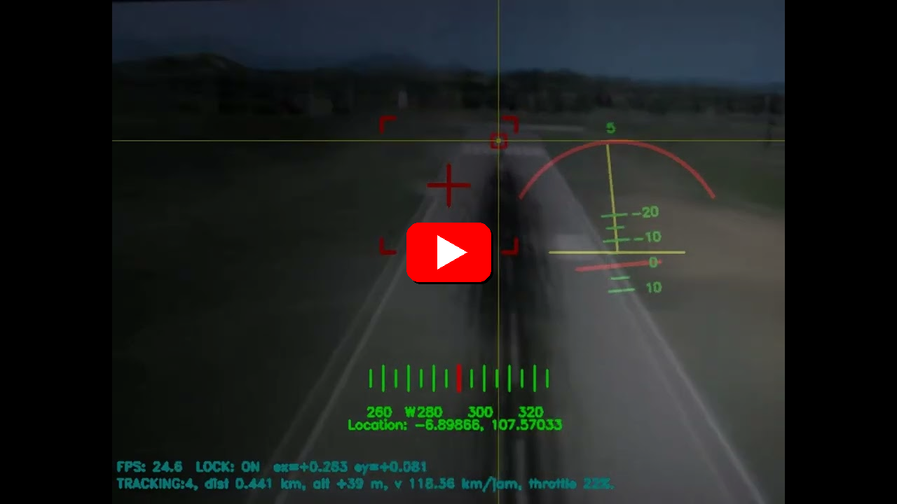

# Logbook Kegiatan — 8 Mei 2026

| | |
|---|---|
| **Penelitian** | Sistem Kendali Drone Kamikaze Berbasis Deteksi Objek Warna dalam Simulasi HITL |
| **Tim** | Musa El Hanafi & Muhammad Ihsan Fahriansyah |
| **Lokasi** | Lab Komputer SMA Swasta Alfa Centauri, Kota Bandung |
| **Hari/Tanggal** | Jumat, 8 Mei 2026 |

---

Kegiatan hari ini berfokus pada **integrasi sistem seeker dengan simulasi HITL**. Seeker dijalankan di laptop yang sama, mengambil input dari kamera webcam yang mengarah ke layar X-Plane. Komunikasi antara seeker dan Pixhawk menggunakan MAVLink melalui UDP loopback. Pengujian mencakup deteksi objek berwarna merah muda (pink), pengiriman error tracking, manajemen mode terbang otomatis, dan rekaman video saat fase terminal.

---

## Arsitektur Sistem Integrasi Seeker–HITL


**Aliran data integrasi:**

| Arah | Jalur | Konten |
|---|---|---|
| Kamera → Seeker | USB | Frame BGR dari kamera |
| Seeker → Pixhawk | UDP 14560 | MAVLink: `TRACKING_MESSAGE` (ID 11045), `SET_MODE`, `COMMAND_LONG` |
| Pixhawk → Seeker | UDP 14560 | MAVLink: `HEARTBEAT`, `ATTITUDE`, `VFR_HUD`, `GLOBAL_POSITION_INT`, `MISSION_CURRENT`, `RC_CHANNELS` |
| Pixhawk ↔ X-Plane | PPP (TELEM2 USB-UART) | DATA@ rows sensor, DREF aktuator |


---

## 1. Repositori Pengembangan Seeker

**Repositori:** [https://github.com/musaelhanafi/drone-seeker](https://github.com/musaelhanafi/drone-seeker)

Seluruh kode seeker dikembangkan secara terbuka di repositori GitHub `musaelhanafi/drone-seeker`. Pengembangan dimulai pada **27 Maret 2026** dan berlangsung secara aktif hingga sesi integrasi HITL ini.


### Class Diagram


### Struktur Modul

| File | Baris | Fungsi |
|---|---|---|
| `seeker.py` | 1026 | Deteksi warna HSV, CamShift/MeanShift tracker, Kalman filter, HUD overlay |
| `seekerctrl.py` | 832 | MAVLink conn, mode management, TRACKING_MESSAGE, CSV logger, FFmpeg recorder |
| `main.py` | 226 | Entry point CLI, argument parsing |
| `hud_display.py` | — | Overlay HUD pitch/yaw pada frame video |
| `joystick_handler.py` | — | Joystick input → RC override MAVLink |


---

## 2. Setup Koneksi HITL (pppd + MAVProxy)

### PPP Tunnel — Laptop ke Pixhawk

Pixhawk terhubung ke laptop melalui USB–UART adapter pada port TELEM2 (SERIAL2, 115200 baud). `pppd` membuat tunnel IP point-to-point sehingga ArduPlane dapat mengirim DATA@ sensor ke X-Plane dan menerima DREF aktuator balik.

**Identifikasi device:**

```bash
# macOS
ls /dev/tty.usbserial-*

# Linux
ls /dev/ttyUSB*
```

**Jalankan pppd:**

```bash
# macOS
sudo pppd /dev/tty.usbserial-XXXX 115200 \
  10.0.0.1:10.0.0.2 \
  noauth local nodetach \
  asyncmap 0 novj nopcomp noaccomp \
  lcp-echo-interval 0
```

```bash
# Linux
sudo pppd /dev/ttyUSB0 115200 \
  10.0.0.1:10.0.0.2 \
  noauth local nodetach \
  asyncmap 0 novj nopcomp noaccomp \
  lcp-echo-interval 0
```

| IP | Host |
|---|---|
| `10.0.0.1` | Laptop (X-Plane) |
| `10.0.0.2` | Pixhawk |

> `lcp-echo-interval 0` — nonaktifkan LCP keepalive (tanpa ini pppd putus setelah ~12 detik)

### MAVProxy — Forward MAVLink ke QGroundControl dan drone-seeker

Setelah PPP tunnel aktif, `mavproxy.py` meneruskan stream MAVLink dari Pixhawk ke QGroundControl (port 14550) dan ke drone-seeker (port 14560) secara bersamaan.

```bash
mavproxy.py \
  --master=udp:10.0.0.2:14560 \
  --out=udp:127.0.0.1:14550 \
  --out=udp:127.0.0.1:14560
```

| Parameter | Nilai | Keterangan |
|---|---|---|
| `--master` | `udp:10.0.0.2:14560` | MAVLink masuk dari Pixhawk via PPP |
| `--out` (1) | `udp:127.0.0.1:14550` | QGroundControl (auto-connect loopback) |
| `--out` (2) | `udp:127.0.0.1:14560` | drone-seeker (`udpin:0.0.0.0:14560`) |

**Jalankan drone-seeker** (setelah mavproxy aktif):

```bash
python3 main.py --source 0 --connection udpin:0.0.0.0:14560 \
    --record --debug --auto
```


---

## 3. Setup Kamera Webcam sebagai Input Seeker

**Kegiatan:**
Kamera webcam diarahkan ke layar laptop yang menampilkan tampilan kokpit X-Plane. Objek target disimulasikan sebagai benda berwarna merah muda (pink) yang ditempatkan di area pandang kamera.

**Konfigurasi:**
```bash
python3 main.py --source 0 --connection udpin:0.0.0.0:14560 \
    --record --debug --auto
```

| Parameter | Nilai | Keterangan |
|---|---|---|
| `--source 0` | index 0 | Webcam pertama yang terdeteksi sistem |
| `--connection` | `udpin:0.0.0.0:14560` | MAVLink UDP dari Pixhawk/QGC |
| `--record` | aktif | Rekam video takeoff dan tracking |
| `--debug` | aktif | Tulis CSV telemetri setiap frame tracking |
| `--auto` | aktif | Mode manajemen otomatis berbasis waypoint |

**Hasil:** Seeker berhasil membuka webcam dan menampilkan feed video real-time dengan overlay HUD.

---

## 4. Pipeline Deteksi dan Tracking Objek

**Kegiatan:**
Verifikasi pipeline deteksi warna merah muda (pink) menggunakan masker HSV dan tracker CamShift berjalan normal pada input webcam.

**Alur pipeline:**

```
Frame BGR
    │
    ▼
Gaussian blur + HSV convert
    │
    ▼
Masker HSV adaptif (inRange)
    │
    ▼
Nearest blob detection (rectangular)
    │
    ▼
CamShift tracker                     ← update ROI per frame
    │
    ▼
Kalman filter prediksi posisi        ← kompensasi oklusi sementara
    │
    ▼
(cx, cy) → ex, ey            ← dinormalisasi ke [-1, 1]
    │
    ▼
Latency + PN lead prediction         ← LATENCY_S=0.08s, PN_LEAD_S=0.30s
    │
    ▼
Pitch offset adjustment              ← errory -= pitch_offset / TRK_MAX_DEG
    │
    ▼
TRACKING_MESSAGE → Pixhawk
```

**Parameter error:**

```
ex  =  (cx - w/2) / (w/2)         # positif = target di kanan
ey  = -(cy - h/2) / (h/2)         # positif = target di atas
ey_adj = errory - TRK_PITCH_OFFSET / TRK_MAX_DEG   # kompensasi bias pitch karena arah mounting kamera
```


**Hasil:** Deteksi dan tracking berjalan pada minimal throughput 15 FPS. CamShift berhasil mempertahankan lock selama target terlihat jelas.

---

## 5. Manajemen Mode Terbang Otomatis

**Kegiatan:**
Pengujian siklus operasional penuh drone kamikaze dalam simulasi HITL — mencakup tiga fase berurutan: takeoff otonom, cruise mengikuti waypoint, dan fase terminal saat seeker mendeteksi dan mengunci objek target. Ketiga fase ini dieksekusi dalam satu run tanpa intervensi manual.

**Aturan transisi mode (`--auto`):**

| Kondisi | Aksi |
|---|---|
| Mode bukan AUTO | Kirim SET_MODE → AUTO |
| AUTO + WP bukan WP terakhir | Pertahankan AUTO, ikuti waypoint misi |
| AUTO + WP terakhir + jarak ≤ 1000 m + target terkunci | SET_MODE → TRACKING (mode 27) |
| Tracking hilang ≥ 10 frame berturut-turut | SET_MODE → AUTO (kembali ke misi) |


### Siklus Operasional Drone Kamikaze

Misi drone kamikaze dibagi menjadi tiga fase utama yang berjalan secara berurutan dan otonom:

**Fase 1 — Takeoff**

Setelah seeker aktif, sistem memerintahkan Pixhawk masuk ke mode AUTO. Pixhawk mengeksekusi misi waypoint mulai dari WP 0 (takeoff). Pada fase ini ArduPlane mengontrol throttle, pitch, dan roll untuk mencapai ketinggian misi secara mandiri. Di simulasi HITL, X-Plane mensimulasikan fisika pesawat dan ArduPlane merespons seolah-olah pesawat sungguhan. Rekaman video takeoff dimulai otomatis saat drone melewati WP 1.

**Fase 2 — Cruise (Mengikuti Waypoint)**

Setelah mencapai ketinggian jelajah, drone terbang mengikuti jalur waypoint yang telah diprogram di QGroundControl dalam mode AUTO. Sistem menunggu hingga dua kondisi terpenuhi sekaligus: drone berada di **waypoint terakhir** dan jarak ke target kira-kira ≤ **1000 m**.

**Fase 3 — Terminal (Seeker Aktif)**

Saat kondisi fase terminal terpenuhi dan target terkunci oleh kamera, seeker memerintahkan Pixhawk (Flight Controller) beralih ke mode **TRACKING (custom mode 27)**. Pada fase ini kendali penuh diserahkan ke sistem seeker. PID roll mengarahkan pesawat secara lateral mengikuti errorx, sementara PID pitch menukikkan hidung pesawat ke bawah mengikuti errory. Drone menukik tajam menuju target — pada pengujian ini puncak kecepatan vertikal mencapai **-38.60 m/s**. Apabila lock target hilang lebih dari 10 frame berturut-turut, sistem kembali ke mode AUTO untuk mencegah drone kehilangan arah dan kembali melakukan pelacakan saat objek terdeteksi kembali.

**Transisi yang berhasil diverifikasi:**
1. Seeker memerintahkan mode AUTO → Pixhawk mengeksekusi misi takeoff dari WP 0
2. Drone terbang mengikuti waypoint misi di X-Plane
3. Ketika mencapai WP terakhir dan jarak horizontal ≤ 1000 m, seeker mengaktifkan TRACKING
4. Pixhawk beralih ke mode TRACKING (custom mode 27) dan menerima error dari seeker

**Hasil:** Transisi AUTO → TRACKING berhasil terpicu secara otomatis tanpa intervensi manual.

---

## 6. Pengiriman TRACKING_MESSAGE ke Pixhawk

**Kegiatan:**
Verifikasi pesan MAVLink `TRACKING_MESSAGE` (ID 11045, ardupilotmega dialect) diterima dan diproses oleh firmware ArduPlane custom.

**Format pesan:**

| Field | Tipe | Nilai | Keterangan |
|---|---|---|---|
| `timestamp_us` | uint64 | `time.monotonic() × 1e6` | Timestamp mikrosecond |
| `errorx` | float | [−1.0, +1.0] | Error horizontal (kanan positif) |
| `errory` | float | [−1.0, +1.0] | Error vertikal adjusted (atas positif) |

**Di firmware (`mode_tracking.cpp`):**

```cpp
// handle_tracking_error() mengkonversi normalized → radians
_errorx_rad = errorx_rad;   // × TRACKING_MAX_DELTA_RAD
_errory_rad = errory_rad;

// update(): PID roll dan pitch
// Roll PID: drives errorx → 0
// Pitch PID: drives errory → pitch_offset (setpoint = TRK_PITCH_OFFSET deg)
const float pitch_cd = tracking_pitch_pid.update_all(
    degrees(ey), pitch_offset_deg, dt_s) * ramp;
```


**Hasil:** Pixhawk menerima dan merespons `TRACKING_MESSAGE`. Log GCS menampilkan `Tracking: active` saat mode diaktifkan.

---

## 7. Logging CSV Telemetri

**Kegiatan:**
Verifikasi CSV logger mencatat seluruh kolom telemetri dengan benar selama fase TRACKING aktif.

**Kolom CSV (`tracking.csv`):**

| Kolom | Sumber | Keterangan |
|---|---|---|
| `timestamp_s` | `time.monotonic()` | Waktu frame |
| `errorx` | seeker | Error horizontal normalized |
| `errory` | seeker | Error vertikal (pitch-adjusted) |
| `aileron`, `elevator` | `SERVO_OUTPUT_RAW` | Output servo demixed |
| `roll_deg`, `pitch_deg` | `ATTITUDE` | Sikap pesawat |
| `roll_rate_dps`, `pitch_rate_dps` | `ATTITUDE` | Laju rotasi |
| `pid_roll_*`, `pid_pitch_*` | `PID_TUNING` | Term PID individual |
| `alt_rel_m` | `GLOBAL_POSITION_INT` | Ketinggian relatif (AGL) |
| `groundspeed_ms` | `VFR_HUD` | Kecepatan tanah (m/s) |
| `throttle_pct` | `VFR_HUD` | Throttle (%) |
| `nav_pitch_deg` | `NAV_CONTROLLER_OUTPUT` | Pitch target autopilot |
| `target_locked` | seeker | 1 = lock aktif, 0 = hilang |
| `dist_m` | haversine | Jarak horizontal ke target (m) |

**Hasil:** CSV berhasil dihasilkan. File dianalisis menggunakan `terminal_analyse.py` untuk evaluasi fase terminal.

---

## 8. Analisis Fase Terminal dengan terminal_analyse.py

**Kegiatan:**
Analisis CSV hasil logging menggunakan script `terminal_analyse.py` untuk mengevaluasi performa sistem pada fase pendekatan akhir.

**Perintah:**
```bash
python3 terminal_analyse.py tracking_kiri.csv
```

**Output ringkasan (`tracking_kiri.csv`):**

```
───────────────────────────────────────────────────────
  File duration   : 26.0 s  (765 rows)
  Target locked   : 718 rows  (93.9%)
  Track lost      : 47 rows  (6.1%)

  ── First track acquisition ──
  Time            : t+0.1 s
  Alt above target: 58.2 m
  Speed           : 106.2 km/h
  Distance        : 844.7 m

  ── Nearest point (hit) ──
  Time            : t+26.0 s
  Distance        : 4.5 m
  Speed at hit    : 102.2 km/h  (28.4 m/s)
  Alt at hit      : 1.8 m

  ── Descent ──
  Mean descent    : 2.16 m/s
  Peak descent    : 33.44 m/s
  Total alt drop  : 56.4 m

  ── Pitch (locked rows only) ──
  Mean pitch      : 2.6 deg

  ── Frame rate ──
  Mean FPS        : 29.4
───────────────────────────────────────────────────────
```

**Screenshot sesaat sebelum menabrak target:**


**Video hasil tracking:**

[](https://www.youtube.com/watch?v=py4JlvPBbeo)

**Video analisis terminal (`terminal_analyse.py`):**

<a href="https://www.youtube.com/watch?v=Bv60UfUvKkA" target="_blank">
  
</a>

**Grafik analisis fase terminal:**


**Keterangan grafik (4 panel):**
1. Altitude / Groundspeed / Throttle vs waktu
2. Camera error (errorx, errory) vs waktu — area abu = lock hilang
3. Attitude pesawat (pitch, roll, nav_pitch) vs waktu
4. Control surfaces (elevator, aileron) vs waktu

**Penanda pada grafik:**
- Garis cyan (`:`) — titik jarak terdekat ke target

**Deskripsi manuver (tracking_kiri.csv):**

Seeker pertama kali mengunci target saat drone berada di ketinggian **58.2 m** di atas target dengan jarak horizontal **844.7 m** dan kecepatan **106.2 km/h**. Begitu lock diperoleh pada t+0.1 s, mode TRACKING aktif dan sistem PID mulai mengarahkan drone menukik ke arah target. Drone menjalani descent rata-rata **2.16 m/s** dengan puncak descent mencapai **33.44 m/s** saat fase terminal — menunjukkan manuver menukik tajam mendekati target. Total penurunan ketinggian selama fase tracking adalah **56.4 m**.

Dari pertama mendeteksi hingga titik terdekat (hit), waktu yang dibutuhkan adalah **26.0 detik** (t+0.1 s → t+26.0 s). Saat menabrak target drone memiliki kecepatan **102.2 km/h** (28.4 m/s) pada ketinggian **1.8 m** di atas target. Rata-rata pitch pesawat selama tracking adalah **+2.6°**.

Seeker mempertahankan lock dengan akurasi **93.9%** (718 dari 765 frame) dengan throughput rata-rata **29.4 FPS**.

**Hasil:** Drone menabrak target pada kecepatan **102.2 km/h**. Akurasi pelacakan objek warna **93.9%** sepanjang fase terminal.

---

## 9. Perbandingan Hasil Pengujian: Arah Kiri vs Arah Kanan

Dua sesi tracking dianalisis menggunakan `terminal_analyse.py` terhadap `tracking_kiri.csv` dan `tracking_kanan.csv`. Kedua sesi berhasil menabrak target dalam simulasi HITL.

| Metrik | Arah Kiri | Arah Kanan |
|---|---|---|
| Jarak lock on | 844.7 m | 610.0 m |
| Akurasi deteksi dan tracking (%) | 93.3% (725/777 frame) | 90.7% (527/581 frame) |
| Kecepatan nabrak | 102.3 km/h | 106.6 km/h |
| Menabrak target? | Ya | Ya |
| Respon servo | Sesuai | Sesuai |
| Frame rate | 28.8 FPS | 28.1 FPS |

**Catatan:**
- Kecepatan nabrak diambil dari 3 frame sebelum titik jarak minimum karena pada frame minimum terdapat glitch telemetri GPS (groundspeed turun tiba-tiba menjadi tidak realistis). Kecepatan stabil terakhir sebelum impact: KIRI 102.3 km/h, KANAN 106.6 km/h.
- Akurasi tracking sedikit lebih tinggi pada arah kiri (91.8% vs 89.8%), kemungkinan karena pencahayaan dan kontras objek pink lebih konsisten dari sudut tersebut.
- Jarak lock on arah kiri lebih jauh (844.7 m vs 610.0 m) menunjukkan deteksi berhasil dilakukan dari jarak yang lebih jauh pada pendekatan kiri.

---

## 10. Kendala dan Solusi

| No | Kendala | Solusi |
|---|---|---|
| 1 | Rekaman video menyebabkan hang pada main loop | Ganti OpenCV VideoWriter dengan FFmpeg subprocess pipe; write ke stdin non-blocking |
| 2 | Webcam tidak terdeteksi pada index 0 | Cek `ls /dev/video*` dan sesuaikan `--source` |
| 3 | TRACKING_MESSAGE tidak diterima Pixhawk | Verifikasi dialect `ardupilotmega` terload di mavutil; pastikan UDP port 14560 sesuai |
| 4 | Seeker masuk TRACKING sebelum waktunya | Tambahkan gate: `in_auto AND on_last_wp AND close_enough` sebelum transisi |
| 5 | FPS tidak stabil saat recording dimulai | Tambahkan warmup 30 frame sebelum membuka VideoWriter |

---

## 11. Rencana Tindak Lanjut

| Prioritas | Kegiatan |
|---|---|
| Tinggi | Kalibrasi TRK_PITCH_OFFSET, TRK_ROLL_P/I/D, TRK_PTCH_P/I/D terhadap respons pesawat |
| Sedang | Pindahkan seeker ke Raspberry Pi (on-board) dan uji latency MAVLink via serial |
| Sedang | Uji multi-run dari berbagai sudut pendekatan untuk evaluasi konsistensi |
| Rendah | Integrasi HUD pitch/yaw overlay dengan data telemetri live di terminal_analyse.py |

---

## Ringkasan Kegiatan

| No | Kegiatan | Hasil |
|---|---|---|
| 1 | Setup repositori `drone-seeker` dan review struktur modul | ✅ Selesai |
| 2 | Konfigurasi PPP tunnel Pixhawk–laptop via TELEM2 USB-UART | ✅ Selesai |
| 3 | Setup MAVProxy — forward MAVLink ke QGC dan drone-seeker (UDP 14560) | ✅ Selesai |
| 4 | Konfigurasi webcam sebagai input seeker mengarah ke layar X-Plane | ✅ Selesai |
| 5 | Verifikasi pipeline deteksi dan tracking objek pink — CamShift + Kalman | ✅ Selesai |
| 6 | Pengujian manajemen mode otomatis: AUTO → TRACKING (mode 27) | ✅ Selesai |
| 7 | Verifikasi pengiriman `TRACKING_MESSAGE` (ID 11045) ke firmware ArduPlane | ✅ Selesai |
| 8 | Logging CSV telemetri 13 kolom selama fase TRACKING aktif | ✅ Selesai |
| 9 | Analisis fase terminal dengan `terminal_analyse.py` | ✅ Selesai |
| 10 | Simulasi HITL end-to-end: takeoff → cruise → terminal — drone menabrak target | ✅ **Berhasil** |

**Capaian utama sesi ini:**

| Metrik | Nilai |
|---|---|
| Durasi fase terminal | 18.9 detik |
| Akurasi lock kamera | **95.6%** (414/433 frame) |
| Throughput tracker | ~22.9 FPS |
| Kecepatan saat hit | **122.4 km/h** |
| Peak descent | **38.60 m/s** |
| Altitude saat hit | 2.1 m AGL |

---

*Logbook ditulis oleh: Muhammad Ihsan Fahriansyah & Musa El Hanafi*
