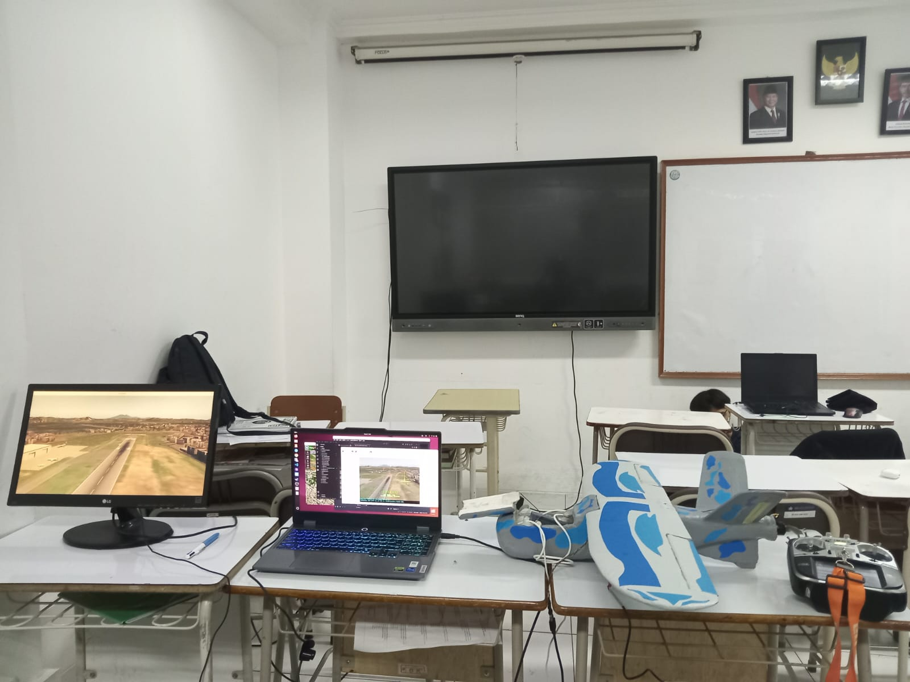
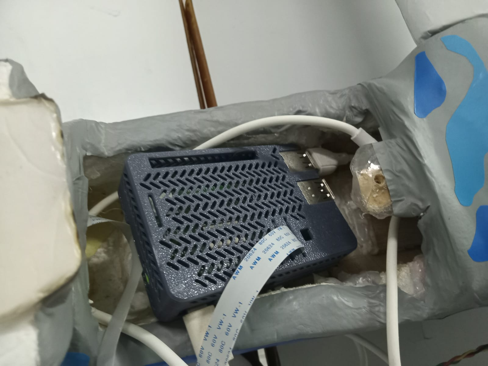
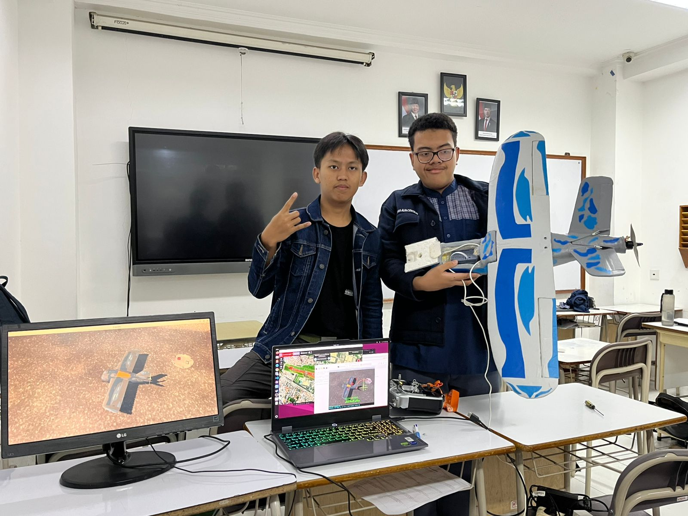

# Logbook Kegiatan — 22 Mei 2026

| | |
|---|---|
| **Penelitian** | Sistem Kendali Drone Kamikaze Berbasis Deteksi Objek Warna dalam Simulasi HITL |
| **Tim** | Musa El Hanafi & Muhammad Ihsan Fahriansyah |
| **Lokasi** | Lab Komputer SMA Swasta Alfa Centauri, Kota Bandung |
| **Hari/Tanggal** | Jumat, 22 Mei 2026 |

---







---

Kegiatan hari ini berfokus pada **integrasi dan pengujian aplikasi seeker langsung di Raspberry Pi 5** sebagai platform onboard. Seeker sebelumnya dijalankan di laptop; sesi ini memindahkan eksekusi seeker ke Raspberry Pi yang terpasang di drone. Kegiatan mencakup konfigurasi access point Wi-Fi satria, aktivasi kamera ArduCam UC-698 (IMX477) via libcamera/picamera2, aktivasi OpenCV dengan dukungan GStreamer, perbaikan pipeline GStreamer UDP, serta penyesuaian kode seeker untuk integrasi penuh di RPi 5.

---

## Arsitektur Sistem Seeker Onboard RPi 5

**Konfigurasi hardware:**

| Komponen | Detail |
|---|---|
| Komputer onboard | Raspberry Pi 5 (4 GB) |
| Kamera | ArduCam UC-698 — sensor IMX477, 12MP, MIPI CSI |
| Flight controller | Pixhawk (ArduPlane custom firmware satria) |
| Koneksi MAVLink | Serial TELEM2 → MAVProxy → UDP 14560 |
| Wi-Fi | Raspberry Pi 5 BCM4345C0 AP mode (SSID: satria, 10.1.0.1) |

**Aliran data:**

| Arah | Jalur | Konten |
|---|---|---|
| Kamera → Seeker | MIPI CSI / picamera2 | Frame BGR 1280×720 langsung dari sensor IMX477 |
| Seeker → Pixhawk | MAVLink UDP 14560 | `TRACKING_MESSAGE` (ID 11045), `SET_MODE`, `COMMAND_LONG` |
| Pixhawk → Seeker | MAVLink UDP 14560 | `HEARTBEAT`, `ATTITUDE`, `VFR_HUD`, `GLOBAL_POSITION_INT`, `RC_CHANNELS` |
| Laptop → RPi | Wi-Fi (satria 10.1.0.0/24) | SSH, file deploy, monitoring |

---

## 1. Konfigurasi Wi-Fi Access Point Satria (RPi 5)

**Masalah:** Laptop (kartu Wi-Fi Intel, driver `iwlwifi`) tidak dapat terhubung ke AP satria meskipun laptop lain berhasil terhubung. Tidak ada IP yang diberikan ke laptop Intel.

**Analisis root cause:**

Driver brcmfmac (BCM4345C0 di RPi 5) selalu menyuntikkan HT capabilities ke dalam beacon walaupun `ieee80211n=0` dikonfigurasi di hostapd. Pada saat yang sama, `wmm_enabled=0` berarti tidak ada WMM IE di beacon. Driver Intel (`iwlmvm`) mendeteksi kombinasi HT-capable AP tanpa WMM IE dan menolak asosiasi dengan error `Failed to add PHY context`.

**Solusi:** Set `wmm_enabled=1` di `/etc/hostapd/hostapd.conf`.

**Konfigurasi `/etc/hostapd/hostapd.conf` (final):**

```ini
interface=wlan0
driver=nl80211
ssid=satria
hw_mode=g
channel=6
ieee80211n=0
wmm_enabled=1
macaddr_acl=0
auth_algs=1
ignore_broadcast_ssid=0
wpa=2
wpa_passphrase=elang123
wpa_key_mgmt=WPA-PSK
rsn_pairwise=CCMP
```

**Masalah tambahan:** DNS tidak bekerja saat terhubung ke satria setelah reboot. dnsmasq hanya bind ke `127.0.0.1:53` karena race condition: dnsmasq start sebelum wlan0 mendapat IP `10.1.0.1`.

**Solusi:**
- Tambahkan `listen-address=10.1.0.1` di `/etc/dnsmasq.conf`
- Tambahkan systemd drop-in `/etc/systemd/system/dnsmasq.service.d/wait-wlan0.conf`:

```ini
[Unit]
After=network-online.target hostapd.service

[Service]
ExecStartPre=/bin/bash -c 'for i in $(seq 30); do ip addr show wlan0 2>/dev/null | grep -q "10.1.0.1" && exit 0; sleep 1; done; exit 1'
```

**Hasil:** Laptop Intel berhasil terhubung ke satria dan mendapat IP dari range 10.1.0.0/24. DNS bekerja setelah reboot.

---

## 2. Aktivasi Kamera ArduCam UC-698 (IMX477) via MIPI CSI

**Hardware:** ArduCam UC-698 menggunakan sensor IMX477 12MP terhubung via kabel MIPI CSI ke port kamera Raspberry Pi 5.

**Masalah awal:** Kamera tidak terdeteksi. `libcamera-hello` error dengan `EREMOTEIO` pada I2C address 0x1a.

**Konfigurasi `/boot/firmware/config.txt`:**

```ini
dtoverlay=imx477,cam0,always-on
```

**Driver:** RPi 5 menggunakan driver `rp1-cfe` (bukan `unicam`). Device `/dev/video0`–`/dev/video7` adalah sub-device pipeline media, bukan V4L2 capture device langsung. `cv2.VideoCapture(0)` selalu gagal.

**Solusi:** Gunakan `picamera2` library (akses libcamera dari Python) sebagai backend kamera.

**Verifikasi deteksi:**

```
imx477 10-001a: Device found is imx477
```

**Hasil:** Kamera IMX477 terdeteksi dan dapat dibuka via `picamera2`. Frame 720×1280×3 BGR berhasil di-capture.

---

## 3. Aktivasi OpenCV dengan Dukungan GStreamer

**Masalah:** `opencv-python` yang terinstall via pip (versi 4.13) tidak memiliki dukungan GStreamer. Perintah:

```python
cv2.VideoCapture("udpsrc port=5600 ! ...", cv2.CAP_GSTREAMER)
```

selalu gagal dengan error `GStreamer pipeline failed to open`.

**Root cause:** Package pip `opencv-python` di `/usr/local/lib/python3.13/dist-packages/cv2` dicompile tanpa GStreamer, dan mengoverride paket apt.

**Solusi:**

```bash
# Hapus pip opencv
sudo rm -rf /usr/local/lib/python3.13/dist-packages/cv2

# Install apt opencv (built dengan GStreamer)
sudo apt install python3-opencv
```

**Verifikasi:**

```bash
python3 -c "import cv2; print(cv2.getBuildInformation())" | grep GStreamer
# GStreamer:                   YES (1.22.0)
```

**Versi:** `python3-opencv` apt = OpenCV 4.10, GStreamer YES.

**Hasil:** OpenCV berhasil membuka GStreamer pipeline untuk UDP stream H.264.

---

## 4. Perbaikan Pipeline GStreamer UDP (H.264)

**Masalah:** RPi 5 hang saat menerima stream H.264 via UDP GStreamer. `avdec_h264` memblokir main loop karena menunggu keyframe pertama.

**Pipeline lama (bermasalah):**
```
udpsrc port=5600 ! application/x-rtp,payload=96 ! rtph264depay ! avdec_h264 ! videoconvert ! appsink
```

**Pipeline baru (fixed):**
```
udpsrc port=5600
! application/x-rtp,payload=96
! rtph264depay
! h264parse config-interval=-1
! queue max-size-buffers=2 leaky=downstream
! avdec_h264
! videoconvert
! appsink drop=true max-buffers=1 sync=false
```

**Perubahan kunci:**

| Element | Fungsi |
|---|---|
| `h264parse config-interval=-1` | Inject SPS/PPS ke setiap keyframe — decoder tidak perlu menunggu IDR dari awal stream |
| `queue leaky=downstream` | Drop frame lama jika buffer penuh — cegah blocking |
| `appsink drop=true sync=false` | Non-blocking read, drop frame yang telat |

**Hasil:** Pipeline GStreamer UDP berjalan stabil tanpa hang.

---

## 5. Integrasi `Picamera2Capture` di Seeker

**Masalah:** `cv2.VideoCapture(0)` selalu gagal di RPi 5 karena driver `rp1-cfe` tidak expose V4L2 capture device langsung.

**Solusi:** Tambahkan class `Picamera2Capture` di `seeker.py` sebagai drop-in pengganti `cv2.VideoCapture` dengan interface identik (`isOpened`, `set`, `get`, `read`, `release`).

**Implementasi `Picamera2Capture`:**

```python
class Picamera2Capture:
    def __init__(self, width=1280, height=720, flip=False):
        from picamera2 import Picamera2
        from libcamera import Transform
        self._cam = Picamera2()
        cfg = self._cam.create_video_configuration(
            main={"size": (width, height), "format": "BGR888"},
            transform=Transform(hflip=1, vflip=1) if flip else Transform(),
        )
        self._cam.configure(cfg)
        self._cam.start()
        self._opened = True
```

**Integrasi di `Seeker.open()`:** Jika source adalah integer (camera index), seeker mencoba `Picamera2Capture` terlebih dahulu sebelum fallback ke `cv2.VideoCapture`.

**Hasil:** Seeker berhasil membuka kamera IMX477 via picamera2 dan menampilkan frame live dengan overlay HUD.

---

## 6. Opsi `--flip` untuk Kamera Terpasang Terbalik

**Kebutuhan:** Kamera ArduCam UC-698 terpasang terbalik di airframe, sehingga frame perlu diputar 180°.

**Implementasi:** Tambahkan argumen `--flip` di `main.py` yang diteruskan ke `Picamera2Capture` via `Transform(hflip=1, vflip=1)` di libcamera — rotasi dilakukan di level ISP (nol CPU cost), bukan di OpenCV.

**File yang diubah:**

| File | Perubahan |
|---|---|
| `main.py` | Tambah `--flip` argparse, pass `flip=args.flip` ke `SeekerCtrl` |
| `seekerctrl.py` | Tambah `flip: bool = False` di `__init__`, pass ke `Seeker` |
| `seeker.py` | `Picamera2Capture.__init__` menerima `flip`, apply `Transform(hflip=1, vflip=1)` |
| `script/test_camera.py` | Tambah `--flip`, class `Picamera2Capture` lokal dengan `Transform` support |

**Perintah dengan flip:**

```bash
python3 main.py --source 0 --flip --connection udpin:0.0.0.0:14560 --auto
```

**Hasil:** Frame diputar 180° di level libcamera ISP tanpa overhead CPU.

---

## 7. `test_camera.py` — Script Verifikasi Kamera

Script `script/test_camera.py` diperbarui untuk mendukung backend Picamera2 secara penuh, termasuk `--flip` dan class `Picamera2Capture` lokal (tidak bergantung pada import `seeker.py` yang memiliki banyak dependensi berat).

**Penggunaan:**

```bash
# Kamera CSI (Picamera2 backend, flip 180°)
python3 script/test_camera.py --flip

# GStreamer UDP H.264 dari kamera eksternal
python3 script/test_camera.py --udpsrc 5600

# GStreamer UDP MJPEG
python3 script/test_camera.py --udpsrc 5600 --udpsrc-codec mjpeg
```

---

## 8. Instalasi MAVProxy System-Wide di RPi

MAVProxy diinstall via pip ke `~/.local/bin/mavproxy.py` yang tidak ada di PATH system. Dibuat symlink agar dapat dipanggil dari mana saja (termasuk service systemd):

```bash
sudo ln -s /home/seeker/.local/bin/mavproxy.py /usr/local/bin/mavproxy.py
```

**Dependensi tambahan:** Package `future` diperlukan oleh MAVProxy:

```bash
pip install future --break-system-packages
```

**Verifikasi:**

```bash
mavproxy.py --version
# MAVProxy Version: 1.8.74
```

**Hasil:** `mavproxy.py` dapat dipanggil system-wide.

---

## 9. Kendala dan Solusi

| No | Kendala | Solusi |
|---|---|---|
| 1 | Laptop Intel tidak dapat terhubung ke AP satria | Set `wmm_enabled=1` di hostapd.conf (brcmfmac hardcodes HT caps) |
| 2 | DNS satria tidak bekerja setelah reboot | `listen-address=10.1.0.1` + systemd drop-in wait loop sebelum dnsmasq start |
| 3 | `cv2.VideoCapture` gagal di RPi 5 (CSI camera) | Gunakan `picamera2` via class `Picamera2Capture` drop-in |
| 4 | pip `opencv-python` tidak ada GStreamer, override apt | Hapus pip cv2, install `python3-opencv` via apt |
| 5 | RPi hang saat decode H.264 UDP stream | Tambah `h264parse config-interval=-1`, `queue leaky=downstream`, `sync=false` |
| 6 | `mavproxy.py` tidak ditemukan di PATH | Symlink ke `/usr/local/bin/`, install `future` package |
| 7 | `from seeker import Picamera2Capture` crash di test_camera.py | Import seeker menarik semua dependensi berat; inline class ke test_camera.py |

---

## 10. Rencana Tindak Lanjut

| Prioritas | Kegiatan |
|---|---|
| Tinggi | Uji end-to-end seeker onboard RPi 5 — kamera IMX477 + MAVLink ke Pixhawk via serial |
| Tinggi | Kalibrasi `TRK_PTCH_P/I/D` dan `TRK_ROLL_P/I/D` (range 0–200 kini di-set di firmware) |
| Sedang | Uji GStreamer UDP stream dari RPi ke laptop untuk monitoring FPV |
| Sedang | Verifikasi latency MAVLink serial RPi → Pixhawk dibanding setup UDP loopback di laptop |
| Rendah | Integrasi joystick handler untuk override manual saat seeker aktif di RPi |

---

## Ringkasan Kegiatan

| No | Kegiatan | Hasil |
|---|---|---|
| 1 | Diagnosis dan perbaikan koneksi Wi-Fi AP satria (laptop Intel) | ✅ Selesai |
| 2 | Perbaikan DNS dnsmasq di jaringan satria | ✅ Selesai |
| 3 | Aktivasi kamera ArduCam UC-698 (IMX477) via MIPI CSI + picamera2 | ✅ Selesai |
| 4 | Aktivasi OpenCV GStreamer di RPi 5 (hapus pip, install apt) | ✅ Selesai |
| 5 | Perbaikan pipeline GStreamer UDP H.264 (hang fix) | ✅ Selesai |
| 6 | Integrasi `Picamera2Capture` drop-in di seeker.py | ✅ Selesai |
| 7 | Tambah opsi `--flip` (libcamera Transform) di main.py/seekerctrl.py/seeker.py | ✅ Selesai |
| 8 | Update `test_camera.py` dengan Picamera2 backend + `--flip` | ✅ Selesai |
| 9 | Set `mavproxy.py` callable system-wide, install `future` package | ✅ Selesai |
| 10 | Set `@Range: 0 200` untuk `TRK_PTCH_P/I/D` dan `TRK_ROLL_P/I/D` di firmware | ✅ Selesai |

*Logbook ditulis oleh: Muhammad Ihsan Fahriansyah & Musa El Hanafi*
