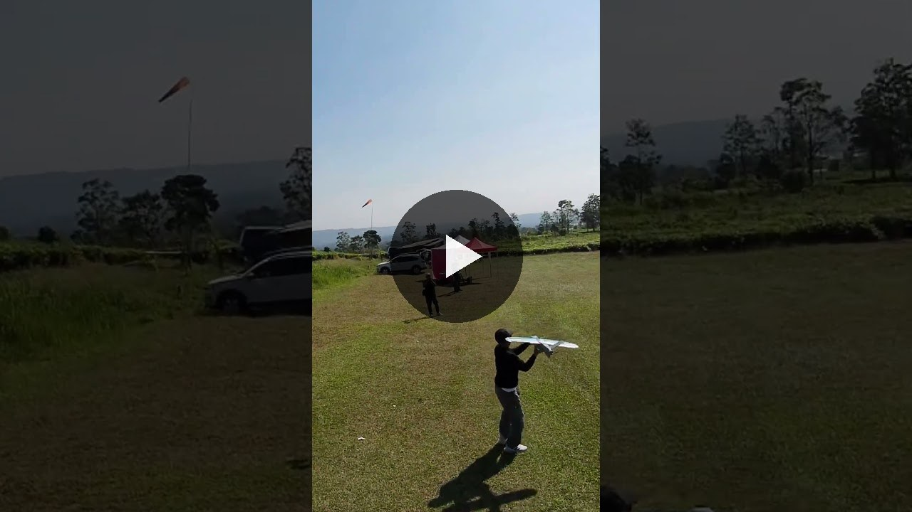

# Logbook Kegiatan — 29 Juni 2026

| | |
|---|---|
| **Penelitian** | Sistem Kendali Drone Kamikaze Berbasis Deteksi Objek Warna dalam Simulasi HITL |
| **Tim** | Musa El Hanafi & Muhammad Ihsan Fahriansyah |
| **Lokasi** | Landing Area Santiong Paralayang, Subang, Jawa Barat |
| **Hari/Tanggal** | Minggu, 29 Juni 2026 |

---

[Video Dokumentasi Uji Terbang Nano Talon](nano_talon_music.mp4)

---

Kegiatan hari ini mencakup dua sesi di Landing Area Santiong Paralayang, Subang: **uji terbang wahana Nano Talon** untuk memverifikasi kelayakan airframe secara fisik, dan **perekaman target oleh drone FPV** sebagai uji awal algoritma seeker di lingkungan luar ruangan. Kedua kegiatan ini bersifat di luar lingkup simulasi HITL — validasi fisik sebelum seluruh siklus pengembangan berfokus kembali pada simulasi HITL di lab.

---

## Latar Belakang dan Tujuan Pengujian

Penelitian utama berfokus pada simulasi HITL (Hardware-In-The-Loop) menggunakan X-Plane sebagai pengganti fisika terbang nyata. Dalam pendekatan ini, firmware ArduPlane berjalan di Pixhawk fmuv3 nyata, sedangkan aerodinamika, sensor, dan lingkungan disimulasikan sepenuhnya oleh X-Plane.

Meskipun demikian, ada pertanyaan penting yang tidak dapat dijawab oleh simulasi: **apakah wahana fisik yang dipilih benar-benar bisa terbang?** Nano Talon dipilih sebagai platform karena:

- Bentuk flying-wing yang kompak dan ringan
- Kapasitas payload yang cukup untuk Pixhawk + Raspberry Pi + kamera
- Kemampuan terbang tanpa ekor horizontal/vertikal konvensional (elevon-only control)

Uji terbang ini menjadi **validasi fisik satu kali** sebelum penelitian sepenuhnya masuk ke ranah HITL.

---

## Spesifikasi Wahana yang Diuji

| Parameter | Nilai |
|---|---|
| **Tipe wahana** | Nano Talon (flying wing, elevon configuration) |
| **Kontrol permukaan** | 2× elevon (aileron + elevator pre-mixed) |
| **Propulsi** | 1× motor brushless pusher, throttle CH3 |
| **Flight controller** | Pixhawk (mode manual RC, tanpa ArduPilot automode) |
| **Lokasi uji** | Landing Area Santiong Paralayang, Subang, ±800 m dpl |

---

## Persiapan Sebelum Terbang

**Pre-flight checklist:**

| No | Item | Status |
|---|---|---|
| 1 | Periksa kondisi airframe — tidak ada retakan atau kerusakan struktur | ✅ |
| 2 | Verifikasi CG sesuai spesifikasi (30% MAC dari LE) | ✅ |
| 3 | Tes respons elevon kiri dan kanan — full deflection tanpa binding | ✅ |
| 4 | Periksa motor dan propeller — rotasi bebas, tidak ada getaran | ✅ |
| 5 | Tes throttle full-range dari TX, motor berputar normal | ✅ |
| 6 | Charge baterai LiPo penuh, periksa cell voltage seimbang | ✅ |
| 7 | Verifikasi area bebas rintangan, kondisi angin layak (<15 km/h) | ✅ |

---

## Pelaksanaan Uji Terbang

**Metode launch:** Hand launch — satu orang melempar wahana ke arah angin, operator RC mengambil alih kendali segera setelah wahana meninggalkan tangan.

**Mode terbang:** Full manual RC (tidak menggunakan autopilot ArduPilot). Tujuan hanya memverifikasi airframe, bukan sistem kendali otonom.

**Urutan kegiatan:**

| Fase | Deskripsi |
|---|---|
| **Persiapan** | Setup wahana, verifikasi CG dan permukaan kendali, briefing area |
| **Percobaan 1** | Hand launch — wahana berhasil terbang, climbing stabil, elevon responsif |
| **Cruising** | Beberapa menit terbang level, belokan kiri-kanan dikonfirmasi responsif |
| **Landing** | Glide approach, touchdown di area landing tersedia |
| **Percobaan 2** | Uji ulang untuk memastikan konsistensi — hasil konsisten dengan percobaan 1 |

---

## Hasil dan Observasi

| Aspek | Hasil |
|---|---|
| **Takeoff** | Berhasil — wahana naik dengan baik dari hand launch |
| **Stabilitas terbang** | Stabil dalam kondisi angin ringan di ketinggian ~800 m dpl |
| **Respons elevon** | Roll dan pitch responsif, tidak ada lag signifikan |
| **Throttle** | Motor pusher memberikan thrust cukup untuk sustained flight |
| **Landing** | Dapat mendarat terkontrol di area yang ditentukan |
| **Kondisi airframe** | Tidak ada kerusakan setelah dua kali penerbangan |

**Catatan lapangan:**
- Angin dari arah selatan dengan kecepatan ringan — kondisi ideal untuk pengujian
- Elevon authority cukup untuk manuver belokan dan pitch correction
- Wahana menunjukkan karakteristik stable pitch yang baik pada CG nominal 30% MAC

---

## Kegiatan Tambahan: Perekaman Target oleh Drone FPV

[Video Hasil Rekaman Target](Hasil%20rekaman.mp4)

Setelah sesi uji terbang Nano Talon, kegiatan dilanjutkan dengan **perekaman objek target menggunakan drone FPV** di area yang sama. Tujuan sesi ini adalah mengumpulkan data video target berwarna (objek yang akan dideteksi oleh algoritma seeker) dalam kondisi cahaya dan latar belakang nyata di luar ruangan.

**Relevansi terhadap penelitian:** Algoritma seeker (`seeker.py`) dirancang untuk mendeteksi objek berwarna spesifik menggunakan color histogram dan tracking berbasis OpenCV. Seluruh pengembangan dan pengujian sebelumnya dilakukan di dalam ruangan atau dalam simulasi. Perekaman di luar ruangan memberikan data uji yang jauh lebih realistis — variasi cahaya matahari, latar belakang kompleks (rumput, tanah, langit), dan kondisi angin yang memengaruhi posisi target.

### Setup Perekaman

| Parameter | Detail |
|---|---|
| **Platform** | Drone FPV — wahana kecil, manuver cepat, sudut pandang fleksibel |
| **Peran drone FPV** | Mensimulasikan perspektif kamera onboard seeker saat mendekati target |
| **Objek target** | Benda berwarna kontras (sesuai warna target yang dikonfigurasi di seeker) |
| **Kondisi pencahayaan** | Cahaya matahari langsung, siang hari |
| **Latar belakang** | Area terbuka dengan rumput dan tanah — variasi tinggi dibanding lab |

### Proses Perekaman

Drone FPV dioperasikan secara manual untuk mendekati objek target dari berbagai sudut dan jarak, mereplikasi skenario yang akan dialami seeker saat fase terminal. Rekaman difokuskan pada:

- **Approach dari jarak jauh** — target muncul kecil di tengah frame, uji deteksi di resolusi rendah
- **Approach dari medium range** — target mengisi ±30% frame, uji stabilitas tracking saat target membesar
- **Sudut off-axis** — target tidak di tengah frame, uji kemampuan seeker mengoreksi error angular

### Hasil dan Observasi

| Aspek | Observasi |
|---|---|
| **Deteksi warna** | Warna target tetap terdistinguisikan dari latar belakang rumput dalam kondisi cahaya siang |
| **Variasi pencahayaan** | Bayangan dan overexposure memengaruhi saturasi warna — perlu toleransi HSV lebih lebar di luar ruangan |
| **Gerakan target** | Target diam — uji berikutnya perlu target bergerak untuk validasi tracking dinamis |
| **Latar belakang** | Tanah dan rumput tidak mengganggu deteksi selama threshold histogram dikalibrasi dengan benar |

---

## Kesimpulan

Uji terbang berhasil membuktikan bahwa **Nano Talon layak sebagai platform fisik** untuk penelitian ini. Airframe dapat terbang, manuver, dan mendarat dengan kendali manual yang baik. Validasi fisik ini memberikan keyakinan bahwa:

1. Model aerodinamika Nano Talon yang dimasukkan ke X-Plane mewakili wahana yang benar-benar bisa terbang
2. Apabila penelitian HITL menghasilkan algoritma tracking yang bekerja, transisi ke wahana fisik memiliki dasar yang valid
3. Karakteristik elevon-only control sesuai dengan konfigurasi yang digunakan di simulasi (`xplane_elevon.json`, `FRAME_TYPE elevon`, board `fmuv3-hil-elevon`)

Penelitian selanjutnya kembali ke lingkungan lab untuk pengembangan dan pengujian sistem HITL.

---

## Rencana Tindak Lanjut

| Prioritas | Kegiatan |
|---|---|
| Tinggi | Kembali ke pengembangan HITL — integrasi seeker onboard Raspberry Pi 5 |
| Tinggi | Kalibrasi parameter PID tracking (`TRK_PTCH_P/I/D`, `TRK_ROLL_P/I/D`) di HITL |
| Sedang | Dokumentasikan karakteristik terbang Nano Talon sebagai referensi validasi model X-Plane |

---

## Ringkasan Kegiatan

| No | Kegiatan | Hasil |
|---|---|---|
| 1 | Pre-flight check airframe dan sistem RC | ✅ Selesai |
| 2 | Hand launch percobaan 1 — verifikasi takeoff dan stabilitas | ✅ Berhasil |
| 3 | Pengujian manuver — roll, pitch, cruising | ✅ Berhasil |
| 4 | Landing percobaan 1 | ✅ Berhasil |
| 5 | Hand launch percobaan 2 — verifikasi konsistensi | ✅ Berhasil |
| 6 | Landing percobaan 2 | ✅ Berhasil |
| 7 | Inspeksi airframe pasca penerbangan | ✅ Tidak ada kerusakan |
| 8 | Setup drone FPV dan konfigurasi objek target | ✅ Selesai |
| 9 | Perekaman target dari berbagai sudut dan jarak dengan drone FPV | ✅ Berhasil |
| 10 | Evaluasi hasil rekaman — deteksi warna dan latar belakang outdoor | ✅ Selesai |

*Logbook ditulis oleh: Musa El Hanafi & Muhammad Ihsan Fahriansyah*
