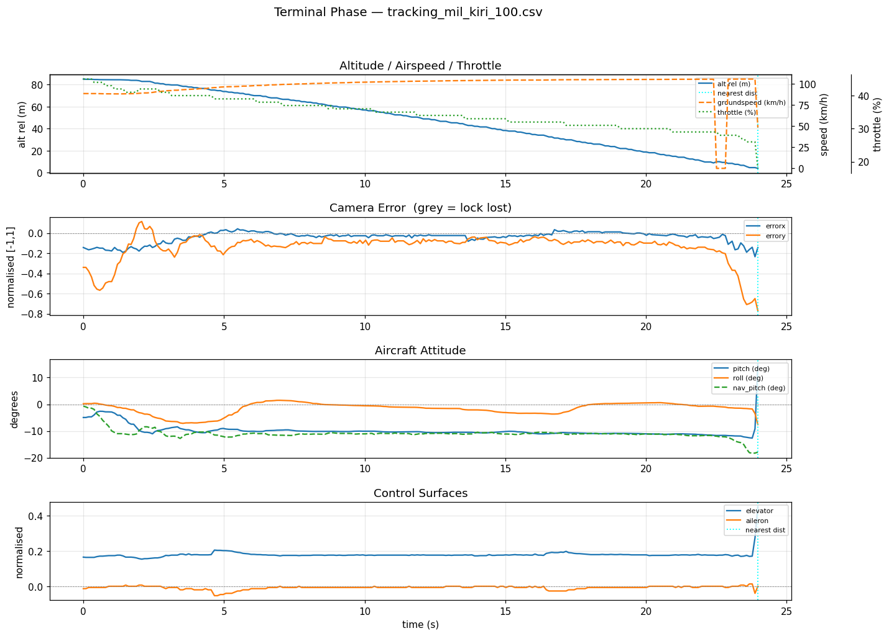
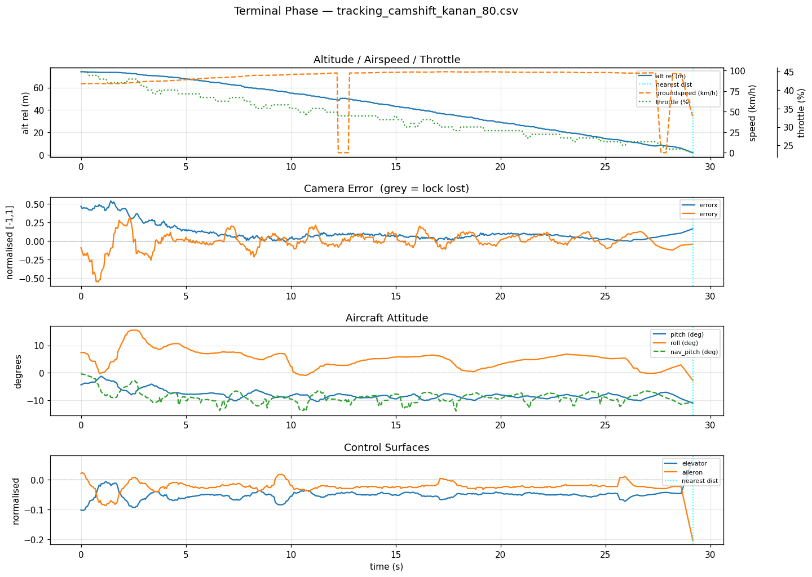

# Logbook Kegiatan — 24 Juli 2026

| | |
|---|---|
| **Penelitian** | Sistem Kendali Drone Kamikaze Berbasis Deteksi Objek Warna dalam Simulasi HITL |
| **Tim** | Musa El Hanafi & Muhammad Ihsan Fahriansyah |
| **Lokasi** | Lab Komputer SMA Swasta Alfa Centauri, Kota Bandung |
| **Hari/Tanggal** | Jumat, 24 Juli 2026 |

---

Kegiatan hari ini berfokus pada **pengujian komparatif dua algoritma tracker** — **MIL (Multiple Instance Learning)** dan **CamShift** — pada fase terminal dalam simulasi HITL. Pengujian dilakukan dari **dua arah pendekatan (kiri dan kanan)** pada **tiga ketinggian cruise (50 m, 80 m, dan 100 m)**, menghasilkan total **12 run tracking**. Setiap run dianalisis menggunakan `terminal_analyse.py` dan profil komputasi pipeline diambil dari log profiling per frame.

---

## 1. Tujuan dan Matriks Pengujian

Tujuan pengujian: membandingkan performa **akurasi terminal** (jarak terdekat ke target) dan **beban komputasi** (FPS pipeline, waktu tracker per frame) antara tracker MIL dan CamShift pada kondisi pendekatan yang identik.

**Matriks pengujian (12 run):**

| Algoritma | Arah | Ketinggian | File hasil |
|---|---|---|---|
| MIL | Kiri | 50 m | `Hasil/tracking_mil_kiri_50.{csv,log,mp4}` |
| MIL | Kiri | 80 m | `Hasil/tracking_mil_kiri_80.{csv,log,mp4}` |
| MIL | Kiri | 100 m | `Hasil/tracking_mil_kiri_100.{csv,log,mp4}` |
| MIL | Kanan | 50 m | `Hasil/tracking_mil_kanan_50.{csv,log,mp4}` |
| MIL | Kanan | 80 m | `Hasil/tracking_mil_kanan_80.{csv,log,mp4}` |
| MIL | Kanan | 100 m | `Hasil/tracking_mil_kanan_100.{csv,log,mp4}` |
| CamShift | Kiri | 50 m | `Hasil/tracking_camshift_kiri_50.{csv,log,mp4}` |
| CamShift | Kiri | 80 m | `Hasil/tracking_camshift_kiri_80.{csv,log,mp4}` |
| CamShift | Kiri | 100 m | `Hasil/tracking_camshift_kiri_100.{csv,log,mp4}` |
| CamShift | Kanan | 50 m | `Hasil/tracking_camshift_kanan_50.{csv,log,mp4}` |
| CamShift | Kanan | 80 m | `Hasil/tracking_camshift_kanan_80.{csv,log,mp4}` |
| CamShift | Kanan | 100 m | `Hasil/tracking_camshift_kanan_100.{csv,log,mp4}` |

Setiap run menghasilkan tiga artefak: **CSV telemetri** (per frame fase TRACKING), **log profiling pipeline** (waktu per stage: capture, track, ctrl+mav, hud, display), dan **rekaman video MP4**.

---

## 2. Konfigurasi Pengujian

Pemilihan algoritma tracker dilakukan melalui argumen `--tracker` pada `main.py`:

```bash
# Run dengan tracker MIL
python3 main.py --source 0 --connection udpin:0.0.0.0:14560 \
    --tracker mil --record --debug --auto

# Run dengan tracker CamShift
python3 main.py --source 0 --connection udpin:0.0.0.0:14560 \
    --tracker camshift --record --debug --auto
```

| Parameter | Nilai | Keterangan |
|---|---|---|
| `--tracker mil` | MIL | Tracker appearance-based (OpenCV `TrackerMIL`) |
| `--tracker camshift` | CamShift | Tracker histogram warna HSV (shift-based) |
| `--record` | aktif | Rekam video fase tracking |
| `--debug` | aktif | Tulis CSV telemetri + log profiling pipeline |
| `--auto` | aktif | Manajemen mode otomatis AUTO → TRACKING |

Setup HITL (PPP tunnel Pixhawk–laptop, MAVProxy forward ke UDP 14560, webcam mengarah ke layar X-Plane) identik dengan sesi 8 Mei 2026.

---

## 3. Analisis Fase Terminal dengan terminal_analyse.py

Seluruh 12 CSV dianalisis menggunakan `terminal_analyse.py`. Dua contoh output ringkasan ditampilkan di bawah — run terbaik masing-masing algoritma.

**Output ringkasan (`tracking_mil_kiri_100.csv`) — jarak terdekat terbaik keseluruhan:**

```
───────────────────────────────────────────────────────
  File duration   : 24.0 s  (237 rows)
  Mean FPS        : 9.8  (wall-clock, from timestamps)
  Target locked   : 237 rows  (100.0%)
  Track lost      : 0 rows  (0.0%)

  ── First track acquisition ──
  Time            : t+0.0 s
  Alt above target: 85.1 m
  Speed           : 88.5 km/h
  Distance        : 669.4 m

  ── Nearest point (hit) ──
  Time            : t+24.0 s
  Distance        : 1.2 m
  Speed at hit    : 105.6 km/h  (29.3 m/s)  [pre-impact sample t+23.9 s]
  Alt at hit      : 3.9 m

  ── Descent ──
  Mean descent    : 3.39 m/s
  Peak descent    : 10.94 m/s
  Total alt drop  : 81.2 m

  ── Pitch (locked rows only) ──
  Mean pitch      : -9.9 deg
  Mean nav_pitch  : -11.0 deg
───────────────────────────────────────────────────────
```



**Output ringkasan (`tracking_camshift_kanan_80.csv`) — run CamShift terbaik:**

```
───────────────────────────────────────────────────────
  File duration   : 29.2 s  (446 rows)
  Mean FPS        : 15.3  (wall-clock, from timestamps)
  Target locked   : 446 rows  (100.0%)
  Track lost      : 0 rows  (0.0%)

  ── First track acquisition ──
  Time            : t+0.0 s
  Alt above target: 74.2 m
  Speed           : 84.0 km/h
  Distance        : 793.8 m

  ── Nearest point (hit) ──
  Time            : t+29.2 s
  Distance        : 2.4 m
  Speed at hit    : 95.9 km/h  (26.6 m/s)  [pre-impact sample t+28.6 s]
  Alt at hit      : 1.8 m

  ── Descent ──
  Mean descent    : 2.39 m/s
  Peak descent    : 15.80 m/s
  Total alt drop  : 72.4 m

  ── Pitch (locked rows only) ──
  Mean pitch      : -7.8 deg
  Mean nav_pitch  : -8.8 deg
───────────────────────────────────────────────────────
```



**Keterangan grafik (4 panel):**
1. Altitude / Groundspeed / Throttle vs waktu
2. Camera error (errorx, errory) vs waktu — area abu = lock hilang
3. Attitude pesawat (pitch, roll, nav_pitch) vs waktu
4. Control surfaces (elevator, aileron) vs waktu

**Penanda pada grafik:**
- Garis cyan (`:`) — titik jarak terdekat ke target

Grafik `terminal_analyse.py` untuk seluruh 12 run tersimpan di `Hasil/plot_tracking_<algoritma>_<arah>_<ketinggian>.png`.

### Catatan Metrik "Speed at hit"

Pada analisis awal, nilai *Speed at hit* di 8 run tampak rendah dan tidak konsisten (40–67 km/jam), jauh di bawah kecepatan dive. Investigasi terhadap baris-baris akhir CSV menunjukkan ini **artefak sampling, bukan perilaku pesawat**:


- Puncak kecepatan dive konsisten **91–106 km/jam** di seluruh 12 run — sebanding dengan sesi 8 Mei (~110 km/jam).
- Versi lama `terminal_analyse.py` melaporkan *Speed at hit* dari baris **jarak terdekat** (`dist_m` minimum). Interval sampling melebar di akhir run (hingga >1 s per baris), sehingga baris jarak terdekat kerap jatuh **sesudah impact** — saat pesawat sudah berhenti di simulator (groundspeed anjlok dari ~28 m/s ke 0–13 m/s antar sampel) tetapi CSV masih merekam.
- Terdapat pula dropout telemetri `VFR_HUD` (groundspeed 0.0 sesaat di tengah dive) yang harus diabaikan saat menganalisis kecepatan.

**Koreksi:** `terminal_analyse.py` diperbaiki dengan fungsi `find_pre_impact_idx()` — *Speed at hit* kini diambil dari **sampel valid terakhir sebelum deselerasi impact**. Impact dideteksi dari penurunan groundspeed antar sampel yang mustahil secara aerodinamis: laju deselerasi > 20 m/s² **atau** penurunan > 35% dari sampel sebelumnya (dua kriteria diperlukan karena celah sampling melebar di akhir run), dengan baris groundspeed 0.0 (dropout) dilewati. Seluruh angka *Kecepatan nabrak* pada tabel §4–§5 memakai metrik terkoreksi ini: rentangnya menjadi **89,5–105,6 km/jam**, konsisten dengan puncak dive.

---

## 4. Hasil Pengujian Tracker MIL: Enam Run (Kiri & Kanan, 50m, 80m & 100m)

| Metrik | Kiri (50m) | Kanan (50m) | Kiri (80m) | Kanan (80m) | Kiri (100m) | Kanan (100m) | **Rata-rata** |
|---|---|---|---|---|---|---|---|
| Durasi fase terminal | 23.3 s (230 rows) | 32.2 s (323 rows) | 21.9 s (220 rows) | 30.0 s (299 rows) | 24.0 s (237 rows) | 29.3 s (294 rows) | **26.8 s (267 rows)** |
| Alt di atas target saat lock on | 50.5 m | 51.1 m | 69.2 m | 74.4 m | 85.1 m | 89.4 m | **70.0 m** |
| Jarak lock on | 591.5 m | 792.4 m | 590.8 m | 791.3 m | 669.4 m | 795.4 m | **705.1 m** |
| Akurasi deteksi dan tracking (%) | 98.7% (227/230) | 100.0% (323/323) | 100.0% (220/220) | 100.0% (299/299) | 100.0% (237/237) | 100.0% (294/294) | **99.8% (1600/1603)** |
| Kecepatan nabrak (pra-impact) | 96.2 km/h (26.7 m/s) | 90.2 km/h (25.1 m/s) | 103.4 km/h (28.7 m/s) | 95.0 km/h (26.4 m/s) | 105.6 km/h (29.3 m/s) | 100.0 km/h (27.8 m/s) | **98.4 km/h (27.3 m/s)** |
| Jarak terdekat (hit) | 2.4 m | 4.2 m | 1.9 m | 3.5 m | 1.2 m | 2.4 m | **2.6 m** |
| Ketinggian saat hit | 3.6 m | 3.4 m | 3.9 m | 2.9 m | 3.9 m | 1.8 m | **3.3 m** |
| Mean descent | 2.01 m/s | 1.50 m/s | 3.03 m/s | 2.38 m/s | 3.39 m/s | 3.00 m/s | **2.55 m/s** |
| Peak descent | 7.34 m/s | 6.60 m/s | 16.71 m/s | 9.26 m/s | 10.94 m/s | 10.87 m/s | **10.29 m/s** |
| Total alt drop | 46.9 m | 47.7 m | 65.3 m | 71.6 m | 81.2 m | 87.6 m | **66.7 m** |
| Mean pitch (locked) | -7.1° | -6.0° | -9.0° | -7.8° | -9.9° | -9.2° | **-8.2°** |
| Mean nav_pitch (locked) | -8.4° | -6.5° | -10.6° | -8.8° | -11.0° | -10.0° | **-9.2°** |
| Menabrak target? (verifikasi visual) | Ya | Ya | Ya | Ya | Ya | Ya | **Ya (6/6)** |
| Frame rate riil fase tracking (wall-clock) | 9.8 FPS | 10.0 FPS | 10.0 FPS | 9.9 FPS | 9.8 FPS | 10.0 FPS | **9.9 FPS** |

**Catatan:**
- Seluruh 6 run MIL menabrak target dengan jarak terdekat terekam **1.2–4.2 m** — konsisten di semua arah dan ketinggian.
- Akurasi lock nyaris sempurna: hanya run kiri 50m yang kehilangan lock 3 frame (98.7%); lima run lainnya 100%.
- Jarak terdekat terbaik dicapai run kiri 100m (**1.2 m**) — run dengan sudut depresi terbesar.

---

## 5. Hasil Pengujian Tracker CamShift: Enam Run (Kiri & Kanan, 50m, 80m & 100m)

| Metrik | Kiri (50m) | Kanan (50m) | Kiri (80m) | Kanan (80m) | Kiri (100m) | Kanan (100m) | **Rata-rata** |
|---|---|---|---|---|---|---|---|
| Durasi fase terminal | 22.4 s (322 rows) | 31.0 s (465 rows) | 23.8 s (309 rows) | 29.2 s (446 rows) | 25.5 s (305 rows) | 27.9 s (379 rows) | **26.6 s (371 rows)** |
| Alt di atas target saat lock on | 50.5 m | 51.2 m | 71.2 m | 74.2 m | 88.2 m | 89.1 m | **70.7 m** |
| Jarak lock on | 592.7 m | 794.1 m | 674.7 m | 793.8 m | 742.5 m | 791.6 m | **731.6 m** |
| Akurasi deteksi dan tracking (%) | 100.0% (322/322) | 100.0% (465/465) | 100.0% (309/309) | 100.0% (446/446) | 100.0% (305/305) | 100.0% (379/379) | **100.0% (2226/2226)** |
| Kecepatan nabrak (pra-impact) | 96.7 km/h (26.9 m/s) | 89.5 km/h (24.9 m/s) | 100.1 km/h (27.8 m/s) | 95.9 km/h (26.6 m/s) | 103.6 km/h (28.8 m/s) | 100.6 km/h (27.9 m/s) | **97.7 km/h (27.2 m/s)** |
| Jarak terdekat (hit) | 11.6 m | 16.7 m | 9.6 m | 2.4 m | 16.3 m | 3.1 m | **10.0 m** |
| Ketinggian saat hit | 5.9 m | 4.8 m | 4.7 m | 1.8 m | 4.8 m | 1.2 m | **3.9 m** |
| Mean descent | 1.92 m/s | 1.44 m/s | 2.74 m/s | 2.39 m/s | 3.21 m/s | 2.97 m/s | **2.45 m/s** |
| Peak descent | 11.59 m/s | 9.82 m/s | 14.29 m/s | 15.80 m/s | 14.07 m/s | 17.59 m/s | **13.86 m/s** |
| Total alt drop | 44.5 m | 46.4 m | 66.6 m | 72.4 m | 83.4 m | 88.0 m | **66.9 m** |
| Mean pitch (locked) | -6.7° | -5.7° | -8.7° | -7.8° | -9.5° | -9.0° | **-7.9°** |
| Mean nav_pitch (locked) | -7.8° | -6.3° | -9.7° | -8.8° | -10.4° | -10.1° | **-8.9°** |
| Menabrak target? (verifikasi visual) | Ya | Ya | Ya | Ya | Ya | Ya | **Ya (6/6)** |
| Frame rate riil fase tracking (wall-clock) | 14.3 FPS | 15.0 FPS | 12.9 FPS | 15.3 FPS | 11.9 FPS | 13.6 FPS | **13.8 FPS** |

**Catatan:**
- CamShift mempertahankan lock 100% di seluruh 6 run — tidak pernah kehilangan target sekalipun.
- **Seluruh 6 run menabrak target — diverifikasi visual dari rekaman MP4.** Tiga run mencatat jarak terdekat > 10 m di CSV (kiri 50m: 11.6 m; kanan 50m: 16.7 m; kiri 100m: 16.3 m), tetapi ini artefak sampling: sampel terakhir masih di udara (alt 4.8–5.9 m, kecepatan penuh), lalu ada celah logging 0.65–0.86 s tepat saat impact — drone menempuh 20–25 m di dalam celah itu, sehingga titik terdekat sesungguhnya tidak pernah terekam.
- Jarak terdekat terekam pada kolom tabel adalah **batas atas** jarak luput sesungguhnya, bukan jarak luput itu sendiri.

---

## 6. Perbandingan Langsung: MIL vs CamShift

Agregat 6 run per algoritma pada kondisi pengujian yang sama:

| Metrik | **MIL** | **CamShift** |
|---|---|---|
| Menabrak target (verifikasi visual) | **6/6** | **6/6** |
| Jarak terdekat terekam rata-rata (batas atas) | **2.6 m** | 10.0 m |
| Jarak terdekat terekam terbaik / terburuk | 1.2 m / 4.2 m | 2.4 m / 16.7 m |
| Akurasi lock | 99.8% (1600/1603) | **100.0% (2226/2226)** |
| RMS errorx (locked) | 0.224 | **0.119** |
| RMS errory (locked) | 0.274 | **0.107** |
| Frame rate riil fase tracking (wall-clock) | 9.9 FPS | **13.8 FPS** |
| Throughput pipeline (profiler, rata-rata sesi) | 19.3 FPS | **21.2 FPS** |
| Waktu step track per frame (rata-rata) | 35.8 ms | **30.9 ms** |
| Waktu inferensi tracker (sub-stage) | ~21.0 ms/frame | terukur menyatu dalam step track |
| Kecepatan nabrak rata-rata (pra-impact) | 98.4 km/h (27.3 m/s) | 97.7 km/h (27.2 m/s) |
| Mean descent rata-rata | 2.55 m/s | 2.45 m/s |

**Analisis:**

1. **Kedua algoritma menabrak target di seluruh 12 run** (diverifikasi visual dari rekaman MP4). Jarak terdekat terekam MIL lebih konsisten kecil (1.2–4.2 m) dibanding CamShift yang tersebar lebar (2.4–16.7 m), namun selisih ini tidak bisa langsung diartikan sebagai perbedaan presisi: nilai terekam adalah batas atas yang dipengaruhi celah sampling menjelang impact (lihat catatan §5), dan posisi bangkai pasca-impact pun terbaca 8–37 m pada `dist_m` di run yang jelas mengenai target — mengindikasikan offset pada koordinat target acuan haversine.
2. **CamShift unggul pada beban komputasi.** FPS riil (wall-clock) selama fase tracking: CamShift 13.8 vs MIL 9.9 (~40% lebih cepat). Tracker MIL menambah ~21 ms inferensi per frame (OpenCV `TrackerMIL` berbasis boosting appearance model), sedangkan CamShift hanya operasi histogram back-projection yang ringan. **MIL berada di bawah ambang minimal 15 FPS** yang ditetapkan sesi 8 Mei — perlu optimasi sebelum porting ke Raspberry Pi.
3. **Kualitas sinyal error berbeda karakter.** RMS errorx/errory CamShift (0.119/0.107) jauh lebih kecil dari MIL (0.224/0.274) — sinyal error CamShift halus karena window mengikuti blob warna secara mulus, sementara sinyal MIL lebih noisy namun tetap terkonvergensi oleh PID. Dengan seluruh run berujung tabrakan, kedua karakter sinyal terbukti memadai untuk guidance; sinyal CamShift yang lebih halus berpotensi mengurangi beban aktuator.
4. **Karakteristik dive keduanya serupa** (mean descent ~2.5 m/s, total alt drop ~67 m, mean pitch -8°) — perbedaan performa berasal dari kualitas sinyal error kamera, bukan dari respons kendali.

---

## 7. Profil Komputasi Pipeline (Log Profiling per Frame)

Rangkuman log profiling seluruh sesi (rata-rata berbobot jumlah frame per blok profil):

| Run | Frame diproses | ms/frame | FPS | Step track | Tracker (sub) |
|---|---|---|---|---|---|
| MIL kiri 50 | 1771 | 55.66 ms | 18.0 | 39.52 ms | 25.67 ms |
| MIL kanan 50 | 2045 | 50.54 ms | 19.8 | 34.10 ms | 18.52 ms |
| MIL kiri 80 | 1803 | 55.28 ms | 18.1 | 39.13 ms | 25.32 ms |
| MIL kanan 80 | 2039 | 49.64 ms | 20.1 | 33.36 ms | 17.78 ms |
| MIL kiri 100 | 2013 | 49.49 ms | 20.2 | 33.39 ms | 17.88 ms |
| MIL kanan 100 | 1947 | 51.86 ms | 19.3 | 35.48 ms | 20.62 ms |
| CamShift kiri 50 | 2202 | 45.82 ms | 21.8 | 29.85 ms | — |
| CamShift kanan 50 | 2265 | 46.06 ms | 21.7 | 29.44 ms | — |
| CamShift kiri 80 | 2087 | 50.65 ms | 19.7 | 34.59 ms | — |
| CamShift kanan 80 | 2278 | 44.55 ms | 22.4 | 27.91 ms | — |
| CamShift kiri 100 | 2093 | 49.91 ms | 20.0 | 33.60 ms | — |
| CamShift kanan 100 | 2176 | 46.24 ms | 21.6 | 29.72 ms | — |

**Catatan:**
- Step `track` mendominasi waktu frame pada kedua algoritma (~60%), diikuti `display` dan `hud`.
- Inferensi `TrackerMIL` memakan 17.8–25.7 ms per frame — komponen tunggal terbesar dalam step track MIL.
- **FPS pada blok `[PROF]` adalah throughput pemrosesan, bukan laju frame nyata.** `StageProfiler.begin()` mereset timer di setiap iterasi loop, sehingga waktu menunggu frame baru dari kamera (iterasi skip) terbuang dari penjumlahan — angkanya menjawab "seandainya frame selalu tersedia". FPS riil yang dilihat HUD (wall-clock antar frame) lebih rendah: verifikasi dari timestamp antar blok `[PROF]` di `tracking_mil_kiri_50.log` menunjukkan blok cruise mengklaim 30.0 FPS padahal riil 25.0 (rata-rata sesi: klaim 21.9 vs riil 16.7).
- **FPS riil selama fase tracking turun ke 9.8–15.3** (tabel §4–§5, dihitung `terminal_analyse.py` dari timestamp CSV) karena beban tracker + rekaman FFmpeg + tulis CSV + overlay HUD. MIL (9.8–10.0 FPS) di bawah ambang minimal 15 FPS sesi 8 Mei; CamShift (11.9–15.3 FPS) di sekitar ambang. Kesimpulan "kedua algoritma ≥ 18 FPS" pada analisis awal keliru karena memakai angka profiler.

---

## 8. Analisis per Ketinggian

**Ketinggian 50 m:**
- Keempat run menabrak target. Jarak terdekat terekam: MIL 2.4 m (kiri) dan 4.2 m (kanan); CamShift 11.6 m (kiri) dan 16.7 m (kanan) — dua nilai CamShift membesar karena impact jatuh di celah sampling (lihat catatan §5).
- Sudut depresi paling landai (mean pitch -5.7° hingga -7.1°) menghasilkan pendekatan paling panjang di antara ketiga ketinggian.

**Ketinggian 80 m:**
- Jarak terdekat terekam paling merata: MIL 1.9 m (kiri) dan 3.5 m (kanan); CamShift 9.6 m (kiri) dan 2.4 m (kanan) — ketinggian dengan seluruh nilai terekam paling dekat ke target, celah sampling impact paling kecil.
- Peak descent tertinggi MIL tercatat di kiri 80m (16.71 m/s).

**Ketinggian 100 m:**
- Keempat run menabrak target. MIL mencetak jarak terdekat terekam terbaik keseluruhan (1.2 m kiri; 2.4 m kanan); nilai CamShift kiri (16.3 m) membesar karena sampel valid terakhir masih di alt 4.8 m dan impact jatuh di celah logging 0.82 s berikutnya.
- Mean descent tertinggi di kedua algoritma (3.0–3.4 m/s) dan mean pitch paling negatif (-9.0° hingga -9.9°), konsisten dengan pola sesi 8 Mei: makin tinggi lock, makin curam dive.
- Total alt drop (81–88 m) mendekati ketinggian lock awal (85–89 m) — drone menukik hingga hampir ground level.

**Pola lintas ketinggian:**
- Mean descent naik monoton terhadap ketinggian pada kedua algoritma: ~1.7 m/s (50m) → ~2.6 m/s (80m) → ~3.1 m/s (100m).
- Mean pitch juga makin negatif seiring ketinggian: ~-6° (50m) → ~-8° (80m) → ~-9.4° (100m).
- Seluruh 12 run pada semua kombinasi arah dan ketinggian menabrak target (verifikasi visual). Arah pendekatan tidak menunjukkan bias sistematis pada perilaku dive; variasi pada kolom jarak terdekat terekam lebih mencerminkan di mana celah sampling jatuh menjelang impact, bukan presisi guidance.

---

## 9. Temuan dan Evaluasi

| No | Temuan | Evaluasi |
|---|---|---|
| 1 | Tiga run CamShift terekam jarak terdekat > 10 m padahal rekaman visual menunjukkan tabrakan | Artefak sampling: impact jatuh di celah logging 0.65–0.86 s (drone menempuh 20–25 m); ditambah posisi bangkai terbaca 8–37 m pada `dist_m` (offset koordinat target). Kriteria hit `dist ≤ 10 m` tidak andal — verifikasi visual rekaman dijadikan kriteria resmi |
| 2 | FPS riil fase tracking: MIL 9.9, CamShift 13.8 — keduanya di bawah/di sekitar ambang 15 FPS | Beban tracker + rekaman + logging menekan laju frame; perlu optimasi (resolusi, skip HUD/display saat headless) sebelum porting ke Raspberry Pi |
| 6 | FPS log `[PROF]` (18–22) jauh di atas FPS riil HUD (~10–14) | Profiler membuang waktu tunggu kamera antar frame — angkanya throughput teoretis; `terminal_analyse.py` kini melaporkan Mean FPS wall-clock dari timestamp CSV sebagai metrik resmi |
| 3 | RMS error kecil CamShift menyesatkan | Window histogram dapat menyusut/bergeser ke sub-region warna; error tampak kecil padahal offset fisik besar |
| 4 | MIL kiri 50m sempat lost 3 frame | Recovery otomatis berjalan; tidak berdampak pada hasil akhir (hit 2.4 m) |
| 5 | *Speed at hit* rendah/tidak konsisten (40–67 km/jam) pada 8 run | Artefak sampling pasca-impact (lihat grafik §3); `terminal_analyse.py` dikoreksi (`find_pre_impact_idx()`) — kini melaporkan sampel pra-impact, rentang menjadi 89,5–105,6 km/jam |

---

## 10. Rencana Tindak Lanjut

| Prioritas | Kegiatan |
|---|---|
| Tinggi | Tetapkan pilihan tracker default: kedua algoritma menabrak target 12/12, sehingga keputusan bertumpu pada laju frame (CamShift ~14 FPS vs MIL ~10 FPS) dan kehalusan sinyal — pertimbangkan CamShift bila optimasi MIL belum menembus ambang 15 FPS |
| Tinggi | Perbaiki metrik jarak: kalibrasi koordinat target acuan haversine (bangkai terbaca 8–37 m) dan pertahankan laju logging di detik-detik akhir agar titik impact terekam |
| Tinggi | Optimasi laju frame fase tracking (FPS riil MIL hanya ~10): profil ulang tanpa display/HUD, uji resolusi lebih rendah, evaluasi encoder rekaman |
| Sedang | Benchmark MIL pada Raspberry Pi (on-board) — pastikan FPS riil (wall-clock) ≥ 15 dipertahankan |
| Sedang | Tambah FPS wall-clock ke laporan `stage_profiler.py` agar log `[PROF]` tidak menyesatkan (saat ini hanya throughput pemrosesan) |
| Sedang | Tambah metrik jarak terdekat dan RMS error ke output standar `terminal_analyse.py` untuk perbandingan antar-run |
| ~~Selesai~~ | ~~Perbaiki metrik *Speed at hit* di `terminal_analyse.py`~~ — sudah dikoreksi dengan `find_pre_impact_idx()` (deteksi impact berbasis laju deselerasi + fraksi penurunan) |
| Rendah | Uji ketinggian antara (60–70 m) untuk memetakan batas transisi performa CamShift |

---

## Ringkasan Kegiatan

| No | Kegiatan | Hasil |
|---|---|---|
| 1 | Setup HITL identik sesi 8 Mei (PPP + MAVProxy + webcam ke layar X-Plane) | ✅ Selesai |
| 2 | 6 run tracking dengan tracker MIL — kiri & kanan, 50/80/100 m | ✅ Selesai |
| 3 | 6 run tracking dengan tracker CamShift — kiri & kanan, 50/80/100 m | ✅ Selesai |
| 4 | Analisis 12 CSV dengan `terminal_analyse.py` | ✅ Selesai |
| 5 | Ekstraksi profil komputasi pipeline dari 12 log profiling | ✅ Selesai |
| 6 | Perbandingan MIL vs CamShift: seluruh 12 run menabrak target (verifikasi visual); jarak terdekat terekam MIL 2.6 m vs CamShift 10.0 m (batas atas, dipengaruhi artefak sampling) | ✅ **12/12 hit** |
| 7 | Verifikasi throughput: FPS riil fase tracking MIL 9.9, CamShift 13.8 — MIL di bawah ambang 15 FPS | ⚠️ **Perlu optimasi** |

*Logbook ditulis oleh: Muhammad Ihsan Fahriansyah & Musa El Hanafi*
