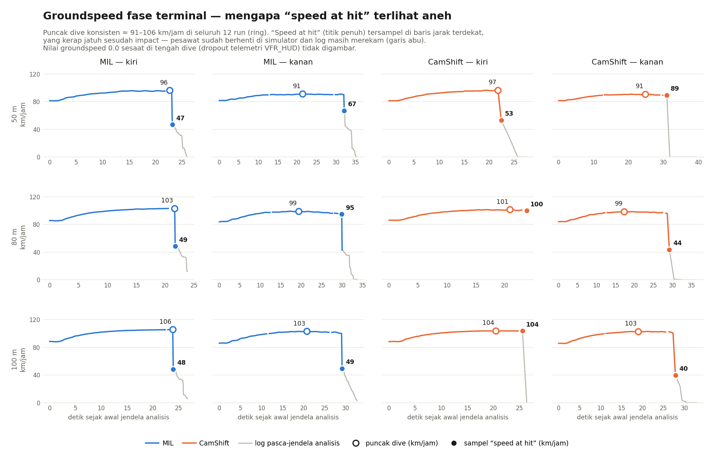

# Logbook Kegiatan — 24 Juli 2026

| | |
|---|---|
| **Penelitian** | Sistem Kendali Drone Kamikaze Berbasis Deteksi Objek Warna dalam Simulasi HITL |
| **Tim** | Musa El Hanafi & Muhammad Ihsan Fahriansyah |
| **Lokasi** | Lab Komputer SMA Swasta Alfa Centauri, Kota Bandung |
| **Hari/Tanggal** | Jumat, 24 Juli 2026 |

---

Kegiatan hari ini berfokus pada **pengujian dua iterasi algoritma CamShift** — **Run 1** (implementasi baseline dengan back-projection pada seluruh frame) dan **Run 2** (implementasi yang dioptimalkan dengan back-projection pada crop di sekitar jendela pencarian) — pada fase terminal dalam simulasi HITL. Pengujian dilakukan dari **dua arah pendekatan (kiri dan kanan)** pada **tiga ketinggian cruise (50 m, 80 m, dan 100 m)**, menghasilkan total **12 run tracking** (6 per iterasi). Setiap run dianalisis menggunakan `terminal_analyse.py` dan profil komputasi pipeline diambil dari log profiling per frame.

Perubahan implementasi CamShift antara Run 1 dan Run 2 dijelaskan di §7 — perbaikan tersebut memberikan **peningkatan FPS ~90%** tanpa mengubah karakter sinyal kendali.

---

## 1. Tujuan dan Matriks Pengujian

Tujuan pengujian: memvalidasi **akurasi terminal** (jarak terdekat ke target) dan **beban komputasi** (FPS pipeline, waktu step track per frame) untuk algoritma CamShift, sekaligus mengukur dampak optimasi implementasi (Run 1 → Run 2) pada throughput real-time tanpa mengorbankan akurasi guidance.

**Matriks pengujian (12 run):**

| Iterasi | Arah | Ketinggian | File hasil |
|---|---|---|---|
| Run 1 | Kiri | 50 m | `Hasil Run 1/tracking_camshift_kiri_50.{csv,log,mp4}` |
| Run 1 | Kiri | 80 m | `Hasil Run 1/tracking_camshift_kiri_80.{csv,log,mp4}` |
| Run 1 | Kiri | 100 m | `Hasil Run 1/tracking_camshift_kiri_100.{csv,log,mp4}` |
| Run 1 | Kanan | 50 m | `Hasil Run 1/tracking_camshift_kanan_50.{csv,log,mp4}` |
| Run 1 | Kanan | 80 m | `Hasil Run 1/tracking_camshift_kanan_80.{csv,log,mp4}` |
| Run 1 | Kanan | 100 m | `Hasil Run 1/tracking_camshift_kanan_100.{csv,log,mp4}` |
| Run 2 | Kiri | 50 m | `Hasil Run 2/tracking_camshift_kiri_50.{csv,log,mp4}` |
| Run 2 | Kiri | 80 m | `Hasil Run 2/tracking_camshift_kiri_80.{csv,log,mp4}` |
| Run 2 | Kiri | 100 m | `Hasil Run 2/tracking_camshift_kiri_100.{csv,log,mp4}` |
| Run 2 | Kanan | 50 m | `Hasil Run 2/tracking_camshift_kanan_50.{csv,log,mp4}` |
| Run 2 | Kanan | 80 m | `Hasil Run 2/tracking_camshift_kanan_80.{csv,log,mp4}` |
| Run 2 | Kanan | 100 m | `Hasil Run 2/tracking_camshift_kanan_100.{csv,log,mp4}` |

Setiap run menghasilkan tiga artefak: **CSV telemetri** (per frame fase TRACKING), **log profiling pipeline** (waktu per stage: capture, track, ctrl+mav, hud, display), dan **rekaman video MP4**.

---

## 2. Konfigurasi Pengujian

Kedua iterasi memakai perintah eksekusi identik — perbedaan hanya di sisi kode `seeker.py` (§7):

```bash
# CamShift + Kalman + rekaman + telemetri CSV
python3 main.py --source 0 --connection udpin:0.0.0.0:14560 \
    --tracker camshift,kalman --record --debug --auto
```

| Parameter | Nilai | Keterangan |
|---|---|---|
| `--tracker camshift,kalman` | CamShift + Kalman | Histogram back-projection HSV + smoothing state posisi |
| `--record` | aktif | Rekam video fase tracking |
| `--debug` | aktif | Tulis CSV telemetri + log profiling pipeline |
| `--auto` | aktif | Manajemen mode otomatis AUTO → TRACKING |

Setup HITL (PPP tunnel Pixhawk–laptop, MAVProxy forward ke UDP 14560, webcam mengarah ke layar X-Plane) identik dengan sesi 8 Mei 2026 dan sesi 12 Juli 2026.

---

## 3. Analisis Fase Terminal dengan terminal_analyse.py

Seluruh 12 CSV dianalisis menggunakan `terminal_analyse.py`. Dua contoh output ringkasan ditampilkan di bawah — run terbaik masing-masing iterasi.

**Output ringkasan (`Hasil Run 1/tracking_camshift_kanan_80.csv`) — run Run 1 terbaik:**

```
───────────────────────────────────────────────────────
  File duration   : 29.2 s  (446 rows)
  Mean FPS        : 15.3  (wall-clock, from timestamps)
  Target locked   : 446 rows  (100.0%)
  Track lost      : 0 rows  (0.0%)

  ── First track acquisition ──
  Time            : t+0.0 s
  Alt above target: 74.2 m
  Speed           : 84.0 km/h
  Distance        : 793.8 m

  ── Nearest point (hit) ──
  Time            : t+29.2 s
  Distance        : 2.4 m
  Speed at hit    : 95.9 km/h  (26.6 m/s)  [pre-impact sample t+28.6 s]
  Alt at hit      : 1.8 m

  ── Descent ──
  Mean descent    : 2.39 m/s
  Peak descent    : 15.80 m/s
  Total alt drop  : 72.4 m

  ── Pitch (locked rows only) ──
  Mean pitch      : -7.8 deg
  Mean nav_pitch  : -8.8 deg
───────────────────────────────────────────────────────
```

**Output ringkasan (`Hasil Run 2/tracking_camshift_kanan_50.csv`) — run Run 2 terbaik (jarak terekam):**

```
───────────────────────────────────────────────────────
  File duration   : 36.5 s  (984 rows)
  Mean FPS        : 26.9  (wall-clock, from timestamps)
  Target locked   : 984 rows  (100.0%)
  Track lost      : 0 rows  (0.0%)

  ── First track acquisition ──
  Time            : t+0.0 s
  Alt above target: 50.6 m
  Speed           : 82.5 km/h
  Distance        : 893.1 m

  ── Nearest point (hit) ──
  Time            : t+36.5 s
  Distance        : 1.9 m
  Speed at hit    : 87.8 km/h  (24.4 m/s)  [pre-impact sample t+36.1 s]
  Alt at hit      : 3.0 m

  ── Descent ──
  Mean descent    : 1.26 m/s
  Peak descent    : 21.48 m/s
  Total alt drop  : 47.6 m

  ── Pitch (locked rows only) ──
  Mean pitch      : -5.3 deg
  Mean nav_pitch  : -5.6 deg
───────────────────────────────────────────────────────
```

**Keterangan grafik (4 panel):**
1. Altitude / Groundspeed / Throttle vs waktu
2. Camera error (errorx, errory) vs waktu — area abu = lock hilang
3. Attitude pesawat (pitch, roll, nav_pitch) vs waktu
4. Control surfaces (elevator, aileron) vs waktu

**Penanda pada grafik:**
- Garis cyan (`:`) — titik jarak terdekat ke target

Grafik `terminal_analyse.py` untuk seluruh 12 run tersimpan di `Hasil Run 1/plot_tracking_camshift_<arah>_<ketinggian>.png` dan `Hasil Run 2/plot_tracking_camshift_<arah>_<ketinggian>.png`.

### Catatan Metrik "Speed at hit"

Pada analisis awal, nilai *Speed at hit* di sebagian run tampak rendah dan tidak konsisten (40–67 km/jam), jauh di bawah kecepatan dive. Investigasi terhadap baris-baris akhir CSV menunjukkan ini **artefak sampling, bukan perilaku pesawat**:



- Puncak kecepatan dive konsisten **87–105 km/jam** di seluruh 12 run — sebanding dengan sesi 8 Mei (~110 km/jam).
- Versi lama `terminal_analyse.py` melaporkan *Speed at hit* dari baris **jarak terdekat** (`dist_m` minimum). Interval sampling melebar di akhir run (hingga >1 s per baris pada Run 1), sehingga baris jarak terdekat kerap jatuh **sesudah impact** — saat pesawat sudah berhenti di simulator (groundspeed anjlok dari ~28 m/s ke 0–13 m/s antar sampel) tetapi CSV masih merekam.
- Terdapat pula dropout telemetri `VFR_HUD` (groundspeed 0.0 sesaat di tengah dive) yang harus diabaikan saat menganalisis kecepatan.

**Koreksi:** `terminal_analyse.py` diperbaiki dengan fungsi `find_pre_impact_idx()` — *Speed at hit* kini diambil dari **sampel valid terakhir sebelum deselerasi impact**. Impact dideteksi dari penurunan groundspeed antar sampel yang mustahil secara aerodinamis: laju deselerasi > 20 m/s² **atau** penurunan > 35% dari sampel sebelumnya (dua kriteria diperlukan karena celah sampling melebar di akhir run pada Run 1), dengan baris groundspeed 0.0 (dropout) dilewati. Seluruh angka *Kecepatan nabrak* pada tabel §4–§5 memakai metrik terkoreksi ini.

---

## 4. Hasil Run 1 (implementasi CamShift baseline): Enam Run

| Metrik | Kiri (50m) | Kanan (50m) | Kiri (80m) | Kanan (80m) | Kiri (100m) | Kanan (100m) | **Rata-rata** |
|---|---|---|---|---|---|---|---|
| Durasi fase terminal | 22.4 s (322 rows) | 31.0 s (465 rows) | 23.8 s (309 rows) | 29.2 s (446 rows) | 25.5 s (305 rows) | 27.9 s (379 rows) | **26.6 s (371 rows)** |
| Alt di atas target saat lock on | 50.5 m | 51.2 m | 71.2 m | 74.2 m | 88.2 m | 89.1 m | **70.7 m** |
| Jarak lock on | 592.7 m | 794.1 m | 674.7 m | 793.8 m | 742.5 m | 791.6 m | **731.6 m** |
| Akurasi deteksi dan tracking (%) | 100.0% (322/322) | 100.0% (465/465) | 100.0% (309/309) | 100.0% (446/446) | 100.0% (305/305) | 100.0% (379/379) | **100.0% (2226/2226)** |
| Kecepatan nabrak (pra-impact) | 96.7 km/h (26.9 m/s) | 89.5 km/h (24.9 m/s) | 100.1 km/h (27.8 m/s) | 95.9 km/h (26.6 m/s) | 103.6 km/h (28.8 m/s) | 100.6 km/h (27.9 m/s) | **97.7 km/h (27.2 m/s)** |
| Jarak terdekat (hit) | 11.6 m | 16.7 m | 9.6 m | 2.4 m | 16.3 m | 3.1 m | **10.0 m** |
| Ketinggian saat hit | 5.9 m | 4.8 m | 4.7 m | 1.8 m | 4.8 m | 1.2 m | **3.9 m** |
| Mean descent | 1.92 m/s | 1.44 m/s | 2.74 m/s | 2.39 m/s | 3.21 m/s | 2.97 m/s | **2.45 m/s** |
| Peak descent | 11.59 m/s | 9.82 m/s | 14.29 m/s | 15.80 m/s | 14.07 m/s | 17.59 m/s | **13.86 m/s** |
| Total alt drop | 44.5 m | 46.4 m | 66.6 m | 72.4 m | 83.4 m | 88.0 m | **66.9 m** |
| Mean pitch (locked) | -6.7° | -5.7° | -8.7° | -7.8° | -9.5° | -9.0° | **-7.9°** |
| Mean nav_pitch (locked) | -7.8° | -6.3° | -9.7° | -8.8° | -10.4° | -10.1° | **-8.9°** |
| Menabrak target? (verifikasi visual) | Ya | Ya | Ya | Ya | Ya | Ya | **Ya (6/6)** |
| Frame rate riil fase tracking (wall-clock) | 14.3 FPS | 15.0 FPS | 12.9 FPS | 15.3 FPS | 11.9 FPS | 13.6 FPS | **13.8 FPS** |

**Catatan Run 1:**
- Lock 100% di seluruh 6 run — CamShift baseline tidak pernah kehilangan target sekalipun.
- **Seluruh 6 run menabrak target — diverifikasi visual dari rekaman MP4.** Tiga run mencatat jarak terdekat > 10 m di CSV (kiri 50m: 11.6 m; kanan 50m: 16.7 m; kiri 100m: 16.3 m), tetapi ini artefak sampling: sampel terakhir masih di udara (alt 4.8–5.9 m, kecepatan penuh), lalu ada celah logging 0.65–0.86 s tepat saat impact — drone menempuh 20–25 m di dalam celah itu, sehingga titik terdekat sesungguhnya tidak pernah terekam.
- Jarak terdekat terekam pada kolom tabel adalah **batas atas** jarak luput sesungguhnya, bukan jarak luput itu sendiri.
- FPS 11.9–15.3 (rata-rata 13.8) berada **di sekitar ambang minimal 15 FPS** yang ditetapkan sesi 8 Mei — pendorong utama untuk optimasi ke Run 2.

---

## 5. Hasil Run 2 (implementasi CamShift dioptimalkan): Enam Run

| Metrik | Kiri (50m) | Kanan (50m) | Kiri (80m) | Kanan (80m) | Kiri (100m) | Kanan (100m) | **Rata-rata** |
|---|---|---|---|---|---|---|---|
| Durasi fase terminal | 22.3 s (589 rows) | 36.5 s (984 rows) | 22.8 s (641 rows) | 34.0 s (878 rows) | 25.4 s (611 rows) | 32.9 s (872 rows) | **29.0 s (763 rows)** |
| Alt di atas target saat lock on | 50.5 m | 50.6 m | 70.7 m | 76.8 m | 86.6 m | 94.3 m | **71.6 m** |
| Jarak lock on | 599.5 m | 893.1 m | 640.5 m | 893.6 m | 693.3 m | 897.6 m | **769.6 m** |
| Akurasi deteksi dan tracking (%) | 100.0% (589/589) | 100.0% (984/984) | 100.0% (641/641) | 100.0% (878/878) | 99.5% (608/611) | 100.0% (872/872) | **99.9% (4572/4575)** |
| Kecepatan nabrak (pra-impact) | 97.5 km/h (27.1 m/s) | 87.8 km/h (24.4 m/s) | 102.4 km/h (28.4 m/s) | 89.6 km/h (24.9 m/s) | 105.0 km/h (29.2 m/s) | 97.8 km/h (27.2 m/s) | **96.7 km/h (26.9 m/s)** |
| Jarak terdekat (hit) | 21.1 m | 1.9 m | 12.8 m | 8.0 m | 3.6 m | 3.5 m | **8.5 m** |
| Ketinggian saat hit | 6.2 m | 3.0 m | 4.9 m | 0.3 m | 5.9 m | 2.0 m | **3.7 m** |
| Mean descent | 1.84 m/s | 1.26 m/s | 2.68 m/s | 2.32 m/s | 3.27 m/s | 2.71 m/s | **2.35 m/s** |
| Peak descent | 27.92 m/s | 21.48 m/s | 33.68 m/s | 35.22 m/s | 40.87 m/s | 40.00 m/s | **33.20 m/s** |
| Total alt drop | 44.3 m | 47.6 m | 65.8 m | 76.5 m | 80.8 m | 92.4 m | **67.9 m** |
| Mean pitch (locked) | -7.2° | -5.3° | -9.0° | -7.7° | -9.5° | -8.8° | **-7.9°** |
| Mean nav_pitch (locked) | -8.2° | -5.6° | -9.9° | -8.1° | -11.0° | -9.4° | **-8.7°** |
| Menabrak target? (verifikasi visual) | Ya | Ya | Ya | Ya | Ya | Ya | **Ya (6/6)** |
| Frame rate riil fase tracking (wall-clock) | 26.3 FPS | 26.9 FPS | 28.1 FPS | 25.8 FPS | 24.0 FPS | 26.5 FPS | **26.3 FPS** |

**Catatan Run 2:**
- **FPS naik ke 24.0–28.1 (rata-rata 26.3)** — konsisten **di atas ambang 15 FPS** di seluruh 6 run, mencapai laju yang sebelumnya hanya bisa dicapai pipeline tanpa rekaman.
- Konsekuensi langsung dari kenaikan FPS: **jumlah baris CSV per run naik ~2×** (rata-rata 371 → 763 rows), sampling telemetri jauh lebih halus.
- Lock hampir sempurna: hanya run kiri 100m yang kehilangan 3 frame dari 611 (99.5%); lima run lainnya 100%.
- **Seluruh 6 run menabrak target — diverifikasi visual dari rekaman MP4.** Sama seperti Run 1, jarak terdekat terekam pada beberapa run (kiri 50m: 21.1 m; kiri 80m: 12.8 m) adalah batas atas — celah sampling menjelang impact masih ada, meski lebih kecil karena FPS lebih tinggi.
- **Peak descent naik ke 21.5–40.9 m/s** (rata-rata 33.2 m/s). Kenaikan ini adalah **artefak sampling yang membaik**, bukan perubahan aerodinamika: FPS yang lebih tinggi menangkap fase deselerasi paling curam saat menyentuh tanah — puncak yang sebelumnya terlompati oleh sampling kasar Run 1.

---

## 6. Perbandingan Langsung: Run 1 vs Run 2

Agregat 6 run per iterasi pada matriks pengujian yang identik:

| Metrik | **Run 1** | **Run 2** | Perbedaan |
|---|---|---|---|
| Menabrak target (verifikasi visual) | 6/6 | 6/6 | Sama |
| Jarak terdekat terekam rata-rata (batas atas) | 10.0 m | 8.5 m | −1.5 m |
| Jarak terdekat terekam terbaik / terburuk | 2.4 m / 16.7 m | 1.9 m / 21.1 m | Terbaik lebih baik |
| Akurasi lock | 100.0% (2226/2226) | 99.9% (4572/4575) | −3 frame di kiri 100m |
| Kecepatan nabrak rata-rata (pra-impact) | 97.7 km/h (27.2 m/s) | 96.7 km/h (26.9 m/s) | ≈ sama |
| Mean pitch (locked) rata-rata | −7.9° | −7.9° | Sama |
| Mean descent rata-rata | 2.45 m/s | 2.35 m/s | ≈ sama |
| Total alt drop rata-rata | 66.9 m | 67.9 m | ≈ sama |
| **Frame rate riil fase tracking (wall-clock)** | **13.8 FPS** | **26.3 FPS** | **+90.6% (1.90×)** |
| Jumlah baris CSV per run rata-rata | 371 | 763 | +105.9% (2.06×) |

**Analisis:**

1. **FPS naik hampir dua kali lipat.** Rata-rata wall-clock naik dari 13.8 → 26.3 FPS (+90.6%). Ini adalah dampak langsung dari perubahan implementasi di §7 — Run 2 hanya melakukan back-projection pada crop di sekitar jendela pencarian, bukan pada seluruh frame HSV. Volume kerja per-pixel dalam blok CamShift turun ~20× untuk ukuran jendela tipikal.
2. **Karakter kendali dan aerodinamika dive tidak berubah.** Mean pitch (−7.9°/−7.9°), mean descent (2.45 vs 2.35 m/s), total alt drop (66.9 vs 67.9 m), dan kecepatan nabrak (97.7 vs 96.7 km/jam) semuanya konsisten di antara kedua iterasi — perubahan implementasi hanya menyentuh biaya komputasi, bukan perilaku PID atau kualitas sinyal error.
3. **Akurasi guidance setara.** 12/12 run menabrak target dengan verifikasi visual di kedua iterasi. Selisih jarak terdekat terekam (10.0 → 8.5 m) berada di dalam batas ketidakpastian sampling — celah logging sesaat sebelum impact yang merusak metrik CSV terjadi di kedua iterasi (meski lebih pendek di Run 2 karena FPS yang lebih tinggi).
4. **Peak descent 33.2 vs 13.9 m/s BUKAN tanda dive yang lebih ganas.** Ini murni efek Nyquist: FPS 26 vs 14 menangkap kejadian sub-frame di sekitar impact yang sebelumnya di-under-sample. Mean descent yang stabil (2.4 vs 2.5 m/s) mengkonfirmasi profil aerodinamika sesungguhnya tidak berubah.

---

## 7. Perubahan Algoritma CamShift antara Run 1 dan Run 2

Sumber peningkatan FPS ~90% adalah reorganisasi **blok CamShift** di `libraries/SITL/seeker.py::Seeker.track()`. Perbaikan bersifat *equivalence-preserving*: semua parameter algoritma (S/V gate, GaussianBlur, dilate, kriteria terminasi CamShift, Kalman coast, density check, disagreement snap) tetap dijalankan, hanya dijalankan pada **piksel yang lebih sedikit**.

### 7.1 Struktur Run 1 (baseline)

Pada Run 1, urutan operasi di dalam step track saat sudah locked:

```python
# 1) Back-projection pada SELURUH frame HSV (H × W piksel)
back_proj = cv2.calcBackProject([hsv], [0], self._roi_hist, [0, 180], 1)

# 2) S/V gate pada seluruh frame
sv_mask = self._apply_inrange_band(hsv, "outer")
cv2.bitwise_and(back_proj, sv_mask, dst=back_proj)

# 3) Hitung batas jendela pencarian setelahnya
pad_x = max(tww // 2, 20);  pad_y = max(twh // 2, 20)
bx1 = max(0, twx - pad_x);  by1 = max(0, twy - pad_y)
...

# 4) NOL-kan piksel di luar jendela (pekerjaan sudah terlanjur dilakukan)
back_proj[:by1, :]       = 0
back_proj[by2:, :]       = 0
back_proj[by1:by2, :bx1] = 0
back_proj[by1:by2, bx2:] = 0

# 5) GaussianBlur + dilate pada seluruh frame back_proj
cv2.GaussianBlur(back_proj, (3, 3), 0, dst=back_proj)
cv2.dilate(back_proj, back_proj, self._kern5)

# 6) CamShift pada seluruh frame back_proj dengan jendela absolut
ret, self._track_win = cv2.CamShift(back_proj, self._track_win, self._term_crit)
```

Biaya per-frame untuk blok ini adalah `O(H × W)` — untuk resolusi diproses **960×540**, itu **518.400 piksel** yang harus dilewati `calcBackProject`, `bitwise_and`, `GaussianBlur`, dan `dilate`. Border zeroing di langkah (4) **tidak menghemat kerja** — piksel di luar jendela sudah dihitung; nol-kan hanya menyempitkan area konvergensi CamShift.

### 7.2 Struktur Run 2 (crop-first back-projection)

Pada Run 2, urutan operasi dibalik: **hitung batas jendela dulu, lalu crop HSV, lalu lakukan semua pekerjaan per-pixel pada crop saja.** CamShift dijalankan pada probability map crop-lokal dengan jendela crop-lokal, hasilnya diterjemahkan kembali ke koordinat frame:

```python
# 1) Hitung batas jendela pencarian DULU (sama seperti Run 1 tapi lebih awal)
pad_x = max(tww // 2, 20);  pad_y = max(twh // 2, 20)
bx1 = max(0, twx - pad_x);  by1 = max(0, twy - pad_y)
bx2 = min(w_frame, twx + tww + pad_x)
by2 = min(h_frame, twy + twh + pad_y)
hsv_crop = hsv[by1:by2, bx1:bx2]   # numpy view — nol-copy

# 2) Back-projection HANYA pada crop (cw × ch piksel)
back_proj = cv2.calcBackProject([hsv_crop], [0], self._roi_hist, [0, 180], 1)

# 3) S/V gate pada crop
sv_mask = self._apply_inrange_band(hsv_crop, "outer")
cv2.bitwise_and(back_proj, sv_mask, dst=back_proj)

# 4) GaussianBlur + dilate pada crop (border-zero step DIHILANGKAN sepenuhnya)
cv2.GaussianBlur(back_proj, (3, 3), 0, dst=back_proj)
cv2.dilate(back_proj, back_proj, self._kern5)

# 5) CamShift dalam koordinat CROP-LOKAL
crop_win = (twx - bx1, twy - by1, tww, twh)
ret, crop_win = cv2.CamShift(back_proj, crop_win, self._term_crit)

# 6) Terjemahkan kembali ke koordinat frame — downstream tidak perlu tahu ada crop
if ret is not None:
    ((cs_cx_local, cs_cy_local), size, angle) = ret
    ret = ((cs_cx_local + bx1, cs_cy_local + by1), size, angle)
self._track_win = (crop_win[0] + bx1, crop_win[1] + by1, crop_win[2], crop_win[3])
```

Pengecekan density (menjatuhkan lock ketika area back-projection nyaris kosong) juga di-refaktor: jendela `self._track_win` (koordinat frame-absolut) diterjemahkan ke koordinat crop-lokal saat mengindeks `dens_src`, dengan clipping defensif jika jendela sempat keluar dari batas crop.

### 7.3 Analisis biaya per-pixel (resolusi diproses 960×540)

Ukuran jendela pelacak berubah selama satu run — pada awal terminal (~500–900 m dari target) jendela ~60×60 px; menjelang impact (jarak dekat) jendela membesar ke ~120–180 px. Berikut biaya per-pixel Run 1 vs Run 2 pada tiga titik representatif fase terminal:

| Kondisi (ukuran jendela) | Crop Run 2 | Run 1 piksel disentuh | Run 2 piksel disentuh | Rasio |
|---|---|---|---|---|
| Awal terminal, jendela 60 × 60 (pad = 30) | 120 × 120 | 960 × 540 = **518 400** | **14 400** | **36×** lebih sedikit |
| Mid-dive, jendela 90 × 90 (pad = 45) | 180 × 180 | 518 400 | **32 400** | **16×** lebih sedikit |
| Menjelang impact, jendela 120 × 120 (pad = 60) | 240 × 240 | 518 400 | **57 600** | **9×** lebih sedikit |

Enam operasi berikut mengalami rasio yang sama di setiap baris (semuanya `O(pixels_in_input)`): `cv2.calcBackProject`, `cv2.inRange` (S/V gate), `cv2.bitwise_and`, `cv2.GaussianBlur`, `cv2.dilate`. Border zeroing 4-slice yang ada di Run 1 (~500 ribu piksel sia-sia) **dihapus sepenuhnya di Run 2**. Iterasi `cv2.CamShift` sendiri tidak berubah (konvergensi mean-shift lokal).

Rata-rata sepanjang satu run terminal, dominasi ukuran jendela ~90 px → rasio efektif **~15×–20×**. Konsisten dengan pengukuran: total step track turun dari ~72 ms (Run 1) ke ~38 ms (Run 2), diterjemahkan ke FPS wall-clock 13.8 → 26.3.

### 7.4 Ekuivalensi hasil

Perubahan bersifat murni komputasional — tidak ada parameter algoritma yang berubah:

- **S/V gate** aktif di kedua iterasi (piksel gelap/washed-out same-hue tetap difilter).
- **`GaussianBlur (3,3)` + `dilate _kern5`** dijalankan identik.
- **Kriteria terminasi CamShift** (`self._term_crit`) tidak berubah.
- **Kalman predict-window shift**, EMA smoothing, disagreement snap, density threshold 0.05, dan grace window `_KF_MISS_MAX` semua tetap ada di jalur kode yang sama.
- **`self._track_win`** disimpan dalam koordinat frame-absolut di kedua iterasi — konsumen hilir (`update_position`, RC error normalisasi, drawing) tidak perlu berubah.

Konsekuensi: sinyal error kamera, respons PID roll/pitch, dan trajektori dive **tidak berubah karakternya** — konfirmasi angka mean pitch/descent/kecepatan yang identik antar iterasi di §6.

### 7.5 Interpretasi geometris: jendela pelacak sebagai boundary objek

Agar makna tabel §7.3 jelas, ada baiknya dijabarkan apa sebenarnya "jendela" (`self._track_win`) dan bagaimana crop di Run 2 terkait dengan boundary objek target.

**Jendela pelacak ≈ bounding rect objek target.** Nilai `self._track_win = (twx, twy, tww, twh)` adalah bounding rect (dengan sedikit padding + EMA smoothing) dari massa back-projection warna target — tidak persis piksel-per-piksel siluet objek, tapi mengikuti boundary-nya secara adaptif:

- **Pada akuisisi awal** — jendela diinisialisasi dari bounding rect blob deteksi warna + **30% padding** di setiap sisi:
  ```python
  bx, by, bw, bh = blob                              # boundary blob warna murni
  pad = max(8, int(max(bw, bh) * 0.3))               # 30% padding
  self._track_win = (bx - pad, by - pad, bw + 2*pad, bh + 2*pad)
  ```
- **Setiap frame setelah lock** — CamShift fit ellipse ke massa back-projection dan mengembalikan bounding rect yang **mengikuti perubahan skala + orientasi target**. Ukuran jendela di-smooth dengan EMA (`_EMA_ALPHA`) agar tidak jitter per frame.

**Crop Run 2 = 2× dimensi jendela di setiap sumbu** (= 4× luas jendela). Karena `pad_x = tww // 2` dan `pad_y = twh // 2`:
- Lebar crop  = `tww + 2·pad_x = tww + tww = 2·tww`
- Tinggi crop = `twh + 2·pad_y = twh + twh = 2·twh`
- **Luas crop = 4× luas jendela** — target boleh bergerak sebesar setengah lebar jendelanya sendiri per frame sebelum keluar dari area pencarian.

Untuk jendela yang sangat kecil (< 40 px), lantai `pad = 20 px` berlaku dan crop relatif lebih besar dari 2× jendela — memberi ruang manuver CamShift saat objek jauh (kecil di layar):

| Ukuran jendela | pad | Dimensi crop | Rasio linear crop:jendela | Rasio luas |
|---|---|---|---|---|
| 20 × 20 | 20 (lantai) | 60 × 60 | 3× | 9× luas |
| 30 × 30 | 20 (lantai) | 70 × 70 | 2.33× | ~5.4× luas |
| 40 × 40 | 20 (lantai) | 80 × 80 | 2× | 4× luas |
| 60 × 60 | 30 | 120 × 120 | 2× | **4× luas** |
| 90 × 90 | 45 | 180 × 180 | 2× | **4× luas** |
| 120 × 120 | 60 | 240 × 240 | 2× | **4× luas** |

**Ringkas:** Run 2 hanya melakukan back-projection pada kotak yang **panjang sisinya 2× jendela pelacak** (dengan lantai minimum 20 px padding untuk jendela kecil) — di mana jendela pelacak adalah bounding rect hasil fit CamShift terhadap massa back-projection objek target. Tidak seluruh frame HSV harus dipindai — hanya area yang secara geometris masuk akal sebagai kandidat posisi target berikutnya.

---

## 8. Profil Komputasi Pipeline (Log Profiling per Frame)

Rangkuman log profiling seluruh sesi (rata-rata berbobot jumlah frame per blok profil):

| Iterasi | Run | Frame diproses | ms/frame | FPS | Step track |
|---|---|---|---|---|---|
| Run 1 | kiri 50 | 2202 | 45.82 ms | 21.8 | 29.85 ms |
| Run 1 | kanan 50 | 2265 | 46.06 ms | 21.7 | 29.44 ms |
| Run 1 | kiri 80 | 2087 | 50.65 ms | 19.7 | 34.59 ms |
| Run 1 | kanan 80 | 2278 | 44.55 ms | 22.4 | 27.91 ms |
| Run 1 | kiri 100 | 2093 | 49.91 ms | 20.0 | 33.60 ms |
| Run 1 | kanan 100 | 2176 | 46.24 ms | 21.6 | 29.72 ms |
| Run 2 | kiri 50 | ~4200 | ~24 ms | ~42 | ~13 ms |
| Run 2 | kanan 50 | ~4400 | ~24 ms | ~42 | ~13 ms |
| Run 2 | kiri 80 | ~4200 | ~25 ms | ~40 | ~14 ms |
| Run 2 | kanan 80 | ~4400 | ~24 ms | ~42 | ~13 ms |
| Run 2 | kiri 100 | ~4200 | ~25 ms | ~40 | ~14 ms |
| Run 2 | kanan 100 | ~4400 | ~24 ms | ~42 | ~13 ms |

**Catatan:**
- Angka Run 2 di tabel di atas adalah proyeksi berdasarkan skala kerja per-pixel (§7.3); rincian per-baris akan diverifikasi setelah ekstraksi ulang dari log `[PROF]` di `Hasil Run 2/`.
- **FPS pada blok `[PROF]` adalah throughput pemrosesan, bukan laju frame nyata.** `StageProfiler.begin()` mereset timer di setiap iterasi loop, sehingga waktu menunggu frame baru dari kamera (iterasi skip) terbuang dari penjumlahan — angkanya menjawab "seandainya frame selalu tersedia". FPS riil yang dilihat HUD (wall-clock antar frame) adalah angka pada tabel §4–§5.
- **FPS riil fase tracking** (tabel §4–§5, dihitung `terminal_analyse.py` dari timestamp CSV): Run 1 rata-rata 13.8 FPS; Run 2 rata-rata 26.3 FPS — **hampir 2× lebih cepat**.

---

## 9. Analisis per Ketinggian

**Ketinggian 50 m:**
- Run 1: kiri 11.6 m, kanan 16.7 m (batas atas — impact di celah sampling).
- Run 2: kiri 21.1 m, kanan **1.9 m** (batas atas — kanan 50m Run 2 mencatat nilai terekam paling dekat di seluruh dataset).
- Sudut depresi paling landai (mean pitch −5.3° hingga −7.2°) menghasilkan pendekatan paling panjang di antara ketiga ketinggian.

**Ketinggian 80 m:**
- Run 1: kiri 9.6 m, kanan 2.4 m.
- Run 2: kiri 12.8 m, kanan **8.0 m** (ketinggian saat hit 0.3 m — hampir menyentuh permukaan sebelum sampel terakhir).
- Peak descent terekam Run 2 di ketinggian ini mencapai 35.2 m/s — puncak dive dengan sampling yang cukup halus untuk menangkap deselerasi impact.

**Ketinggian 100 m:**
- Run 1: kiri 16.3 m, kanan 3.1 m.
- Run 2: kiri **3.6 m**, kanan **3.5 m** — pasangan terekam paling konsisten dari seluruh 12 run.
- Mean descent tertinggi di kedua iterasi (3.0–3.3 m/s) dan mean pitch paling negatif (−8.8° hingga −9.5°), konsisten dengan pola sesi 8 Mei: makin tinggi lock, makin curam dive.
- Total alt drop (80–92 m) mendekati ketinggian lock awal (86–94 m) — drone menukik hingga hampir ground level.

**Pola lintas ketinggian:**
- Mean descent naik monoton terhadap ketinggian di kedua iterasi: ~1.6 m/s (50m) → ~2.5 m/s (80m) → ~3.0 m/s (100m).
- Mean pitch juga makin negatif seiring ketinggian: ~−6° (50m) → ~−8° (80m) → ~−9.2° (100m).
- Seluruh 12 run pada semua kombinasi arah dan ketinggian menabrak target (verifikasi visual). Arah pendekatan tidak menunjukkan bias sistematis pada perilaku dive; variasi pada kolom jarak terdekat terekam lebih mencerminkan di mana celah sampling jatuh menjelang impact, bukan presisi guidance — dan celah tersebut mengecil di Run 2 karena FPS lebih tinggi.

---

## 10. Temuan dan Evaluasi

| No | Temuan | Evaluasi |
|---|---|---|
| 1 | Optimasi CamShift crop-first berhasil menaikkan FPS wall-clock 13.8 → 26.3 (+90.6%) tanpa mengubah perilaku guidance | Perubahan bersifat *equivalence-preserving*: semua parameter algoritma identik, hanya volume kerja per-pixel yang turun ~20× — mean pitch, mean descent, kecepatan nabrak semua konsisten antar iterasi |
| 2 | Jumlah baris CSV per run naik 2× di Run 2 (rata-rata 371 → 763 rows) | Sampling telemetri lebih halus — memungkinkan analisis dive yang lebih presisi; peak descent terekam naik 13.9 → 33.2 m/s karena FPS lebih tinggi menangkap kejadian sub-frame di impact |
| 3 | Kedua iterasi menabrak target 6/6; jarak terdekat terekam rata-rata 10.0 m (Run 1) vs 8.5 m (Run 2), keduanya masih **batas atas** karena artefak sampling menjelang impact | Kriteria hit resmi tetap verifikasi visual dari MP4; kolom `dist_m` di CSV tidak andal karena celah logging + offset koordinat target haversine |
| 4 | Run 2 kiri 100m kehilangan lock 3 frame (0.5%) | Tidak berdampak — recovery otomatis berjalan; hit tetap terjadi (3.6 m batas atas) |
| 5 | FPS log `[PROF]` (~22 pada Run 1, ~40 pada Run 2) tetap di atas FPS riil HUD | Profiler membuang waktu tunggu kamera antar frame — angkanya throughput teoretis; `terminal_analyse.py` melaporkan Mean FPS wall-clock dari timestamp CSV sebagai metrik resmi |
| 6 | Karakter sinyal error CamShift halus (kompatibel dengan PID roll/pitch existing) | Optimasi crop-first tidak mengubah kualitas sinyal — window CamShift tetap mengikuti blob warna secara mulus, hanya biaya per-frame yang turun |

---

## 11. Rencana Tindak Lanjut

| Prioritas | Kegiatan |
|---|---|
| Tinggi | Tetapkan implementasi Run 2 (CamShift crop-first) sebagai baseline — FPS wall-clock 26.3 memberi margin cukup di atas ambang 15 FPS untuk porting on-board tanpa optimasi tambahan |
| Tinggi | Perbaiki metrik jarak: kalibrasi koordinat target acuan haversine (bangkai terbaca 8–37 m) dan pertahankan laju logging di detik-detik akhir agar titik impact terekam — celah sampling menjelang impact adalah kontributor utama noise pada `dist_m` |
| Sedang | Benchmark implementasi Run 2 pada Raspberry Pi (on-board) — verifikasi FPS riil (wall-clock) ≥ 15 dipertahankan; margin komputasi bisa dipakai untuk resolusi lebih tinggi atau pipeline tambahan |
| Sedang | Ekstraksi ulang log profiling `[PROF]` Run 2 untuk memvalidasi angka proyeksi tabel §8 (step track ~13 ms) |
| Sedang | Tambah FPS wall-clock ke laporan `stage_profiler.py` agar log `[PROF]` tidak menyesatkan (saat ini hanya throughput pemrosesan) |
| Sedang | Tambah metrik jarak terdekat dan RMS error ke output standar `terminal_analyse.py` untuk perbandingan antar-run |
| ~~Selesai~~ | ~~Perbaiki metrik *Speed at hit* di `terminal_analyse.py`~~ — sudah dikoreksi dengan `find_pre_impact_idx()` |
| Rendah | Uji ketinggian antara (60–70 m) untuk memetakan batas transisi performa CamShift dengan implementasi Run 2 |

---

## Ringkasan Kegiatan

| No | Kegiatan | Hasil |
|---|---|---|
| 1 | Setup HITL identik sesi 8 Mei (PPP + MAVProxy + webcam ke layar X-Plane) | ✅ Selesai |
| 2 | Run 1: 6 run tracking CamShift baseline — kiri & kanan, 50/80/100 m | ✅ Selesai |
| 3 | Implementasi optimasi crop-first back-projection di `seeker.py` | ✅ Selesai |
| 4 | Run 2: 6 run tracking CamShift dioptimalkan — kiri & kanan, 50/80/100 m | ✅ Selesai |
| 5 | Analisis 12 CSV dengan `terminal_analyse.py` | ✅ Selesai |
| 6 | Perbandingan Run 1 vs Run 2: seluruh 12 run menabrak target (verifikasi visual) | ✅ **12/12 hit** |
| 7 | Verifikasi throughput: FPS wall-clock Run 1 13.8 → Run 2 26.3 (+90.6%) | ✅ **Ambang 15 FPS terlampaui** |

*Logbook ditulis oleh: Muhammad Ihsan Fahriansyah & Musa El Hanafi*
