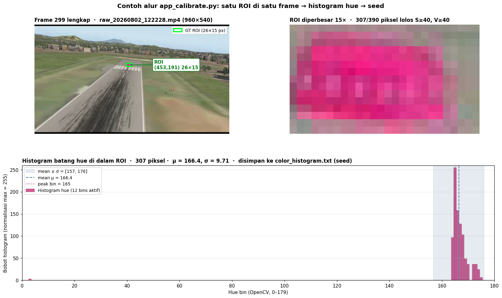
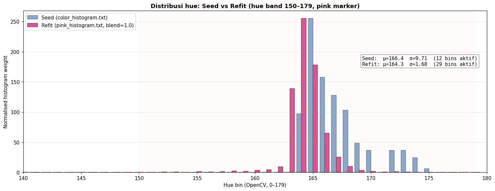
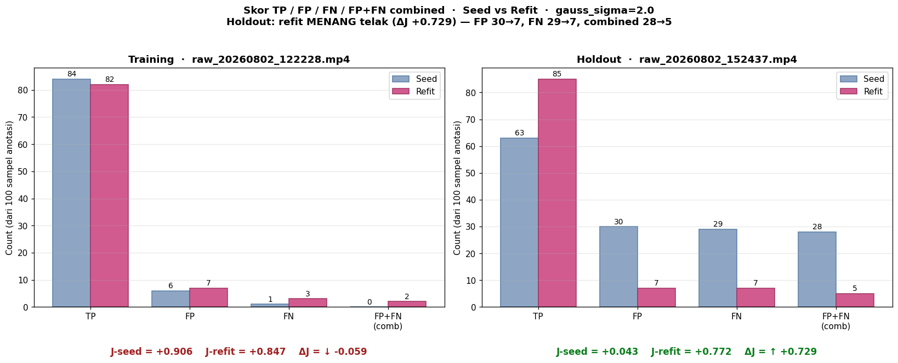
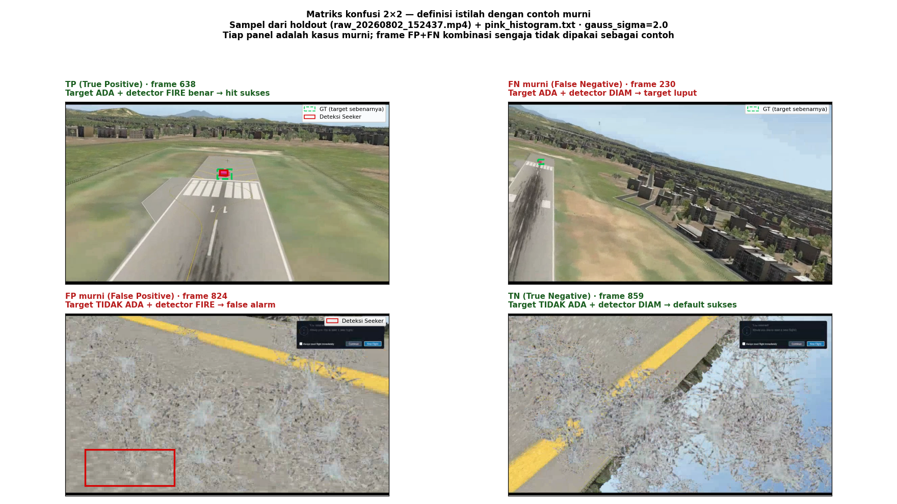
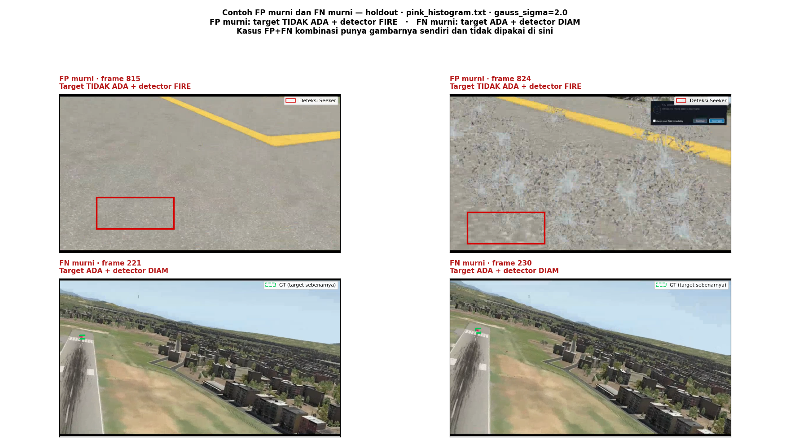
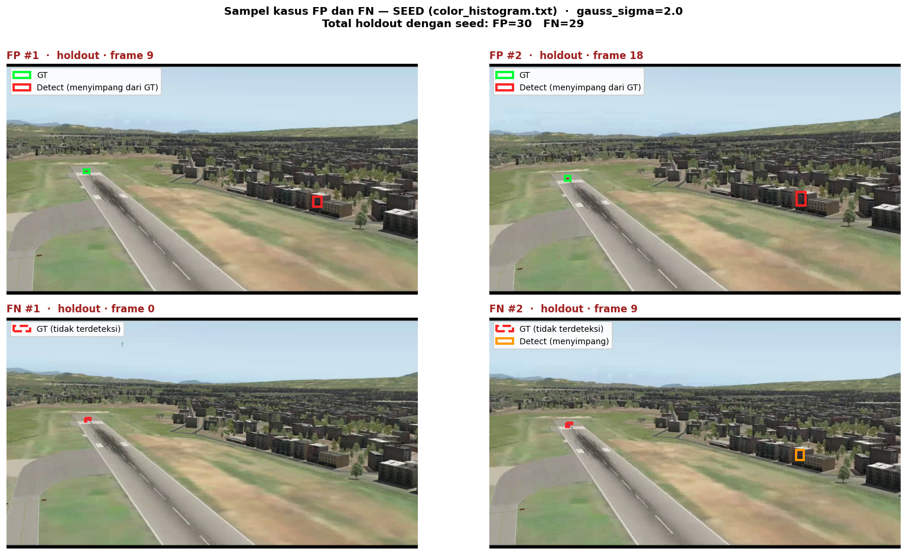
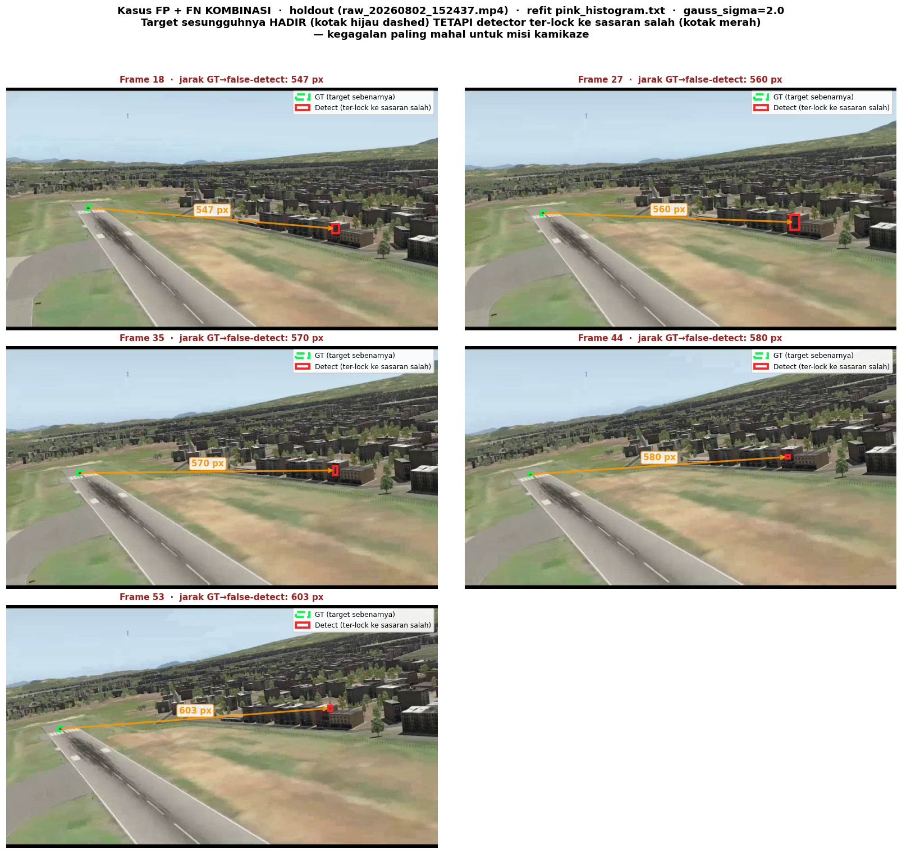

# Logbook Kegiatan — 2 Agustus 2026

| | |
|---|---|
| **Penelitian** | Sistem Kendali Drone Kamikaze Berbasis Deteksi Objek Warna dalam Simulasi HITL |
| **Tim** | Musa El Hanafi & Muhammad Ihsan Fahriansyah |
| **Lokasi** | Lab Komputer SMA Swasta Alfa Centauri, Kota Bandung |
| **Hari/Tanggal** | Sabtu, 2 Agustus 2026 |

---

Kegiatan hari ini adalah **fine-tuning kalibrasi warna berbasis ground truth**. Prosesnya dalam empat langkah:

1. **Seed histogram** dihasilkan `app_calibrate.py` dari satu ROI di satu frame (metode standar hand-picked)
2. **Fine-tuning berbasis ground truth** — sample warna dari kotak GT training clip, refit histogram
3. **Evaluasi dengan `gauss_sigma=2`** — pita hue Seeker mean ± 2σ (lebih longgar dari default 1σ)
4. **Perbandingan performa** seed vs refit + verifikasi visual per kategori TP/FP/FN/TN, kasus FP+FN kombinasi (misdirection)

**Hasil utama:** klip holdout mengandung episode misdirection (FP+FN kombinasi salah arah) yang seed hampir tidak sanggup menangani (recall 68%, 28 kasus combined). Refit dari fine-tuning **menyelamatkan seluruh episode** — recall naik ke 92% dan kasus combined turun dari 28 → 5 (−82%). Bukti bahwa fine-tuning berbasis GT bukan sekadar cosmetics, tetapi memperbaiki mode kegagalan paling mahal untuk misi kamikaze.

---

## 1. Sumber Rekaman

Dua rekaman HITL fase terminal dengan target hot-pink:

| Peran | File | Durasi (frame) | Resolusi |
|---|---|---:|---:|
| **Training** | `raw_20260802_122228.mp4` | 706 | 960 × 540 |
| **Holdout** | `raw_20260802_152437.mp4` | 878 | 960 × 540 |

Klip holdout lebih panjang (878 frame) dan mengandung fase dengan latar bangunan/atap yang membingungkan detektor — ini menjadi stress test untuk histogram warna.

---

## 2. Anotasi Ground Truth

`script/app_annotate.py` melakukan stratified sub-sampling ~100 frame merata sepanjang klip. Setiap frame dianotasi manual sebagai *positive* (dengan bounding box target) atau *explicitly empty*.

| Split | Sumber | Sampel | Marked done | Frame dengan box | % positive |
|---|---|---:|---:|---:|---:|
| `dataset/train` | `raw_20260802_122228.mp4` | 100 | 100 | 85 | 85% |
| `dataset/holdout` | `raw_20260802_152437.mp4` | 100 | 100 | 92 | 92% |

Struktur dataset:

```
drone-seeker/dataset/
├── train/     annotations.json (100 samples, 85 boxes)  +  frames/*.png
└── holdout/   annotations.json (100 samples, 92 boxes)  +  frames/*.png
```

---

## 3. Seed Histogram — `app_calibrate.py`

`app_calibrate.py` normalnya interaktif: pengguna menggambar ROI di satu frame, histogram hue di dalam ROI (dengan gate S/V) menjadi `color_histogram.txt`. Untuk sesi ini seed disiapkan dengan cara setara (script `scratchpad/emulate_app_calibrate.py`) yang menggunakan **satu kotak GT di frame tengah training** sebagai ROI — piksel diambil dengan S ≥ 40 dan V ≥ 40, kemudian histogram 180-bin dinormalisasi ke max = 255.

**Contoh visual satu shot `app_calibrate.py`** — frame + ROI + histogram batang seed:



Panel kiri-atas: frame 299 dari klip training dengan kotak GT hijau (26×15 px) di ujung runway. Panel kanan-atas: ROI diperbesar 15× — terlihat sebaran hue pink pekat di tengah, dengan 307/390 piksel lolos S/V gate (S ≥ 40, V ≥ 40). Panel bawah: histogram batang hue dari 307 piksel yang lolos, dinormalisasi max = 255 dan disimpan langsung sebagai `color_histogram.txt` (12 bin aktif, μ = 166.4, σ = 9.71, peak bin 165). Cakupan sempit karena satu ROI di satu frame — cukup menangkap warna target di frame tersebut, tetapi belum menampung variasi hue sepanjang misi (masalah yang diselesaikan `app_finetune.py` di §4).

**Statistik seed (`color_histogram.txt`):**
- Frame ROI: 299 (tengah 85 positive training)
- 307 piksel disampling (dari 390 total dalam ROI 26×15)
- **Mean 166.4, std 9.71, 12 nonzero bins, peak bin 165**
- Sesudah Seeker's internal Gaussian fit: **8 effective bins** dalam pita mean ± σ

Ini adalah baseline detector — sempit karena satu ROI, cukup untuk hue target yang dominan di frame ROI, tetapi belum menampung variasi hue sepanjang klip.

---

## 4. Fine-tuning Berbasis Ground Truth

`app_finetune.py` refit histogram dari sampel piksel di **seluruh 85 GT box** training, kemudian membuktikan atau menolak kandidat berdasarkan skor holdout.

**Perintah lengkap:**

```bash
python3 script/app_finetune.py \
    --source raw_20260802_122228.mp4 --truth dataset/train \
    --holdout raw_20260802_152437.mp4 --holdout-truth dataset/holdout \
    --output pink_histogram.txt \
    --blend 1.0 --tracker camshift,kalman \
    --gauss-sigma 2 --force
```

Parameter kunci:
- `--blend 1.0` — full-replace seed dengan histogram baru dari GT samples
- `--gauss-sigma 2` — Seeker replay memakai pita hue mean ± 2σ (lebih toleran ke variasi warna target)
- `--force` — tulis pink_histogram.txt walaupun skript menganggap refit tidak wajib

**Statistik refit (`pink_histogram.txt`):**
- 42 846 piksel disampling dari 85 GT box (S/V gate ≥ 40/40, core 60% default)
- **Mean 164.3, std 1.68, 29 nonzero bins raw / 7 effective bins**
- Mean bergeser −2.1 bin dari seed (167.0 → 164.3), lebih terkonsentrasi di pink pekat

---

## 5. Perbandingan Performa

Skoring pada 100 sampel anotasi masing-masing klip, `gauss_sigma=2.0`, IoU ≥ 0.3, center pad 4 px.

### 5.1 Distribusi Hue — Seed vs Refit



Seed menyebar lebar (σ=9.71, 12 bins aktif) dengan ekor sampai bin 175 — hue yang tidak semuanya milik target. Refit jauh lebih tajam (σ=1.68) dan terpusat di bin 164–166 walau bins aktif lebih banyak (29), karena bin tambahan itu berbobot sangat kecil (efektif 7 bins dalam pita mean ± σ).

### 5.2 Skor TP / FP / FN per Klip



### 5.3 Rumus Metrik Evaluasi

Dari TP/FP/FN diturunkan tiga metrik ringkas yang dipakai di tabel §5.4, mengikuti formulasi baku Van Rijsbergen [[35]](../../drone-seeker/docs/05-BIBLIOGRAPHY.md), Bab 7:

$$\text{Precision} = \frac{\text{TP}}{\text{TP} + \text{FP}} \qquad \text{Recall} = \frac{\text{TP}}{\text{TP} + \text{FN}}$$

F1 bukan rumus yang berdiri sendiri, melainkan kasus khusus **F_β-measure** — bentuk umum yang dirumuskan Van Rijsbergen:

$$F_\beta = \frac{(1 + \beta^2) \cdot \text{Precision} \cdot \text{Recall}}{\beta^2 \cdot \text{Precision} + \text{Recall}}$$

Bentuk aslinya adalah **E-measure** (*effectiveness*), dengan bobot α ∈ (0, 1) yang kemudian disubstitusi menjadi β agar lebih intuitif:

$$E = 1 - \frac{1}{\alpha \dfrac{1}{\text{Precision}} + (1 - \alpha) \dfrac{1}{\text{Recall}}} \qquad \beta^2 = \frac{1 - \alpha}{\alpha} \qquad F_\beta = 1 - E$$

**β = seberapa kali lipat recall dianggap lebih penting daripada precision.** Substitusi β = 1 (α = 0.5) memberi bobot setimbang dan menghasilkan F1 yang biasa dipakai:

$$F_1 = \frac{2 \cdot \text{Precision} \cdot \text{Recall}}{\text{Precision} + \text{Recall}}$$

Contoh dengan angka holdout × refit (TP = 85, FP = 7, FN = 7):

$$P = \frac{85}{85 + 7} = 0.924 \qquad R = \frac{85}{85 + 7} = 0.924 \qquad F_1 = \frac{2 \cdot 0.924 \cdot 0.924}{0.924 + 0.924} = 0.924$$

Catatan: misi kamikaze secara profil biaya sebenarnya cocok dengan β > 1 (misal β = 2, artinya kehilangan target 2× lebih mahal dari false alarm). Sesi ini tetap melaporkan F1 (β = 1) sebagai ringkasan, tetapi keputusan accept/reject memakai objektif **J** — lihat §5.5, karena J juga bisa menghukum kasus *combined FP+FN* terpisah, sesuatu yang tidak bisa diekspresikan F_β pada nilai β mana pun.

### 5.4 Matriks Konfusi Lengkap

| Klip × Histogram | TP | FN | FP | TN | FP+FN comb | Precision | Recall | F1 | **J** |
|---|---:|---:|---:|---:|:---:|:---:|:---:|:---:|:---:|
| Training × Seed | 84 | 1 | 6 | 9 | 0 | 0.933 | 0.988 | 0.960 | **+0.906** |
| Training × Refit | 82 | 3 | 7 | 10 | 2 | 0.921 | 0.965 | 0.943 | **+0.847** |
| Holdout × Seed | 63 | 29 | 30 | 6 | 28 | 0.677 | 0.685 | 0.681 | **+0.043** |
| **Holdout × Refit** | **85** | **7** | **7** | **6** | **5** | **0.924** | **0.924** | **0.924** | **+0.772** |

### 5.5 Interpretasi

**Holdout (data yang menentukan) — refit menang telak:**
- **TP naik 22** (63 → 85) — recall dari 0.685 → 0.924
- **FP turun 23** (30 → 7) — precision dari 0.677 → 0.924
- **FN turun 22** (29 → 7)
- **Combined FP+FN turun 23** (28 → 5) — episode misdirection **sangat berkurang**
- ΔJ = **+0.729** — perbaikan besar

**Training (data yang di-fit) — trade-off minor:**
- Refit sedikit lebih ketat: TP turun 2, FP naik 1, FN naik 2
- 2 kasus combined FP+FN muncul (di training tetapi bukan di holdout — bukti bahwa itu edge case training-specific, tidak menyebar)
- ΔJ = −0.059 (regresi minor)

**Kesimpulan:** Refit **wajib deploy** — seed hanya menangani ~68% target di holdout dengan 28 kasus tracker aktif dikirim ke sasaran salah. Refit menaikkan ke 92% dan menekan misdirection menjadi 5 kasus. Skript otomatis menerima refit karena ΔJ holdout positif jauh (+0.729), meski training sedikit regresi.

**Metrik yang dipakai untuk decision (interpretasi ringkas):**

| Metrik | Peran di sesi ini | Alasan |
|---|---|---|
| **Recall** | ⭐ Utama untuk validasi | Kamikaze wajib tidak kehilangan target. Refit naik 0.685 → **0.924** ⇒ **lolos ambang 0.85** |
| **Precision** | Safety gate | Precision naik 0.677 → **0.924** ⇒ false alarm turun drastis |
| **F1** | Ringkasan (bukan decision) | Naik 0.681 → 0.924, konfirmasi keseimbangan P+R |
| **J** | ⭐⭐ Metrik formal accept/reject | Skript memilih refit karena ΔJ holdout **+0.729** |

**Cara membaca:** Recall dulu (harus ≥ 0.85 di holdout) → cek precision (juga ≥ 0.85 untuk safety) → J sebagai *tie-breaker* dan kriteria formal. F1 tidak dijadikan kriteria acceptance karena F1 = F_β dengan β = 1 (§5.3) — bobot P+R selalu setimbang, sementara misi kamikaze menyaratkan bobot yang asimetris (kehilangan target > false alarm). Detail lengkap di [`docs/06-COLOR HISTOGRAM FINETUNING.md`](../../drone-seeker/docs/06-COLOR HISTOGRAM FINETUNING.md) §2.4a.

---

## 6. Verifikasi Visual

### 6.1 Matriks Konfusi 2×2 — Definisi Istilah dengan Contoh

Satu contoh visual per kategori (dari holdout dengan refit):



- **TP (True Positive)** — target ADA + detector FIRE benar → hit sukses (kotak kuning menutup kotak GT hijau)
- **FN (False Negative)** — target ADA + detector DIAM/salah → target luput (kotak merah dashed = GT tidak terdeteksi)
- **FP (False Positive)** — target TIDAK ADA + detector FIRE → false alarm (kotak merah, tidak ada GT)
- **TN (True Negative)** — target TIDAK ADA + detector DIAM benar → default sukses (tanpa kotak apa pun)

Detail konvensi True/False + Positive/Negative dijelaskan lengkap di [`docs/06 §2.4`](../../drone-seeker/docs/06-COLOR HISTOGRAM FINETUNING.md).

### 6.2 Kasus FP dan FN di Holdout — Refit (`pink_histogram.txt`)

Refit di holdout: **7 FP + 7 FN** (total 14 kesalahan dari 100 sampel).



Sampel FP dan FN masing-masing dari tengah rentang kesalahan. Detector fire ke target sebenarnya di 85/92 frame positive (92% recall).

### 6.3 Kasus FP dan FN di Holdout — Seed (`color_histogram.txt`)

Seed di holdout: **30 FP + 29 FN** (total 59 kesalahan) — jauh lebih banyak dari refit.



Perbandingan langsung dengan §6.2 menunjukkan seed 4× lebih sering salah — mayoritas kesalahan adalah **misdirection** (FP dan FN pada frame yang sama, tracker menyimpang ke sasaran salah).

### 6.4 Kasus FP+FN Kombinasi (Misdirection) di Holdout

Kegagalan **paling mahal** untuk misi kamikaze: detector fire di lokasi salah **saat** target sesungguhnya hadir — tracker aktif dikirim menuju sasaran salah. Field `combined_fp_fn` di `Counts` menghitung ini terpisah dari pure FP atau pure FN. Teori lengkap di [`docs/06 §2.4b`](../../drone-seeker/docs/06-COLOR HISTOGRAM FINETUNING.md).

Refit di holdout menyisakan **5 kasus combined FP+FN**:



Setiap panel menunjukkan:
- **Kotak hijau dashed** — GT (target sebenarnya)
- **Kotak merah solid** — detector fire (sasaran salah)
- **Panah oranye** dengan label jarak GT → false-detect dalam pixel

Kasus tersisa ini konsentrat di fase dengan latar bangunan/atap kemerahan yang mirip pink. Jarak spasial GT → false-detect signifikan (ratusan pixel) — bila drone mengejar deteksi, ia akan menabrak bangunan alih-alih target. Pembobotan skoring dengan `--combined-penalty 3.0` (opsi `app_finetune.py`) memungkinkan iterasi berikutnya mengurangi kelas kegagalan ini lebih agresif.

**Perbandingan seed vs refit pada combined FP+FN:**

| Histogram | Combined FP+FN di holdout | Interpretasi |
|---|---:|---|
| Seed | **28** | Tracker aktif dikirim ke sasaran salah pada 28 dari 92 frame positive (30%) — misi tidak layak |
| **Refit** | **5** | Turun 82%; tersisa 5 kasus di frame paling sulit |

---

## 7. Status File

| File | Ukuran | Peran |
|---|---:|---|
| `color_histogram.txt` | 1 274 B | **Seed** — hasil `app_calibrate.py` (emulasi) pada 1 GT frame; 12 raw bins / 8 effective, μ=166.4, σ=9.71 |
| `color_histogram.txt.prev` | 1 282 B | Backup histogram sebelum seed baru ditulis |
| **`pink_histogram.txt`** | **1 268 B** | **Refit** — hasil `app_finetune.py --gauss-sigma 2`, 29 raw bins / 7 effective, μ=164.3, σ=1.68 |
| `pink_histogram.txt.bak` | 1 268 B | Backup otomatis oleh `--force` |

---

## 8. Rekomendasi Deployment

**Deploy `pink_histogram.txt` (refit) ke pipeline produksi**:
- Holdout: 85/92 (92.4%) recall, 92.4% precision, hanya 5 combined FP+FN
- Refit mengalahkan seed di semua metrik holdout (ΔJ +0.729)
- Verifikasi visual: sisa kesalahan (14 total dari 100) sebagian besar di fase dengan latar bangunan/atap yang mirip hue target — batas fundamental color-only detection

Konfigurasi Seeker saat deployment: `--gauss-sigma 2` (setting yang divalidasi di finetuning).

**Iterasi lanjutan yang bermanfaat:** rerun finetune dengan `--combined-penalty 3.0` untuk memaksa refit lebih agresif menekan 5 kasus combined tersisa. Trade-off yang mungkin: precision naik lebih tinggi tapi recall turun sedikit.

---

## 9. Rencana Tindak Lanjut

| Prioritas | Kegiatan |
|---|---|
| Tinggi | Salin `pink_histogram.txt` ke `color_histogram.txt` produksi (setelah snapshot backup) untuk deployment aktif |
| Tinggi | Rerun `app_finetune.py --combined-penalty 3.0` untuk menekan 5 kasus combined FP+FN tersisa |
| Tinggi | Uji visual dengan `test_detect_color.py --gauss-sigma 2 --histogram-file pink_histogram.txt` pada rekaman baru di luar dataset |
| Sedang | Rekam + anotasi klip ke-3 sebagai holdout independen kedua untuk konfirmasi generalisasi |
| Sedang | Investigasi 5 kasus combined FP+FN residual: apakah semuanya berada di area latar bangunan tertentu yang bisa di-mask? |
| Rendah | Sweep `gauss_sigma` (1.0, 1.5, 2.5, 3.0) untuk mengukur sensitivitas deployment terhadap knob ini |

---

## Ringkasan Kegiatan

| No | Kegiatan | Hasil |
|---|---|---|
| 1 | Rekam sesi HITL: 706-frame train + 878-frame holdout klip 960×540 | ✅ 2 klip siap diproses |
| 2 | Sub-sampling + anotasi manual (train 85 box, holdout 92 box) | ✅ 200 sampel done |
| 3 | Generate seed histogram via `app_calibrate.py` (emulate: 1 GT box @ frame 299) | ✅ 12 bins, μ=166.4, σ=9.71 |
| 4 | Fine-tune: `app_finetune.py --blend 1.0 --gauss-sigma 2 --force` | ✅ `pink_histogram.txt` ditulis |
| 5 | Skoring TP/FP/FN + combined per klip × per histogram (4 kombinasi) dengan gauss_sigma=2 | ✅ Refit menang holdout (ΔJ +0.729) |
| 6 | Verifikasi visual: matriks konfusi 2×2 dengan contoh per kategori | ✅ `plot_confusion_definitions.png` |
| 7 | Verifikasi visual: kasus FP + FN di holdout — REFIT (7 FP + 7 FN) | ✅ `plot_fp_fn_samples.png` |
| 8 | Verifikasi visual: kasus FP + FN di holdout — SEED (30 FP + 29 FN) | ✅ `plot_fp_fn_samples_seed.png` |
| 9 | Verifikasi visual: 5 kasus combined FP+FN di holdout dengan panah GT → false-detect | ✅ `plot_combined_fpfn.png` |
| 10 | Regenerate finetune result plot, dipisah jadi 2 gambar | ✅ `plot_finetune_histogram.png` (overlay hue) + `plot_finetune_scores.png` (bar TP/FP/FN + skor J) |
| 11 | Rekomendasi deployment: `pink_histogram.txt` dengan `gauss_sigma=2` | ✅ Dokumentasi selesai |

*Logbook ditulis oleh: Muhammad Ihsan Fahriansyah & Musa El Hanafi*
