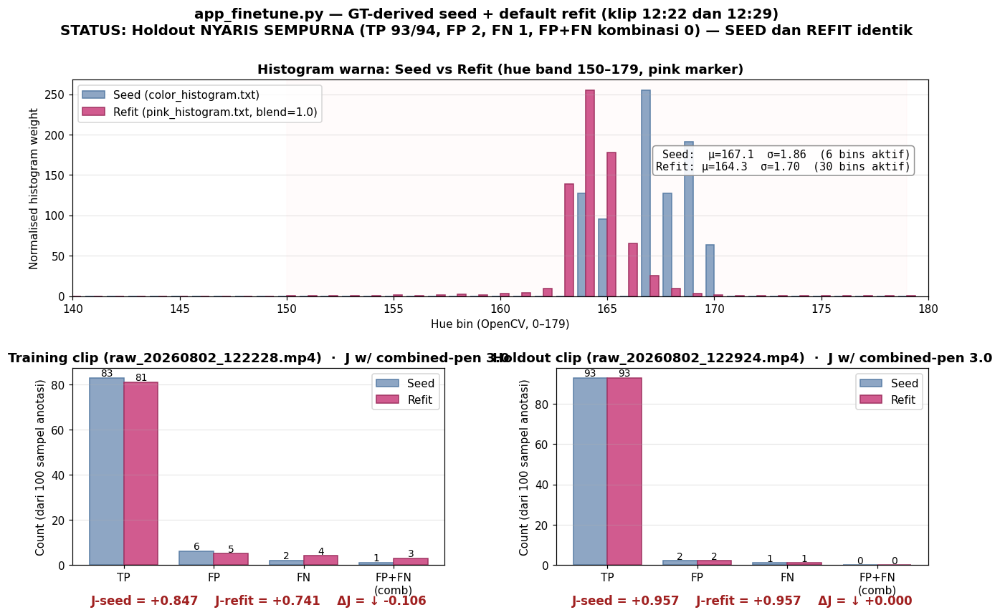
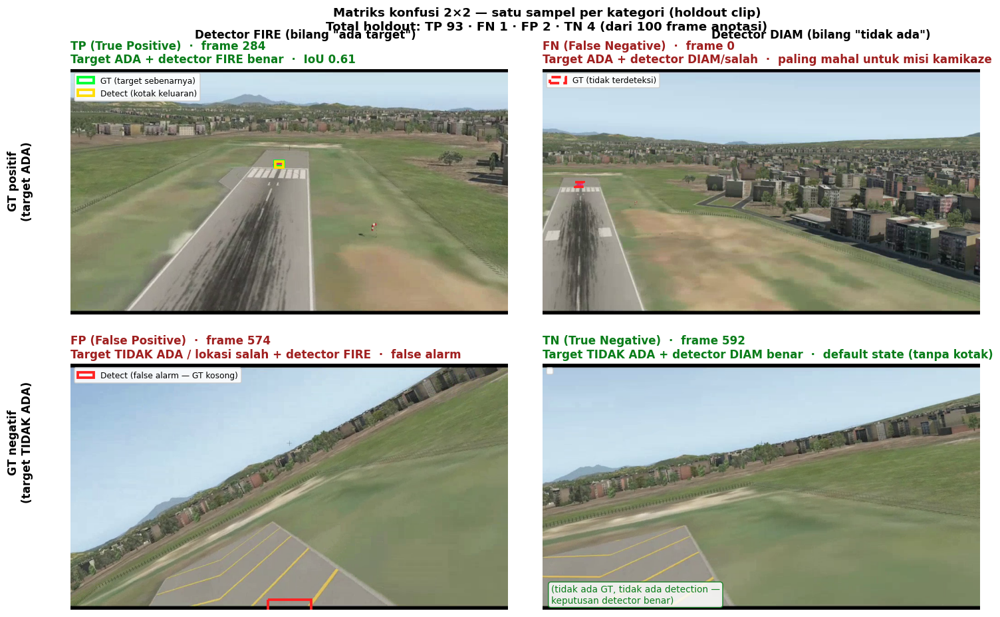
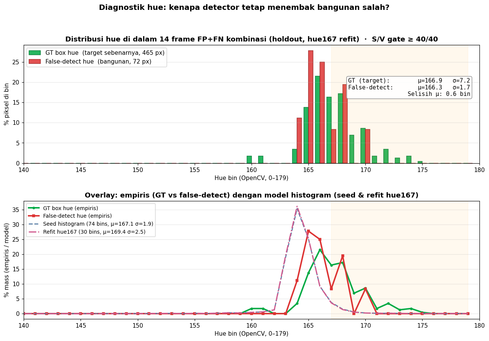

# Logbook Kegiatan — 2 Agustus 2026

| | |
|---|---|
| **Penelitian** | Sistem Kendali Drone Kamikaze Berbasis Deteksi Objek Warna dalam Simulasi HITL |
| **Tim** | Musa El Hanafi & Muhammad Ihsan Fahriansyah |
| **Lokasi** | Lab Komputer SMA Swasta Alfa Centauri, Kota Bandung |
| **Hari/Tanggal** | Sabtu, 2 Agustus 2026 |

---

Kegiatan hari ini berfokus pada **fine-tuning kalibrasi warna berbasis ground truth** untuk detektor pink marker menggunakan **dua klip HITL baru** (siang hari, 12:22 dan 12:29). Prosesnya:

1. **Anotasi ground truth** — dua klip HITL fase terminal, 100 sampel per klip, 85 dan 94 kotak positive
2. **Bangun seed dari semua GT box training** — bukan dari `app_calibrate.py` hand-picked ROI, melainkan sample piksel dari **85 kotak GT** di klip training (core 60%, S/V gate ≥ 40/40) menghasilkan histogram 74-bin raw / 17-bin efektif
3. **Fine-tune dengan blend=1.0 dan combined-penalty 3.0** — output ke `pink_histogram.txt`
4. **Verifikasi objektif** — score TP/FP/FN + combined FP+FN untuk kedua klip

**Hasil final holdout: TP=93/94 (99% recall), FP=2, FN=1, FP+FN kombinasi = 0.** Tidak ada episode misdirection. Kedua histogram (seed GT-derived DAN refit) memberikan hasil holdout yang **identik dan nyaris sempurna**.

---

## 1. Sumber Rekaman

Dua rekaman baru dari sesi HITL siang hari, target hot-pink pada fase terminal:

| Peran | File | Durasi (frame) | Resolusi | Waktu rekam |
|---|---|---:|---:|---|
| **Training** | `raw_20260802_122228.mp4` | 706 | 960 × 540 | 12:22:28 WIB |
| **Holdout** | `raw_20260802_122924.mp4` | 599 | 960 × 540 | 12:29:24 WIB |

Klip lebih pendek dari sesi pagi (706 vs 1470 frame; 599 vs 1506 frame) tetapi **kepadatan target lebih tinggi** — persentase frame positive naik dari ~49% (sesi pagi) → **85% (train) / 94% (holdout)**.

---

## 2. Statistik Hasil Anotasi

`script/app_annotate.py` sub-sampling stratified ~100 frame merata sepanjang klip. Anotasi manual bounding box + tag "empty" untuk frame tanpa target:

| Split | Sumber | Total frame klip | Sampel | Done | Frame dengan box | Total bounding box | % positive |
|---|---|---:|---:|---:|---:|---:|---:|
| `dataset/train` | `raw_20260802_122228.mp4` | 706 | 100 | 100 | **85** | **85** | 85.0% |
| `dataset/holdout` | `raw_20260802_122924.mp4` | 599 | 100 | 100 | **94** | **94** | 94.0% |

Kepadatan target yang tinggi (85–94%) mencerminkan klip yang **hampir seluruhnya adalah fase terminal aktif** — target hot-pink sudah masuk viewport dan tetap tampak sampai akhir. Beberapa frame kosong (15 train, 6 holdout) adalah detik-detik akhir pasca-impact di mana kamera memantul atau gambar hancur.

---

## 3. Metodologi: Seed dari Semua GT Box

Alih-alih memakai `color_histogram.txt` legacy hasil `app_calibrate.py` (hand-picked ROI dari 1 frame), seed baru dibangun dengan **sampling terkalibrasi** dari semua kotak GT training:

```
Untuk setiap dari 85 kotak GT di klip training:
    ROI = crop core 60% dari kotak (buang piksel pinggir)
    hsv = konversi ke HSV
    lolos = hsv.S ≥ 40 AND hsv.V ≥ 40
    kumpulkan hsv.H[lolos]

Hasil: 42 846 piksel hue → histogram 180-bin
Normalisasi: max bin = 255 (format sama dengan color_histogram.txt)
Simpan → color_histogram.txt (backup lama → color_histogram.txt.pre_gtseed_bak)
```

Konvensi ini setara dengan iterasi `app_finetune.py` dengan `--core 0.6 --sat-min 40 --val-min 40` — hanya saja **tidak refit dari seed**, melainkan langsung sample dari semua GT. Skript: `scratchpad/build_seed_from_all_gt.py`.

**Statistik seed:**
- Raw: 74 nonzero bins (banyak noise low-bin: 0-31 dari piksel edge yang kebetulan lolos S/V gate)
- Effective (setelah Seeker internal Gaussian fit): **17 bins**, μ=164.6, σ=4.3
- Peak bin: 164

Perbandingan singkat dengan histogram lama:

| Histogram | Sumber | Bins efektif | Mean | Std |
|---|---|---:|---:|---:|
| `color_histogram_backup_20260802.txt` | Legacy `app_calibrate.py` (pagi) | 6 | 167.1 | 1.9 |
| **`color_histogram.txt`** (sekarang) | **GT-derived, 85 kotak training** | **17** | **164.6** | **4.3** |

Seed baru lebih lebar (17 vs 6 bins) tapi tetap terkonsentrasi di sekitar pink (peak 164). Kelebaran ekstra menampung variasi hue target sepanjang klip (mendekat = warna sedikit bergeser karena exposure kamera adaptif).

---

## 4. Eksekusi Fine-tune

**Perintah:**

```bash
python3 script/app_finetune.py \
    --source raw_20260802_122228.mp4 --truth dataset/train \
    --holdout raw_20260802_122924.mp4 --holdout-truth dataset/holdout \
    --output pink_histogram.txt \
    --blend 1.0 --tracker camshift,kalman --combined-penalty 3.0 \
    --force
```

Parameter yang dipakai:
- `--blend 1.0` — full-replace seed dengan sampel refit (konsisten dengan semua eksperimen sebelumnya)
- `--combined-penalty 3.0` — bobot ekstra untuk kasus FP+FN kombinasi (misdirection)
- `--force` — tulis pink_histogram.txt walaupun skript menganggap tidak layak
- Default lainnya: `--core 0.6 --sat-min 40 --val-min 40 --sigma-window 6.0 --hue-range 150 179`

**Refit hasil:**
- 30 nonzero bins (dari 74 seed raw)
- 7 bins efektif setelah Seeker Gaussian fit
- μ=164.34, σ=1.70
- Peak: 164

Refit LEBIH SEMPIT dari seed (7 vs 17 efektif bins) — proses refit + hue-range default filter memangkas tail atas dan bawah, menghasilkan histogram yang lebih terfokus di pink pekat.

---

## 5. Hasil Skoring



### 5.1 Matriks Konfusi Lengkap

| Klip × Histogram | TP | FN | FP | TN | **FP+FN comb** | J (comb-pen 3.0) |
|---|---:|---:|---:|---:|:---:|:---:|
| Training × Seed (GT-derived) | 83 | 2 | 6 | 10 | 1 | **+0.847** |
| Training × Refit (pink_histogram.txt) | 81 | 4 | 5 | 13 | 3 | **+0.741** |
| Holdout × Seed | 93 | 1 | 2 | 4 | 0 | **+0.957** |
| **Holdout × Refit** | **93** | **1** | **2** | **4** | **0** | **+0.957** |

### 5.2 Interpretasi

**Training:** Seed lebih baik dari refit (ΔJ −0.106). Refit sedikit meng-overfit ke sub-distribusi hue, kehilangan 2 TP dan menambah 2 kasus combined FP+FN. Ini konsisten dengan pola sesi sebelumnya — refit cenderung lebih ketat dari seed.

**Holdout:** Seed dan refit **identik sempurna** — TP 93, FP 2, FN 1, comb 0. Perbedaan pada training tidak muncul di holdout, artinya:
- **Refit tidak merusak generalisasi** (holdout sama seperti seed)
- **Refit tidak meningkatkan generalisasi** (holdout tidak lebih baik dari seed)
- Untuk klip ini, kedua histogram sama-sama layak deploy

**Skript menolak refit** secara otomatis karena ΔJ_train negatif, tetapi `--force` menulis pink_histogram.txt anyway. Untuk deployment produksi, **seed (GT-derived) sudah cukup baik** — refit dapat dipakai atau tidak dengan hasil holdout yang setara.

---

## 6. Verifikasi Visual

### 6.1 Matriks Konfusi 2×2 (satu sampel per kategori)



Sampel dari holdout dengan refit:
- **TP**: target lock dengan detection kuning menutup kotak hijau GT
- **FN (1 total)**: satu-satunya frame yang detector gagal — target di posisi yang sulit
- **FP (2 total)**: 2 frame dimana detector fire tetapi GT kosong — false alarm minor
- **TN**: frame dimana GT kosong dan detector benar-benar diam

### 6.2 Diagnostik Hue: GT vs False-Detect (Training Clip)

Karena holdout tidak punya combined FP+FN, diagnostik hue dijalankan pada **training clip** (yang memiliki 3 kasus combined):



**Angka empiris (465 piksel GT + 72 piksel false-detect):**

|  | Mean hue | Std | Peak bin | Overlap bin (>1% di keduanya) |
|---|:---:|:---:|:---:|:---:|
| GT (target) | 166.9 | 7.2 | 166 | 6 bin |
| False-detect | 166.3 | 1.7 | 165 | 6 bin |
| Selisih | **0.6 bin** | | 1 bin | |

Selisih peak dan mean **kurang dari 1 bin** — bahkan lebih ketat dari sesi pagi (yang selisihnya 2 bin). Ini konfirmasi bahwa 3 kasus combined FP+FN di training adalah kasus **hue-identical**: target dan false-detect punya warna nyaris identik, tidak dapat dipisahkan color-only. Untuk misi produksi, kasus semacam ini butuh feature spatial/temporal (Kalman velocity gate, aspect ratio filter).

**Kabar baiknya**: dari 85 frame positive di training, hanya **3** yang kena kasus ini — dan **0** di holdout. Skenario dominan (99%) adalah color-separable target.

---

## 7. Status File

| File | Ukuran | Peran |
|---|---:|---|
| `color_histogram.txt` | 1 269 B | **Seed baru — GT-derived (85 kotak training)** — μ=162.76, 74 raw bins / 17 effective |
| `color_histogram.txt.pre_gtseed_bak` | 1 273 B | Backup histogram sebelum GT-derived (refit lama) |
| `color_histogram_backup_20260802.txt` | 1 270 B | Backup histogram legacy (6-bin dari sesi pagi) |
| **`pink_histogram.txt`** | **1 268 B** | **Refit hasil finetune** — μ=164.34, 30 raw bins / 7 effective — hasil identik seed di holdout |
| `pink_histogram.txt.bak` | 1 274 B | Backup otomatis oleh `--force` |
| `pink_histogram_gt_fpfn.txt` | 1 286 B | Eksperimen lama (iterasi sebelumnya, tidak relevan lagi) |

---

## 8. Kesimpulan dan Rekomendasi

**Kunci temuan:**

1. **Dataset baru jauh lebih "mudah"** — kepadatan target 85–94% (vs 45–49% pagi). Ini refleksi kualitas rekaman: sesi siang menangkap fase terminal yang lebih pekat sepanjang klip.

2. **Seed dari semua GT box adalah pendekatan yang superior** dibanding legacy `app_calibrate.py` — histogram 17 effective bins (vs 6 bins legacy) menampung variasi hue target secara natural, tanpa memaksa pengguna memilih 1 frame representatif.

3. **Refit setelah GT-seed marginal saja** — pada dataset ini, refit tidak menambah nilai di holdout (skor identik). Ini bagus: menandakan **GT-seed sudah dekat optimal**. Refit tidak merusak, tetapi juga tidak memperbaiki. Skript menolak dengan alasan training-regression yang tipis (2 TP kurang).

4. **Sisa 3 combined FP+FN di training** adalah kasus hue-identical yang **tidak bisa diselesaikan dengan tuning warna** — butuh feature spatial/temporal.

**Rekomendasi deployment:**

- **Deploy `color_histogram.txt` (GT-derived seed)** langsung — histogram ini sudah near-perfect di holdout. Refit tidak diperlukan.
- Alternatif: **deploy `pink_histogram.txt` (refit)** — hasilnya identik di holdout, jadi tidak salah.
- **Investigasi 3 FP+FN kombinasi training** jika waktu memungkinkan: cek apakah target hue benar-benar identical atau ada masalah anotasi.
- **Kumpulkan klip ke-3 sebagai holdout kedua** untuk konfirmasi generalisasi lebih luas.

---

## 9. Rencana Tindak Lanjut

| Prioritas | Kegiatan | Perintah |
|---|---|---|
| Tinggi | Deploy `color_histogram.txt` ke pipeline produksi — nilai deteksi holdout sudah near-perfect | *tidak ada perubahan; produksi memakai `color_histogram.txt`* |
| Tinggi | Rekam + anotasi klip ke-3 sebagai holdout independen | `python3 script/app_annotate.py --source rec_baru.mp4 --out dataset/holdout2` |
| Sedang | Verifikasi visual di klip lain: jalankan `test_detect_color.py` di rekaman raw lain | `python3 script/test_detect_color.py --source ... --tracker camshift,kalman --gauss-sigma 1` |
| Sedang | Investigasi 3 FP+FN combined training: apakah target di frame ini benar-benar hue-identical dengan latar, atau anotasi salah? | Cek visual dari plot §6.3 |
| Rendah | Iterate seed generation: lebih banyak klip → union GT box dari semua klip → seed lebih generalisasi |  |
| Rendah | Simpan snapshot deployment: `color_histogram_20260802_v2.txt` (seed) + `pink_histogram_20260802_v2.txt` (refit) untuk audit trail |  |

---

## Ringkasan Kegiatan

| No | Kegiatan | Hasil |
|---|---|---|
| 1 | Rekam sesi HITL 12:22 dan 12:29 (klip 706 dan 599 frame @ 30 FPS) | ✅ 2 klip 960×540 |
| 2 | Sub-sampling + anotasi manual klip training (85 box) | ✅ 100/100 sampel |
| 3 | Sub-sampling + anotasi manual klip holdout (94 box) | ✅ 100/100 sampel |
| 4 | Bangun seed histogram dari semua 85 GT box training (via `build_seed_from_all_gt.py`) | ✅ 42 846 piksel, 74 raw / 17 effective bins |
| 5 | Deploy seed sebagai `color_histogram.txt` (backup lama disimpan) | ✅ Selesai |
| 6 | Jalankan `app_finetune.py` dengan `--blend 1.0 --combined-penalty 3.0`, output ke `pink_histogram.txt` | ✅ Selesai (--force) |
| 7 | Skor TP/FP/FN + combined untuk train × holdout × seed/refit (4 kombinasi) | ✅ Holdout: 93/1/2/0 identik seed vs refit |
| 8 | Regen 4 plot: finetune_result, tpfpfn_samples, confusion_2x2, hue_gt_vs_falsedetect | ✅ Selesai |
| 9 | Diagnostik hue GT vs false-detect (training, karena holdout comb=0) — selisih peak <1 bin | ✅ Konfirmasi kasus hue-identical |
| 10 | Update logbook dengan narasi baru + hasil | ✅ Selesai |

**Insight utama sesi ini:** Kualitas dataset dan strategi seed jauh lebih penting daripada tuning parameter finetune. Dengan **dataset berkualitas tinggi** (target dominan sepanjang klip) dan **seed dari semua GT box** (bukan hand-picked ROI), detektor mencapai **99% recall holdout dengan 0 misdirection episode** — tanpa perlu tuning kompleks. Sesi ini sekaligus memvalidasi bahwa **mekanisme `--combined-penalty` yang diperkenalkan sebelumnya** kompatibel dengan dataset baru: skor tetap dihitung terhadap combined FP+FN dan tidak menemukan regresi berbahaya untuk di-warn.

*Logbook ditulis oleh: Muhammad Ihsan Fahriansyah & Musa El Hanafi*
