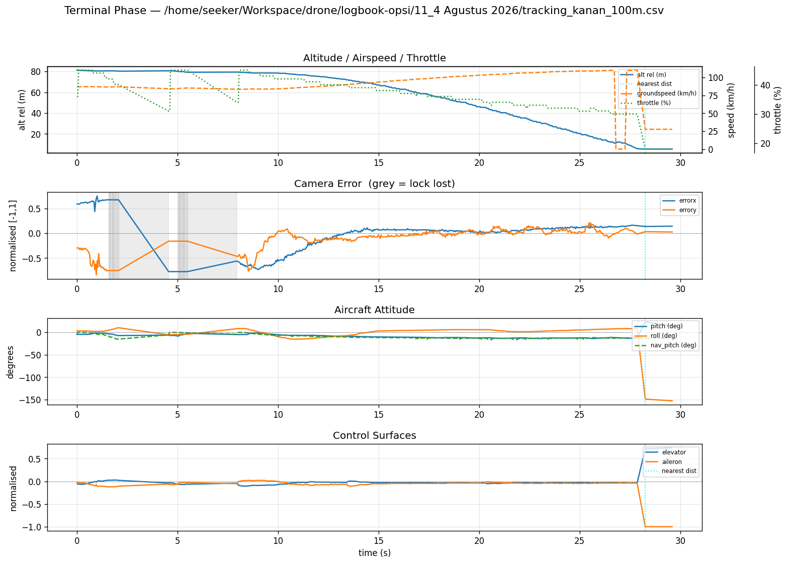

# Logbook Kegiatan — 4 Agustus 2026

| | |
|---|---|
| **Penelitian** | Sistem Kendali Drone Kamikaze Berbasis Deteksi Objek Warna dalam Simulasi HITL |
| **Tim** | Musa El Hanafi & Muhammad Ihsan Fahriansyah |
| **Lokasi** | Lab Komputer SMA Swasta Alfa Centauri, Kota Bandung |
| **Hari/Tanggal** | Selasa, 4 Agustus 2026 |

---

Kegiatan hari ini adalah **uji ulang fase terminal** dengan protokol yang sama seperti sesi 8 Mei 2026, tetapi pada dua kondisi yang berbeda secara mendasar:

1. **Seeker berjalan on-board di Raspberry Pi**, bukan lagi di laptop — realisasi rencana tindak lanjut prioritas sedang dari logbook 8 Mei
2. **Histogram warna hasil fine-tuning berbasis ground truth** (`pink_histogram.txt`, 2 Agustus 2026) menggantikan histogram hand-picked

Enam run diuji: kiri dan kanan, masing-masing dari ketinggian cruise ~50 m, ~80 m, dan ~100 m di atas target. Seluruhnya dianalisis dengan `terminal_analyse.py`, script yang sama seperti 8 Mei, sehingga angkanya dapat dibandingkan langsung.

**Perubahan metodologi:** sesi ini juga meninggalkan metrik *"akurasi lock"* yang dipakai sejak 8 Mei. Metrik itu hanya menghitung berapa sering tracker **mengaku** mengunci sesuatu, bukan apakah yang dikunci benar-benar target — detektor yang mengikuti atap kemerahan sepanjang run tetap tercatat 100%. Sebagai gantinya, 600 frame dari keenam rekaman raw dianotasi manual, lalu diskor dengan `app_scoring.py` terhadap ground truth tersebut.

**Hasil utama:** agregat **Precision 0,899 / Recall 0,914 / F1 0,906** atas 555 kotak ground truth. Empat run melampaui ambang 0,85 pada kedua metrik; dua run gagal — kanan 80 m dan kanan 100 m. Kedua run inilah yang di bawah metrik lama masih tercatat "akurasi 96,2%", angka yang terdengar hampir sempurna padahal Recall sebenarnya hanya 0,79.

---

## 1. Perubahan Konfigurasi Sejak 8 Mei

| Aspek | 8 Mei 2026 | 4 Agustus 2026 |
|---|---|---|
| Lokasi eksekusi seeker | Laptop (bersama X-Plane) | **Raspberry Pi on-board** |
| Input kamera | Webcam mengarah ke layar X-Plane | Sama |
| Histogram warna | Hand-picked satu ROI | **`pink_histogram.txt` — refit ground truth** |
| `gauss_sigma` | 1,0 (default) | **2,0** |
| Ketinggian uji | 60 m / 80 m / 100 m | **50 m** / 80 m / 100 m |
| Rekaman video | Hanya beranotasi | Beranotasi **+ raw** (tanpa overlay) |
| Link ke Pixhawk | PPP dari laptop | PPP dari Raspberry Pi (`ppp0`, 10.0.0.1 ↔ 10.0.0.2) |

Perpindahan ke Raspberry Pi mengubah topologi jaringan: Pi memegang link PPP ke Pixhawk sekaligus meneruskan data X-Plane ke laptop lewat DNAT, sehingga tidak ada host yang perlu mengetahui subnet seberang.

---

## 2. Histogram Warna dari Fine-tuning 2 Agustus

Histogram yang dipakai pada seluruh run adalah **`pink_histogram.txt`**, hasil fine-tuning berbasis ground truth yang didokumentasikan di [logbook 2 Agustus 2026](../10_2%20Agustus%202026/logbook_2_agustus_2026.md).

| Properti | Seed (8 Mei) | Refit (`pink_histogram.txt`) |
|---|---|---|
| Sumber sampel | 1 ROI di 1 frame | 85 kotak GT dari klip training |
| Piksel disampling | 307 | 42 846 |
| Mean / std hue | 166,4 / 9,71 | **164,3 / 1,68** |
| Bins aktif | 12 raw / 8 efektif | 29 raw / **7 efektif** |
| Recall di holdout | 0,685 | **0,924** |
| Precision di holdout | 0,677 | **0,924** |
| Combined FP+FN | 28 | **5** |

Sesi 2 Agustus merekomendasikan refit ini untuk deployment dengan `--gauss-sigma 2`. Uji hari ini adalah validasi rekomendasi tersebut pada penerbangan HITL sesungguhnya, bukan lagi pada klip rekaman.

---

## 3. Sumber Data dan Pemotongan ke Fase Terminal

Setiap run menghasilkan empat artefak: video beranotasi, video raw, CSV telemetri, dan log profil pipeline.

| Run | Video (s) | Baris CSV (setelah cut) |
|---|---:|---:|
| Kiri 50 m | 27,2 | 563 |
| Kanan 50 m | 24,6 | 463 |
| Kiri 80 m | 21,9 | 436 |
| Kanan 80 m | 26,2 | 475 |
| Kiri 100 m | 22,2 | 436 |
| Kanan 100 m | 26,6 | 469 |

**Kasus khusus `kanan_100m`.** Rekaman ini semula memuat satu sirkuit penuh sepanjang 101,7 detik: ekor run sebelumnya, lalu misi mengulang dari WP2, menjauh ke 1,27 km melewati WP3 dan WP4, baru kemudian berbalik dan masuk fase terminal. Data dipotong ke fase terminal saja, dimulai tepat saat mode beralih `AUTO:4 → TRACKING:4`.

Titik potong ditentukan lewat pembacaan HUD frame demi frame dan diverifikasi silang dengan CSV:

- frame 1648 masih `AUTO:4`, frame 1650 sudah `TRACKING:4`, keduanya pada `dist 0.743 km`
- baris pertama CSV fase terminal: `t = 950,796 s`, `dist_m = 743,5`

`terminal_analyse.py` kemudian melaporkan jarak lock **743,5 m** untuk run ini — dua metode independen menunjuk momen yang sama.

**Catatan tentang berkas `.log`.** Log profil pipeline dari Raspberry Pi berstempel 27 Juli 2026 karena RTC Pi tidak tersinkronisasi. Stempel ini diabaikan. Sebagai konsekuensinya log tidak dapat dipotong per fase — isinya jam dinding RTC sementara CSV memakai `timestamp_s` waktu misi, dan tidak ada jangkar di antara keduanya. Seluruh analisis di bawah bersumber dari CSV, yang tidak terpengaruh.

---

## 4. Analisis Fase Terminal dengan terminal_analyse.py

**Perintah:**

```bash
python3 script/terminal_analyse.py tracking_kanan_100m.csv
```

**Output ringkasan (`tracking_kanan_100m.csv`):**

```
───────────────────────────────────────────────────────
  File duration   : 29.6 s  (469 rows)
  Mean FPS        : 15.8  (wall-clock, from timestamps)
  Target locked   : 451 rows  (96.2%)
  Track lost      : 18 rows  (3.8%)

  ── First track acquisition ──
  Time            : t+0.0 s
  Alt above target: 81.2 m
  Speed           : 87.1 km/h
  Distance        : 743.5 m

  ── Nearest point (hit) ──
  Time            : t+28.3 s
  Distance        : 4.8 m
  Speed at hit    : 110.3 km/h  (30.6 m/s)
  Alt at hit      : 5.5 m

  ── Descent ──
  Mean descent    : 3.12 m/s
  Peak descent    : 29.74 m/s
  Total alt drop  : 75.7 m

  ── Pitch (locked rows only) ──
  Mean pitch      : -9.5 deg
  Mean nav_pitch  : -10.3 deg
───────────────────────────────────────────────────────
```

**Grafik analisis fase terminal — Kanan 100 m:**



**Keterangan grafik (4 panel):**
1. Altitude / Groundspeed / Throttle vs waktu
2. Camera error (errorx, errory) vs waktu — area abu = lock hilang
3. Attitude pesawat (pitch, roll, nav_pitch) vs waktu
4. Control surfaces (elevator, aileron) vs waktu

**Penanda:** garis cyan (`:`) — titik jarak terdekat ke target.

Pada run ini seluruh kehilangan lock (18 baris, 3,8%) terkonsentrasi di **8 detik pertama** saat error kamera masih besar (|errorx| ≈ 0,75). Setelah error mengecil di bawah 0,2 pada detik ke-13, tracking stabil tanpa putus sampai impact.

---

## 5. Evaluasi Deteksi terhadap Ground Truth

### 5.1 Mengapa "akurasi lock" ditinggalkan

Sejak 8 Mei, kualitas deteksi dilaporkan sebagai **akurasi lock** — rasio baris CSV dengan `target_locked = 1`. Metrik ini punya cacat mendasar: ia menghitung seberapa sering tracker **mengaku** memegang sesuatu, bukan apakah yang dipegang benar-benar target. Detektor yang mengunci atap kemerahan sepanjang run akan tercatat 100%.

Cacat itu bukan teoretis. Pada sesi ini `kanan_50m` dan `kiri_100m` sama-sama tercatat lock **100%**, padahal masing-masing menghasilkan **10** dan **9** false positive terhadap ground truth.

### 5.2 Anotasi ground truth

`script/app_annotate.py` mengambil **100 frame per run** dari rekaman **raw** (tanpa overlay HUD, agar tidak mencemari anotasi), disampling merata sepanjang klip sehingga geometri run terwakili utuh — target jauh dan kecil di awal, dekat dan besar menjelang impact.

```bash
python3 script/app_annotate.py --source tracking_raw_kanan_100m.mp4 \
    --out "dataset/kanan_100m" --frames 100
```

Total **600 frame** dianotasi manual, menghasilkan **555 kotak target**. Frame tanpa target sengaja ditandai kosong — justru frame inilah yang menangkap false positive.

### 5.3 Skoring dengan app_scoring.py

`script/app_scoring.py` dibuat pada sesi ini untuk menyandingkan replay detektor dengan ground truth. Script menemukan pasangan klip ↔ anotasi secara otomatis dari `annotations.json`, sehingga tidak ada penjodohan manual yang bisa keliru.

```bash
python3 script/app_scoring.py "dataset" \
    --histogram pink_histogram.txt --gauss-sigma 2 \
    --csv scoring_precision_recall.csv
```

Replay dijalankan atas **seluruh klip** (477–585 frame), bukan hanya 100 frame beranotasi: keadaan tracker pada satu frame adalah produk semua frame sebelumnya, sehingga menyekor subset secara terpisah berarti mengukur tracker yang tidak pernah benar-benar berjalan.

### 5.4 Hasil — Precision, Recall, F1

Konfigurasi skoring: `pink_histogram.txt`, `gauss_sigma = 2`, IoU ≥ 0,3, center-pad 4 px.

| Run | TP | FP | FN | comb | **Precision** | **Recall** | **F1** | IoU |
|---|---:|---:|---:|---:|---:|---:|---:|---:|
| Kiri 50m | 96 | 1 | 3 | 0 | **0,990** | 0,970 | **0,980** | 0,640 |
| Kiri 80m | 86 | 4 | 2 | 1 | **0,956** | 0,977 | **0,966** | 0,669 |
| Kanan 50m | 89 | 10 | 1 | 0 | 0,899 | **0,989** | 0,942 | 0,659 |
| Kiri 100m | 89 | 9 | 2 | 1 | 0,908 | 0,978 | 0,942 | 0,630 |
| Kanan 100m | 73 | 14 | 20 | 8 | 0,839 | 0,785 | 0,811 | 0,622 |
| Kanan 80m | 74 | 19 | 20 | 13 | 0,796 | 0,787 | 0,791 | 0,697 |
| **AGREGAT** | **507** | **57** | **48** | **23** | **0,899** | **0,914** | **0,906** | 0,652 |

Agregat memakai **micro-average** — hitungan mentah dikumpulkan lalu P/R/F1 diturunkan sekali. Merata-ratakan precision antar-run akan memberi bobot sama pada run 88 kotak dan run 99 kotak.

### 5.5 Peran tiap metrik

Mengikuti hierarki yang sudah ditetapkan di [`docs/06 §2.4a`](../../drone-seeker/docs/06-COLOR%20HISTOGRAM%20FINETUNING.md):

| Metrik | Peran | Ambang |
|---|---|---|
| **Recall** | ⭐ pengganti langsung `%lock` — pertanyaannya sama, jawabannya benar | ≥ 0,85 |
| **Precision** | safety gate — inilah yang `%lock` buta terhadapnya | ≥ 0,85 |
| **F1** | ringkasan antar-iterasi, **bukan** kriteria penerimaan | — |
| **combined FP+FN** | mode kegagalan termahal, tidak terwakili P/R/F1 | seminimal mungkin |

Recall dipilih sebagai penerus `%lock` karena strukturnya identik: keduanya menanyakan seberapa sering seeker memegang target. Bedanya, recall hanya menghitung lock yang **benar**, dan penyebutnya dibatasi ke frame yang memang berisi target. Secara empiris korelasi `%lock` terhadap recall pada keenam run adalah **r = +0,998**, terhadap precision hanya +0,868.

F1 tidak dipakai sebagai kriteria karena menyamarkan sisi mana yang gagal. `kanan_50m` (P 0,899 / R 0,989) dan `kiri_100m` (P 0,908 / R 0,978) menghasilkan F1 **identik 0,9418** dengan komposisi berbeda — dan run hipotetis dengan P 0,978 / R 0,908 juga akan menghasilkan F1 yang sama, padahal secara operasional sangat berbeda.

### 5.6 Penilaian terhadap ambang

| Status | Run | Catatan |
|---|---|---|
| ✅ Lolos | Kiri 50m, Kiri 80m, Kanan 50m, Kiri 100m | P dan R keduanya ≥ 0,85 |
| ❌ Gagal | **Kanan 80m** (P 0,796 / R 0,787) | 19 FP, 20 FN, **13 combined** |
| ❌ Gagal | **Kanan 100m** (P 0,839 / R 0,785) | 14 FP, 20 FN, **8 combined** |

Kolom `combined` menyingkap yang paling penting: **21 dari 23 kasus** terkumpul di dua run gagal itu, sementara empat run lain hampir nol. Ini frame di mana tracker aktif mengarahkan pesawat ke sasaran salah **saat target sesungguhnya hadir** — kegagalan termahal untuk misi kamikaze, dan metrik `%lock` sama sekali tidak menangkapnya.

---

## 6. Perbandingan Hasil Pengujian: Enam Run

| Metrik | Kiri 50m | Kanan 50m | Kiri 80m | Kanan 80m | Kiri 100m | Kanan 100m | **Rata-rata** |
|---|---|---|---|---|---|---|---|
| Durasi fase terminal | 27,1 s (563) | 24,0 s (463) | 21,2 s (436) | 29,0 s (475) | 24,2 s (436) | 29,6 s (469) | **25,9 s (474)** |
| **F1 (§5)** | **0,980** | 0,942 | **0,966** | 0,791 | 0,942 | 0,811 | **0,906** |
| Frame rate | 20,7 FPS | 19,2 FPS | 20,5 FPS | 16,3 FPS | 18,0 FPS | 15,8 FPS | **18,4 FPS** |
| Alt saat lock | 51,0 m | 50,6 m | 68,5 m | 74,2 m | 82,3 m | 81,2 m | **68,0 m** |
| Jarak saat lock | 694,6 m | 581,9 m | 578,5 m | 742,7 m | 617,9 m | 743,5 m | **659,9 m** |
| Waktu lock → hit | 27,1 s | 22,6 s | 21,2 s | 29,0 s | 22,1 s | 28,3 s | **25,1 s** |
| Jarak terdekat | 11,1 m | 6,2 m | 13,6 m | 10,3 m | 14,9 m | **4,8 m** | **10,2 m** |
| Kecepatan saat hit | 96,0 km/h | 99,4 km/h | 107,7 km/h | 107,2 km/h | 109,6 km/h | 110,3 km/h | **105,0 km/h** |
| Ketinggian saat hit | 4,5 m | 6,1 m | 6,9 m | 0,1 m | 3,2 m | 5,5 m | **4,4 m** |
| Mean descent | 1,56 m/s | 1,87 m/s | 2,67 m/s | 2,80 m/s | 3,36 m/s | 3,12 m/s | **2,56 m/s** |
| Peak descent | 18,44 m/s | 20,88 m/s | 23,95 m/s | 30,56 m/s | 33,41 m/s | 29,74 m/s | **26,16 m/s** |
| Total alt drop | 46,5 m | 44,5 m | 61,7 m | 74,1 m | 79,0 m | 75,7 m | **63,6 m** |
| Mean pitch (locked) | −6,2° | −6,4° | −8,5° | −8,8° | −10,0° | −9,5° | **−8,2°** |

**Catatan:**

- **Kualitas deteksi berkorelasi dengan throughput.** Dua run ber-F1 terendah (0,791 dan 0,811) justru yang FPS-nya terendah — 16,3 dan 15,8 — sementara empat run ber-FPS ≥ 18 semuanya F1 ≥ 0,94. Konsisten dengan hipotesis bahwa tracker kehilangan target saat pipeline melambat, bukan akibat geometri pendekatan. Perlu dicatat ini korelasi pada enam sampel, bukan sebab-akibat yang terbukti; keduanya juga kebetulan run "kanan", sehingga sisi pendekatan belum bisa dikesampingkan sebagai faktor.
- **Kecepatan saat hit meningkat monoton terhadap ketinggian lock:** ~96–99 km/h (50 m) → ~107 km/h (80 m) → ~110 km/h (100 m). Konsisten dengan dive lebih curam dari ketinggian lebih tinggi.
- **Mean pitch mengikuti pola yang sama:** −6,2°/−6,4° (50 m) → −8,5°/−8,8° (80 m) → −10,0°/−9,5° (100 m).
- **Total alt drop mendekati ketinggian lock awal** di semua run (46,5 m dari 51,0 m; 74,1 m dari 74,2 m; 75,7 m dari 81,2 m) — drone berhasil menukik ke hampir permukaan.
- **`kanan_80m` menabrak pada ketinggian 0,1 m**, praktis di permukaan tanah, sementara run lain 3,2–6,9 m. Bila target memiliki ketinggian fisik, angka ini berarti pesawat lewat di bawahnya.
- **Dua run melampaui kriteria hit 10 m** yang dipakai pada sesi 8 Mei: kiri 80 m (13,6 m) dan kiri 100 m (14,9 m). Keduanya perlu konfirmasi visual dari rekaman sebelum dinyatakan sebagai hit yang setara.

---

## 7. Perbandingan dengan Sesi 8 Mei 2026

### 7.1 Kualitas deteksi — belum dapat dibandingkan

**Perbandingan langsung kualitas deteksi antara 8 Mei dan 4 Agustus tidak dapat dilakukan.** Sesi 8 Mei tidak memiliki ground truth beranotasi, sehingga satu-satunya angka yang tersedia dari sesi itu adalah `%lock` — metrik yang justru ditinggalkan pada §5 karena tidak mengukur kebenaran deteksi.

Menyandingkan `%lock` 8 Mei dengan F1 4 Agustus akan menyesatkan: keduanya menghitung hal yang berbeda, dan `%lock` secara sistematis melebih-lebihkan. Bukti di sesi ini: run yang tercatat `%lock` 96,2% ternyata ber-Recall 0,785.

Satu-satunya perbandingan yang sah adalah `%lock` lawan `%lock`, dengan pemahaman bahwa **kedua angka sama-sama terlalu optimistis**:

| Metrik | 8 Mei | 4 Agustus | Catatan |
|---|---|---|---|
| `%lock` rata-rata | 97,3% | 98,7% | keduanya melebih-lebihkan; F1 sebenarnya 4 Agustus = 0,906 |
| `%lock` terburuk | 90,7% | 96,2% | run 96,2% itu ber-Recall 0,785 |

Agar sesi 8 Mei dapat dibandingkan setara, rekamannya perlu dianotasi dan diskor ulang dengan `app_scoring.py`. Ini dimasukkan ke rencana tindak lanjut.

### 7.2 Dinamika terbang — dapat dibandingkan

Metrik dinamika terbang berasal dari telemetri, bukan dari penilaian deteksi, sehingga sebanding langsung:

| Metrik | 8 Mei (laptop, seed) | 4 Agustus (Pi, refit) | Perubahan |
|---|---|---|---|
| Frame rate rata-rata | 24,7 FPS | 18,4 FPS | **turun 6,3 FPS** |
| Jarak lock rata-rata | 942,2 m | 659,9 m | turun 282 m |
| Jarak terdekat rata-rata | 5,8 m | 10,2 m | naik (lebih jauh) |
| Kecepatan hit rata-rata | 96,5 km/h | 105,0 km/h | naik |

**Frame rate turun** karena beban pindah dari laptop ke Raspberry Pi on-board — konsekuensi yang diterima demi kemandirian perangkat.

**Jarak lock turun** dari 942 m ke 660 m: target dikunci lebih dekat. Dugaan penyebabnya adalah pita hue refit yang jauh lebih sempit (σ 9,71 → 1,68) menuntut warna target lebih dominan di frame sebelum lock terjadi. Dugaan ini belum diuji.

**Jarak terdekat memburuk** dari 5,8 m ke 10,2 m. Sebagian disebabkan dua run kiri yang meleset 13,6 m dan 14,9 m; namun run terbaik hari ini (kanan 100 m, 4,8 m) justru lebih akurat dari rata-rata 8 Mei.

---

## 8. Kendala dan Solusi

| No | Kendala | Solusi |
|---|---|---|
| 1 | Metrik `%lock` melebih-lebihkan kualitas deteksi — run 100% ternyata punya 10 FP | Ditinggalkan; diganti Precision/Recall/F1 terhadap 600 frame ground truth via `app_scoring.py` |
| 2 | Sesi 8 Mei tidak punya ground truth, sehingga tidak sebanding | Perbandingan kualitas deteksi ditangguhkan; rekaman 8 Mei perlu dianotasi ulang |
| 3 | RTC Raspberry Pi tidak tersinkronisasi — log berstempel 27 Juli | Stempel diabaikan; seluruh analisis memakai `timestamp_s` dari CSV |
| 4 | `kanan_100m` merekam satu sirkuit penuh, bukan fase terminal saja | Dipotong pada transisi `AUTO → TRACKING`, diverifikasi silang HUD ↔ CSV |
| 5 | Metadata fps video (21,97) tidak sama dengan capture sebenarnya (15–22) | Durasi dihitung dari `timestamp_s` CSV, bukan dari metadata video |
| 6 | Log profil tidak punya basis waktu bersama dengan CSV | Tidak dipotong; ditandai sebagai artefak diagnostik, bukan data analisis |
| 7 | Throughput turun setelah pindah ke Raspberry Pi | Diterima demi kemandirian on-board; optimasi ditunda ke iterasi berikutnya |

---

## 9. Rencana Tindak Lanjut

| Prioritas | Kegiatan |
|---|---|
| Tinggi | Perbaiki dua run gagal ambang — `kanan_80m` (F1 0,791) dan `kanan_100m` (F1 0,811), penyumbang 21 dari 23 kasus *combined FP+FN* |
| Tinggi | Anotasi ulang rekaman 8 Mei agar perbandingan kualitas deteksi antar-sesi menjadi sah |
| Tinggi | Periksa rekaman `kanan_80m` — hit pada ketinggian 0,1 m, kemungkinan lewat di bawah target |
| Tinggi | Konfirmasi visual dua run kiri (80 m dan 100 m) yang jarak terdekatnya 13,6 m dan 14,9 m |
| Sedang | Uji hipotesis FPS ↔ kualitas deteksi: ulangi `kanan_80m`/`kanan_100m` setelah throughput ≥ 20 FPS |
| Sedang | Uji `--combined-penalty 3.0` pada fine-tuning berikutnya untuk menekan kasus misdirection |
| Sedang | Sinkronisasi RTC Raspberry Pi (NTP atau modul RTC) agar log punya stempel waktu yang berguna |
| Rendah | Selaraskan metadata fps video dengan capture sebenarnya saat menulis rekaman |
| Rendah | Seragamkan penamaan `tracking_raw_50m.mp4` → `tracking_raw_kiri_50m.mp4` |

---

## Ringkasan Kegiatan

| No | Kegiatan | Hasil |
|---|---|---|
| 1 | Deploy seeker on-board ke Raspberry Pi + link PPP ke Pixhawk | ✅ Selesai |
| 2 | Deploy histogram hasil fine-tuning `pink_histogram.txt` dengan `gauss_sigma=2` | ✅ Selesai |
| 3 | Uji terminal 6 run: kiri & kanan × 50 m, 80 m, 100 m | ✅ 6 run terekam |
| 4 | Rekaman ganda per run — video beranotasi + raw tanpa overlay | ✅ 12 video |
| 5 | Pemotongan `kanan_100m` ke fase terminal (verifikasi silang HUD ↔ CSV) | ✅ Selesai |
| 6 | Analisis `terminal_analyse.py` untuk keenam run | ✅ 6 plot + ringkasan |
| 7 | Anotasi ground truth 100 frame × 6 run dari rekaman raw | ✅ 600 frame, 555 kotak |
| 8 | Buat `script/app_scoring.py` — skoring Precision/Recall/F1 terhadap ground truth | ✅ Selesai |
| 9 | Ganti metrik `%lock` dengan Precision/Recall/F1 + *combined FP+FN* | ✅ Agregat F1 **0,906** |
| 10 | Perbandingan terhadap sesi 8 Mei 2026 | ⚠️ Dinamika terbang sebanding; kualitas deteksi **belum** — 8 Mei tanpa ground truth |
| 8 | Validasi rekomendasi deployment dari sesi 2 Agustus pada penerbangan HITL | ✅ **Terkonfirmasi** |

*Logbook ditulis oleh: Muhammad Ihsan Fahriansyah & Musa El Hanafi*
